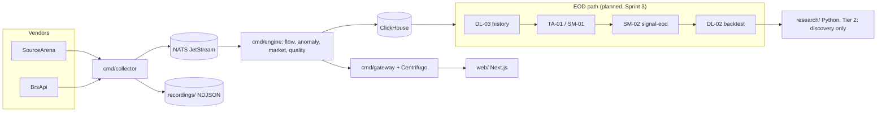

# برنامه پژوهش «کشف سهام مستعد رشد کوتاه‌مدت» (فاز ۰ تا ۴، پیشنهاد)

- وضعیت: **پیشنهاد، در انتظار تأیید مالک.** تا تأیید و تا پایان ساخت مجموعه داده و دروازه کیفیت، **هیچ سیگنال خرید یا فروشی تولید نمی‌شود.**
- تاریخ: ۱۳ مهر ۱۴۰۵ (2026-10-05).
- اسناد هم‌راه: `docs/tablokhani_inventory.md` (فاز ۱ تا ۳)، `docs/data_dictionary.md` (فاز ۴)، `docs/source_independence_matrix.md` (استقلال و تبار)، `docs/authenticated_audit.md` (MI-01)، `docs/archive_feasibility.md` (کفایت بایگانی، سقف BrsApi، داده درون‌روزی، تحلیل شکاف).
- اسناد پایه که این برنامه بر آن‌ها سوار است و جایگزینشان نمی‌شود: `docs/sprint3-plan.md`، `docs/signal-engine-spec.md` نسخه ۱٫۲، ADR-0004 تا ADR-0007.

## ۱. فاز ۰: محیط و معماری موجود

### ۱-الف. یافته
پروژه از صفر شروع نمی‌شود. مخزن `bourse` (Go، اسناد فارسی) سکوی تحلیل لحظه‌ای بازار است و **بیشتر زیرساخت این مأموریت را دارد یا برنامه‌ریزی کرده است**:

| لایه مأموریت | موجود در مخزن | وضعیت |
| --- | --- | --- |
| Collect | `cmd/collector`، `internal/source` (سورس‌آرنا، BrsApi، بازپخش) | ساخته شده؛ سهمیه محدود |
| Validate Data | `internal/quality`، `docs/data-quality.md`، کدهای SG مشخصات | ساخته شده (درون‌روزی)؛ قواعد D پایان روز برنامه‌ریزی‌شده (DL-03) |
| تقویم و زمان | `internal/calendar`، `internal/tehran` | ساخته شده؛ تقویم تأییدنشده |
| جریان پول درون‌روزی | `internal/flow` (پول داغ، بازی بازار، ماتریس ۱۰ دقیقه‌ای) | ساخته شده (ADR-0004) |
| ناهنجاری | `internal/anomaly` (AI-01، AI-02) | ساخته شده |
| تاریخچه روزانه | DL-03a تا DL-03d | برنامه‌ریزی‌شده؛ مسدود به سهمیه History (Q-SG1) |
| فنی و پول هوشمند | TA-01، SM-01 | برنامه‌ریزی‌شده |
| Detect Market Regime، Rank Industries، Patterns، Risk، Gate | SM-02 «رادار جهش v1» (قواعد R، I، G، M، J، Z، X، O) | مشخصات کامل؛ کد ندارد |
| Backtest و Validation | DL-02 (پیش‌رونده ۲۴/۳، FDR، Newey–West، خط پایه، حذف) | مشخصات کامل؛ کد ندارد |
| Track Outcome و Learn | قواعد S (کارنامه زنده)، G-3b (۴۰ روز کاغذی) | مشخصات |
| مدل آموزش‌دیده | ردیف ۲ ADR-0005 (Python، MLflow، سایه ۲۰ روز) | فاز ۲ |



### ۱-ب. تصمیم ساختاری (D-1)
**سامانه موازی ساخته نمی‌شود.** درخت پیشنهادی مأموریت (`market-intelligence/…`) روی ساختار موجود نگاشت می‌شود. پوشه‌ای پیش از نیاز ساخته نمی‌شود.

| پوشه پیشنهادی مأموریت | جای آن در مخزن | زمان ساخت |
| --- | --- | --- |
| `config/` | `configs/` (`signal_engine.yaml`) | موجود |
| `collectors/`، `connectors/` | `cmd/collector`، `internal/source` | موجود |
| `data/raw` | ClickHouse `market.*` و `recordings/` (بیرون از git) | موجود |
| `data/normalized`، `data/features` | ClickHouse `signal.features_daily`؛ خروجی Parquet پژوهش در `D:\Bourse\data\research\` (بیرون از git؛ درایو C پر است) | MI-04 |
| `db/` | `infra/clickhouse/` | موجود |
| `research/` | **`research/` (تازه)**: Python ردیف ۲، فقط کشف و ارزیابی | MI-04 |
| `patterns/` | `internal/signal/patterns` (Go) + کارت‌ها در `docs/patterns/` | SM-02 / MI-08 |
| `backtest/` | `internal/backtest`، `cmd/backtest` | DL-02 |
| `regime/`، `industry/` | `internal/signal/regime`، `internal/signal/industry` | SM-02 |
| `scanner/`، `gate/` | `cmd/signal-eod`، قواعد C و O | SM-02 |
| `reports/` | `reports/` (تازه؛ با نخستین گزارش) | MI-08 |
| `tests/` | آزمون Go کنار کد (`*_test.go`)؛ `research/tests/` | همراه کد |
| `docs/`، `scripts/` | `docs/`، `infra/` و `Makefile` | موجود |

**قاعده مرزی Go و Python (از اصل E-2):** هر فرمولی که به سیگنال، رتبه یا دروازه برسد فقط یک پیاده‌سازی Go دارد. Python ویژگی‌ها و برچسب‌ها را از خروجی Go می‌خواند. ویژگی آزمایشی را می‌شود موقتاً در Python ساخت، ولی پیش از ورود به هر قاعده باید به Go منتقل شود و آزمون برابری دو پیاده‌سازی بگذراند (مسیر ارتقا، بخش ۷).

### ۱-پ. محدودیت‌های محیطی که برنامه را شکل می‌دهند

| محدودیت | اثر |
| --- | --- |
| سورس‌آرنا حدود ۴۵ درخواست در روز (سقف واقعی تأییدنشده)؛ BrsApi رایگان ۱۰۰ در روز | ضبط درون‌روزی فقط با فاصله حدود ۱۴ دقیقه (`local-live.sh` پیش‌فرض ۴۰ در روز). باندهای پول داغ در ۵ ثانیه کالیبره شده‌اند؛ با این فاصله، داده درون‌روزی ضبط‌شده برای پول داغ معتبر نیست. |
| سقف History.php نامعلوم | مجموعه داده تاریخی منتظر Q-SG1 است. |
| TSETMC و fipiran از این رایانه در دسترس نیستند؛ تابلوخوانی، emofid و rahavard365 هستند | تطبیق با TSETMC (DL-03c) از شبکه دیگر |
| درایو C حدود ۵ گیگابایت خالی | همه داده پژوهش روی D |
| لپ‌تاپ می‌خوابد؛ Docker پس از راه‌اندازی دوباره خودکار بالا نمی‌آید | ضبط روزانه شکاف دارد و باید شکاف‌ها ثبت شوند |
| تابلوخوانی = کش سورس‌آرنا | منبع مستقل دوم نیست (inventory بخش ۱) |

## ۲. تصمیم‌های مهندسی (با دلیل)

| کد | تصمیم | دلیل |
| --- | --- | --- |
| D-1 | گسترش مخزن `bourse`، بدون مخزن یا درخت موازی | بیشتر زنجیره Market ← Exit در مشخصات SM-02 تعریف شده؛ دو تعریف از یک سنجه ممنوع است (E-2) |
| D-2 | **پژوهش دو مسیر دارد.** (۱) **پایان روز، از امروز تا ۵ سال گذشته** روی History.php. (۲) **درون‌روزی، فقط رو به جلو** از ضبط‌های R-01. هیچ فرضیه درون‌روزی با داده پایان روز «تأیید» نمی‌شود. | تاریخچه درون‌روزی (دفتر، سرانه بازه‌ای، پول داغ) در هیچ منبع در دسترسی نیست. هر روز ضبط‌نشده از دست می‌رود. |
| D-3 | داده تابلوخوانی سه نقش دارد و نقش چهارمی ندارد: (الف) منبع فرضیه، (ب) **معیار مقایسه** (آیا سیگنال رقیب پیش‌بینی می‌کند؟)، (پ) بایگانی رویداد برای مطالعه رویداد، فقط با اجازه مالک و سایت. هرگز وابستگی زمان اجرا یا ورودی امتیاز ما نیست. | قاعده ۶ و ۷ مخزن؛ مستقل نبودن داده؛ نامعلوم بودن شرایط استفاده |
| D-4 | لایه `research/` در Python، با محیط مجازی روی D، بدون notebook در git (اسکریپت + گزارش Markdown) | ADR-0005 ردیف ۲؛ بازتولیدپذیری؛ نسخه Python نصب‌شده (۳٫۱۴) ممکن است برای LightGBM چرخ آماده نداشته باشد، پس نسخه در MI-04 قفل می‌شود |
| D-5 | برچسب‌ها برای افق‌های ۱، ۲، ۳، ۵، ۱۰ و ۲۰ روز ساخته می‌شوند، ولی **آزمون فرضیه فقط روی ۵ و ۱۰ پیش‌ثبت می‌شود** (۱۰ اصلی، تصمیم مالک). بقیه فقط منحنی توصیفی‌اند. | کنترل آزمون چندگانه |
| D-6 | ورود همیشه با مدل پرشدن B2 (سقف سفارش یا گشایش t+1)، **هرگز پایانی روز سیگنال**؛ معامله پرنشده موفقیت شمرده نمی‌شود | واقع‌گرایی اجرا (فاز ۱۷) |
| D-7 | رژیم شش‌حالته مأموریت **برچسب پژوهشی** است؛ دروازه تولید همان سه‌حالته مشخصات (مثبت، خنثی، منفی) می‌ماند تا داده نشان دهد شش حالت ارزش افزوده دارد | پرهیز از پیچیدگی بی‌شاهد |
| D-8 | چرخش صنعت تا ساخت عضویت نقطه‌ای در زمان (D7) فقط با برچسب «سوگیری عضویت جاری» گزارش می‌شود و از دروازه نمی‌گذرد | نگاه به آینده |
| D-9 | هیچ پارامتر، آستانه یا وزنی پیش از ثبت در شبکه پیش‌ثبت‌شده و `signal.trials` روی داده واقعی آزموده نمی‌شود | آزمون چندگانه (B6، B15) |
| D-10 | دو مفهوم جدا: **HotMoneyMetric** (میانگین ارزش بازه بر افزایش تعداد) و **TrueLargeBuyerEvidence** (فقط تغییر سهامداران ≥ ۱٪). در فرضیه‌ها و متن دلیل، «پول هوشمند» فقط وقتی به کار می‌رود که شاهد دوم هم باشد. | هیچ داده‌ای خرید یک شخص را نشان نمی‌دهد (`source_independence_matrix` بخش ۵) |
| D-11 | ادعاهای رقیب با **بازسازی خودمان** روی تاریخچه BrsApi آزموده می‌شوند (۹ هشدار پایان روز، فیلترهای تعریف‌شده)، نه با بایگانی سایت؛ بایگانی سایت (ماتریس ۱۰ دقیقه‌ای، امتیاز نماد) فقط اکتشافی است. | بایگانی پول داغ، هشدار، صنعت و تابلوکستیک وجود ندارد؛ دو بایگانی موجود ۸ تا ۹ ماه‌اند (`archive_feasibility`) |

## ۳. سؤال پژوهشی و معیار رد

**سؤال مرکزی:** کدام ترکیب رژیم بازار، چرخش صنعت، رفتار پول و خریدار و فروشنده، ویژگی‌های ابزارهای تابلوخوانی، حرکت قیمت، حجم و ساختار فنی، بیشترین احتمال حرکت سودآور **قابل معامله** را در ۱ تا ۱۰ جلسه آینده دارد؟

**سؤال تعیین‌کننده:** آیا این رابطه روی داده‌ای که در ساخت الگو دیده نشده باقی می‌ماند؟ **اگر نه، الگو رد می‌شود.**

**هدف:** بیشینه امید ریاضی خالص با نرخ مثبت کاذب پذیرفتنی، نه بیشینه شمار سیگنال. در یک روز ۳ نامزد قوی بر ۳۰ نامزد متوسط ترجیح دارد. پس معیار رتبه‌بندی دقت در K برتر (`Precision@K`، K در {۳، ۵، ۱۰}) و امید خالص دهک برتر است، نه بازخوانی کل.

## ۴. ثبت فرضیه‌ها

هر فرضیه **یک** تعریف عملیاتی پیش‌ثبت‌شده دارد (رویداد روز t، با داده تا t) و حداکثر حدود ۲۴ ترکیب پارامتر (B15). «پایان روز» یعنی با History.php آزمون‌پذیر است.

| کد | خانواده | فرضیه عملیاتی (رویداد روز t) | آزمون‌پذیر با | منشأ |
| --- | --- | --- | --- | --- |
| H-A1 | A. انباشت پول مؤثر | صدک `F1_nrf_5d` بالا و `F3` بالا، در حالی که `ROC5` کمتر از آستانه است (قیمت هنوز حرکت نکرده) ← بازده مازاد ۵ و ۱۰ روزه مثبت | پایان روز | مأموریت؛ ادعای پول داغ (T01) |
| H-A2 | A | **تغییر** قدرت خریدار (`buyer_power_change`) بیش از **سطح** آن (`F2`) بازده مازاد را پیش‌بینی می‌کند | پایان روز | ادعای «روند سرانه» (inventory بخش ۵) |
| H-B1 | B. بازگشت زودهنگام | پس از روند نزولی (`ROC20 < 0`، زیر MA50)، `buyer_power_change` مثبت + `P2_clv` بالا + `intraday_recovery` بالا ← بازده مازاد | پایان روز | مأموریت؛ ادعای تابلوکستیک |
| H-C1 | C. منفی به مثبت | `low < prev` با افت دست‌کم x٪ دامنه و `final > prev`، همراه `nrf_day > 0` ← بازده مازاد | پایان روز (نسخه درون‌روزی فقط رو به جلو) | ادعای تابلوکستیک |
| H-D1 | D. ادامه روند | صدک `T1` در دهک برتر + `T2` برقرار + پولبک به MA20 با خشک‌شدن حجم ← ادامه | پایان روز | مأموریت |
| H-E1 | E. رهبر چرخش صنعت | IGR گروه رو به افزایش؛ رهبر یا جامانده گروه (G2، G3 مشخصات) | **مسدود** به D7 | مأموریت؛ ادعای T11 |
| H-F1 | F. شکست با حجم | همان G1 مشخصات (انباشت و شکست با تأیید پایانی) | پایان روز | مشخصات SM-02 |
| H-G1 | G. تقاضای پنهان / جذب | **دو فرضیه رقیب روی یک رویداد:** ورود پول بدون رشد قیمت (`price_response_to_money_flow` منفی بزرگ). مشخصات آن را «جذب عرضه» و **وتو** می‌داند (M2)؛ مأموریت آن را «تقاضای پنهان» و **مثبت** می‌داند. جهت با داده تعیین می‌شود، به تفکیک بازار منفی و مثبت. | پایان روز | مأموریت در برابر مشخصات M2 |
| H-G2 | G | در روز صف فروش، جمع‌کننده حقیقی (نه حقوقی) ← بازگشت | پایان روز (تقریب با قفل پایین و `inst_net_share`) | ادعای ویدئو «حقیقی یا حقوقی» |
| H-H1 | H. شکست ناموفق حمایت | `low` زیر کف ۲۰ روزه و `final` بالای آن در همان روز یا تا ۲ روز بعد ← بازده مازاد | پایان روز | مأموریت |
| H-I1 | I. پول + تأیید فنی | ارزش افزوده خانواده K-TREND روی H-A1 (آزمون حذف B8) | پایان روز | مأموریت |
| H-J1 | J. پول هوشمند کاذب (عدم ورود) | ورود پول (`F1` بالا) بدون واکنش قیمت در بازار مثبت یا خنثی، با صنعت ضعیف ← بازده مازاد **منفی یا صفر** | پایان روز | مأموریت؛ ادعای T03 |
| H-X1 | هم‌گرایی | `signal_confluence` (سطح خوشه) بهتر از `filter_frequency` (سطح فیلتر) رتبه‌بندی می‌کند | پایان روز | ادعای تحلیل چندبعدی (T07) |
| H-R1 | رژیم | تعریف‌های رقیب رژیم (بخش ۶) امید خالص H-A1 و H-F1 را به تفکیک وضعیت بهتر از نبود فیلتر جدا می‌کنند | پایان روز | مأموریت |
| H-T08 | ادعای رقیب | برچسب «اثر مثبت/منفی» هر یک از ۲۱ هشدار ویژه با علامت بازده مازاد ۵ و ۱۰ روزه هم‌خوان است | پایان روز برای ۹ هشدار با بازسازی خودمان (`authenticated_audit` بخش ۴)؛ بقیه رو به جلو | inventory T08 |
| H-T09 | ادعای رقیب | دهک برتر «امتیاز نماد» تابلوخوانی بازده مازاد مثبت دارد | اکتشافی با بایگانی `symbol-scores` (از 2026-01-04؛ اجازه مالک)؛ یا بازسازی فرمول منتشرشده روی تاریخچه BrsApi | inventory C-01 |
| H-T17 | ادعای رقیب | سیگنال‌های تالار پس از هزینه و مدل پرشدن، امید مثبت دارند | `signals/closed` (اجازه لازم) | inventory T17 |

فرضیه‌های درون‌روزی (پول داغ بازه‌ای، کراس سرانه، صف، پیش‌گشایش) تا رسیدن ضبط کافی (دست‌کم ۱۲۰ روز معاملاتی با فاصله مناسب) فقط **ثبت** می‌شوند و آزمون نمی‌شوند.

## ۵. مجموعه داده تاریخی (فاز ۷)

**دانه:** یک ردیف برای هر (نماد، روز t) در جهان نرمال‌سازی، به‌علاوه ردیف‌های وتوشده با کد دلیل (برای سوگیری انتخاب).

| بخش | ستون‌ها (`data_dictionary`) | زمان در دسترس بودن |
| --- | --- | --- |
| کلید | `ins_code`، `day`، `as_of`، `config_hash`، `dataset_version` | — |
| بازار | `regime_score`، `regime_state`، `regime6_label`، `breadth_*`، `market_nrf_n`، `ew_index_univ` | پایان روز t |
| صنعت | `IGR`، `industry_relative_strength` (با پرچم سوگیری) | پایان روز t |
| نماد | بار روزانه خام و تعدیل‌شده با لنگر t | پایان روز t |
| جریان | `F1`، `F2`، `F3`، `per_capita_*`، `buyer_power_change`، `inst_net_share`، `price_response_to_money_flow` | پایان روز t |
| فنی | ۳-ب تا ۳-ت | پایان روز t |
| تابلوخوانی | فقط ستون‌های `tk_*` که برداشتشان تأیید شده؛ با `source` جدا | زمان انتشار نزد سایت |
| برچسب (`LBL`) | `fill_flag`، `fill_price`، `fwd_ret_h` و `ex_ret_h` برای h در {۱، ۲، ۳، ۵، ۱۰، ۲۰}، `mfe_h`، `mae_h`، برچسب سه‌مانعی، `exit_reason`، `holding_days` | آینده؛ **هرگز ورودی** |

**تعریف برچسب‌ها (روی پرشدن، با لنگر روز ورود؛ مشخصات B12):**
- `fwd_ret_h = final(e+h) ÷ (fill × Π f) − 1`، خالص هزینه (L5).
- `ex_ret_h` = `fwd_ret_h` منهای بازده شاخص هم‌وزن جهان در همان بازه.
- `MFE_h = max(high(e..e+h)) ÷ fill − 1` و `MAE_h = min(low(e..e+h)) ÷ fill − 1`، با تعدیل رویدادها. روزی که قفل پایین است و فروش ممکن نیست، MAE واقعی همان قیمت قابل اجرای بعدی است (L4).
- سیگنالی که پر نشده (`fill_flag = 0`) در بازده و نرخ برد شمرده نمی‌شود و در **نرخ پرشدن** می‌آید.

**افق نهایی:** افق اصلی ۱۰ روز (تصمیم مالک، ۶ مهر)؛ ۵ روز ثانوی. منحنی ۱ تا ۲۰ روز برای یافتن «بهترین دوره نگهداری» هر الگو فقط توصیفی است؛ تغییر افق اصلی یک الگو یعنی آزمون تازه و ثبت در `signal.trials`.

## ۶. رژیم بازار (فاز ۹)

| تعریف | ورودی‌ها | خروجی |
| --- | --- | --- |
| R-SPEC | R1 تا R3 مشخصات (پهنا، جریان کل، شاخص هم‌وزن) با پسماند R6 | مثبت، خنثی، منفی (دروازه تولید) |
| R-TREND6 | شیب و جای شاخص هم‌وزن نسبت به MA50 و MA200 + نوسان ۲۰ روزه نسبت به صدک تاریخی خودش | BULL، RECOVERY، RANGE، DISTRIBUTION، BEAR، PANIC |
| R-FLOW | جریان حقیقی کل (R2) + سرانه بازار + نسبت صف خرید به فروش (T14، رو به جلو) | همان شش حالت |
| R-HMM (فاز ۲) | مدل پنهان مارکوف دو تا چهار حالته روی بازده و نوسان شاخص هم‌وزن | حالت‌ها؛ فقط با برازش پیش‌رونده |

**قاعده:** همه تعریف‌ها فقط از داده تا t استفاده می‌کنند. تعریف‌هایی که به قله‌یابی گذشته‌نگر نیاز دارند فقط برچسب توصیفی هستند. معیار انتخاب تعریف: کدام تعریف، **بیرون از نمونه**، امید الگوها را به تفکیک وضعیت بهتر جدا می‌کند (H-R1)، با دست‌کم ۳۰ رویداد در هر وضعیت.

## ۷. روش کشف و اعتبارسنجی (فاز ۱۳ تا ۱۹)

**نردبان مدل (هر پله فقط اگر پله پیش ناکافی باشد):**
1. **مطالعه رویداد:** میانگین و توزیع `ex_ret_h`، MFE و MAE پس از رویداد، با خطای معیار Newey–West روی سری یک‌مشاهده‌ای هر روز (B13).
2. **احتمال شرطی:** `P(ex_ret_10 > 0 | رویداد)` و `P(fwd_ret_5 > 5٪ | رویداد)` در برابر نرخ پایه همان روزها.
3. **کاوش قاعده** روی شبکه پیش‌ثبت‌شده.
4. **درخت تصمیم** با عمق ۳، فقط برای یافتن آستانه طبیعی؛ آستانه پیدا‌شده یک پارامتر تازه است و دوباره پیش‌ثبت می‌شود.
5. **رگرسیون لجستیک** با نماینده هر خوشه (`data_dictionary` بخش ۴).
6. **Gradient Boosting (LightGBM) یا Random Forest:** فقط اگر نسبت به لجستیک، بیرون از نمونه، در دست‌کم ۷۰٪ دوره‌های پیش‌رونده هم دقت در K برتر و هم امید خالص دهک برتر را بهبود دهد. وگرنه مدل ساده می‌ماند.

**جداسازی زمانی:**
- پیش‌رونده ۲۴ ماه آموزش / ۳ ماه آزمون، غلتان، با فاصله H (B4).
- برای انتخاب ابرپارامتر درون پنجره آموزش: **اعتبارسنجی متقاطع پاک‌شده** (purged k-fold) با embargo برابر H.
- ۶ ماه آخر نگهداشت، یک بار (B5).

**کنترل آزمون چندگانه:** همه ترکیب‌های فرضیه × افق × پارامتر و هر اجرای حذف در `signal.trials` شمرده می‌شوند؛ Benjamini–Hochberg با FDR ۱۰٪ روی بازده مازاد (B13). نسبت شارپ هر الگو به‌صورت «شارپ تعدیل‌شده با شمار آزمون‌ها» (Deflated Sharpe) هم گزارش می‌شود.

**پایداری (فاز ۱۹):** هر الگو به تفکیک رژیم (هر سه تعریف)، نوسان بالا و پایین (صدک نوسان شاخص)، صنعت قوی و ضعیف (با پرچم سوگیری)، اندازه (سه‌ک ارزش بازار)، نقدشوندگی (صدک MDV20) و سال گزارش می‌شود. الگویی که فقط در یک برش یا یک سال کار کند **رد** است.

**واقع‌گرایی اجرا (فاز ۱۷):** مدل پرشدن B2 و B3، جهت قفل D5، هزینه L5 (نرخ کارمزد و مالیات منتظر Q-SG8)، نرخ پرنشدن، توقف و بازگشایی (U4)، و دو گونه پرشدن (پایه و محافظه‌کار؛ دروازه روی محافظه‌کار).

**شاخص‌ها (فاز ۱۸):** امید ریاضی (R و درصد)، ضریب سود، نرخ برد، میانگین سود و زیان، نسبت سود به زیان، بیشینه افت، شارپ و سورتینو (مازاد بر درآمد ثابت، B10)، MFE و MAE (میانه و صدک‌ها)، دقت در K برتر، بازخوانی (نسبت حرکت‌های بزرگ آینده که الگو پیش از آن‌ها دیده)، گردش، نرخ پرشدن، دوره نگهداری.

**مسیر ارتقای ویژگی از Python به قاعده:** ویژگی آزمایشی Python ← شواهد در مطالعه رویداد ← پیاده‌سازی Go با فرمول منتشرشده و آزمون مقدار دستی و نابستگی به آینده ← آزمون برابری Go و Python روی همان داده ← ورود به پیکربندی با `config_hash` تازه.

## ۸. وضعیت الگو و کارت الگو (فاز ۲۰ و ۳۰)

| وضعیت | شرط | نوع سیگنال مجاز |
| --- | --- | --- |
| REJECTED | بیرون از نمونه منفی یا ناپایدار، یا از FDR نگذشته | هیچ؛ نتیجه در گزارش می‌ماند |
| EXPERIMENTAL | پیش‌ثبت شده؛ آزمون نشده یا نمونه کمتر از ۳۰ | Research Signal (فقط داخلی) |
| PROMISING | مطالعه رویداد مثبت درون آموزش؛ پیش‌رونده هنوز کامل نیست | Research Signal |
| VALIDATED | دروازه G-3a برای همان الگو | Validated Signal (کاغذی) |
| PRODUCTION | G-3b (۴۰ روز کاغذی، پاسخ حقوقی O-4، تأیید مالک) | Production Signal |

تا ساخت مجموعه داده کافی، هر خروجی زنده فقط **EXPERIMENTAL SIGNAL** است. قالب کارت الگو همان قالب مأموریت (شناسه، فرضیه، شرط‌ها، رژیم، صنعت، نمونه، نرخ برد، امید، ضریب سود، MFE، MAE، بیشینه افت، نتیجه بیرون از نمونه و پیش‌رونده، حالت‌های خطا، نگهداری، ورود، ابطال، اطمینان) به‌علاوه `config_hash`، `grid_hash`، شمار آزمون‌ها و منشأ (مأموریت، مشخصات یا ادعای رقیب). کارت‌ها در `docs/patterns/` و گزارش نهایی در `reports/pattern_research_report.md`؛ الگوهای ردشده حذف نمی‌شوند.

## ۹. دروازه کیفیت داده (فاز ۶)

پیش از هر تحلیل روز t، این بررسی‌ها روی جهان همان روز اجرا می‌شوند. هر کدام کد کیفیت موجود یا تازه دارد:

| بررسی | قاعده موجود | شکست |
| --- | --- | --- |
| زمان و تازگی | `source_time` و `ingest_time`؛ `STALE` | ← NO TRADE DECISION |
| مقدار ناموجود | قاعده ۱؛ `INCOMPLETE` | ویژگی ناموجود؛ خانواده و الگو «ارزیابی‌نشده» |
| داده کهنه | تقویم + آخرین تاریخ معامله | نماد بیرون |
| نگاشت نماد | `ins_code` کلید؛ `classmap` | کلاس `unknown` بیرون از جمع‌ها |
| رویداد شرکتی | D4، `SG_ADJUSTMENT_REVIEW` | سری در عرض آن تاریخ ناقص |
| توقف | U4 | دوره سرد پس از بازگشایی |
| دامنه | D5، `SG_LIMIT_UNKNOWN` | با جانشین، افشا در گزارش |
| پوشش مقطع | `SG_THIN_CROSS_SECTION` | بدون صدک آن روز |
| رژیم | `SG_REGIME_UNKNOWN` | بدون ورود تازه |

**قرارداد خروجی:** اگر پوشش جهان یا ورودی‌های رژیم زیر حد پیکربندی باشد، کل خروجی روز فقط این است:

```text
DATA QUALITY FAILURE
NO TRADE DECISION
reason: <code list>
```

مقدار ناموجود هرگز برآورد نمی‌شود. مقدار ناموجود در گزارش `NOT AVAILABLE` و اطمینان کم `LOW CONFIDENCE` نوشته می‌شود.

## ۱۰. نقشه راه

| کد | کار | وابستگی | خروجی | وضعیت |
| --- | --- | --- | --- | --- |
| MI-00 | فاز ۰ تا ۴: سیاهه، فرهنگ داده، این برنامه | — | سه سند | **این شاخه** |
| MI-01 | ممیزی بخش اشتراکی تابلوخوانی | ورود مالک | `authenticated_audit.md`، `archive_feasibility.md` | **انجام شد** (۱۳ مهر ۱۴۰۵) |
| MI-02 | ضبط روزانه رو به جلو (R-01) با شکاف‌های ثبت‌شده؛ فاصله ممکن با سهمیه فعلی | سهمیه | `recordings/` | پیشنهاد: از همین هفته |
| MI-03 | پایه داده پایان روز = DL-03a تا DL-03d | Q-SG1 | `market.daily_*` | برنامه اسپرینت ۳ |
| MI-04 | سازنده مجموعه داده پژوهش (Go ← Parquet)، دروازه کیفیت، سنجش استقلال ویژگی‌ها، محیط `research/` | MI-03، TA-01، SM-01 | Parquet نسخه‌دار + گزارش استقلال | — |
| MI-05 | مطالعه رویداد فرضیه‌های پایان روز (H-A تا H-J، H-X1) | MI-04 | `docs/research_risks.md` (فاز ۸) پیش از نخستین اجرا؛ کارت‌های EXPERIMENTAL | — |
| MI-06 | پژوهش رژیم (H-R1) | MI-04 | انتخاب تعریف | — |
| MI-07 | نردبان مدل (بخش ۷) | MI-05 | مقایسه بیرون از نمونه | — |
| MI-08 | کارت‌های الگو و `reports/pattern_research_report.md` | MI-05 تا MI-07 | گزارش | — |
| MI-09 | رتبه‌بندی، دروازه روزانه، ورود، ریسک = SM-02، DL-02، UI-02 (وزن‌ها از MI-07، نه دلخواه) | MI-08 | `cmd/signal-eod` | اسپرینت ۳ |
| MI-10 | اجرای کاغذی ۴۰ روز، دفتر الگو (Pattern Journal = `signal.signals` و `signal.outcomes`)، پایش زوال الگو | MI-09 | G-3b | — |
| MI-11 | معیار مقایسه رقیب (H-T08، H-T09، H-T17) | بازسازی خودمان پس از MI-04؛ برداشت بایگانی امتیاز و ماتریس (حدود ۳۳۵ درخواست) فقط با اجازه مالک | گزارش | H-T17 ناممکن (۱۰ رویداد) |

**پایش زوال (فاز ۲۷)، پس از MI-10:** برای هر الگو، امید غلتان ۶۰ رویداد و نرخ برد در برابر بازه اطمینان پیش‌رونده؛ آزمون CUSUM روی `ex_ret_10`؛ رانش توزیع ویژگی‌ها (PSI) نسبت به پنجره آموزش؛ پایش تغییر نسخه برنامه تابلوخوانی (نام فایل `index-*.js`) برای ابزارهایی که معیار مقایسه‌اند. عبور از مرز یعنی بازگشت وضعیت الگو به PROMISING و آموزش دوباره در دوره بعدی، نه تنظیم دستی.

## ۱۱. تصمیم‌های لازم از مالک

1. ~~ورود به تابلوخوانی برای MI-01~~: انجام شد. اشتراک «stock_gold» حساب در 2026-10-06 تمام می‌شود.
2. **برداشت از بایگانی‌های تابلوخوانی (MI-11):** فقط دو بایگانی وجود دارد (ماتریس ۱۰ دقیقه‌ای از ژانویه ۲۰۲۶ و امتیاز نماد). برداشت آن‌ها (حدود ۳۳۵ درخواست) مجاز است یا نه، و آیا از سایت اجازه کتبی گرفته شود.
3. **سقف History.php** یا خرید پلن برای بارگذاری اولیه (Q-SG1، باز از اسپرینت ۳). کل مسیر پایان روز منتظر آن است.
4. **ضبط رو به جلو (MI-02):** آیا بخشی از سهمیه روزانه سورس‌آرنا صرف ضبط درون‌روزی شود؟ با سهمیه فعلی فاصله حدود ۱۴ دقیقه است، که برای پول داغ کافی نیست ولی برای سرانه و صف درون‌روزی ارزش دارد.
5. پرسش‌های باز اسپرینت ۳ که این برنامه هم به آن‌ها نیاز دارد: نرخ کارمزد و مالیات (Q-SG8)، فهرست نمادهای حذف‌شده (Q-SG11)، رویدادهای شرکتی با زمان اعلام (Q-SG4).

## ۱۲. فهرست بستن هر فاز

در پایان هر فاز: (۱) یافته‌ها در سند همان فاز؛ (۲) مشکلات داده با کد کیفیت؛ (۳) تصمیم مهندسی بعدی با دلیل در جدول بخش ۲؛ (۴) فایل‌ها؛ (۵) آزمون: برای کد Go همان تعریف «انجام‌شده» اسپرینت ۳ (فرمول با مقدار دستی، مسیر ناقص، نابستگی به آینده، بدون آستانه در کد، ثبت در `signal.trials`)؛ برای اسناد، بررسی سازگاری خودکار (همه شناسه‌های فرضیه ارجاع‌شده تعریف شده باشند، همه ردیف‌های فرهنگ داده ۱۱ ستون داشته باشند)؛ (۶) سپس فاز بعد.
