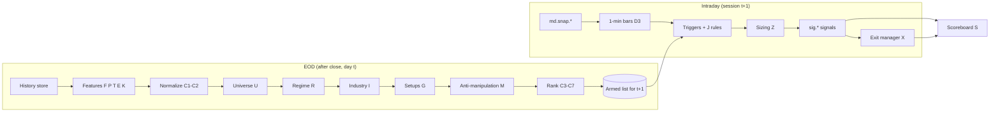
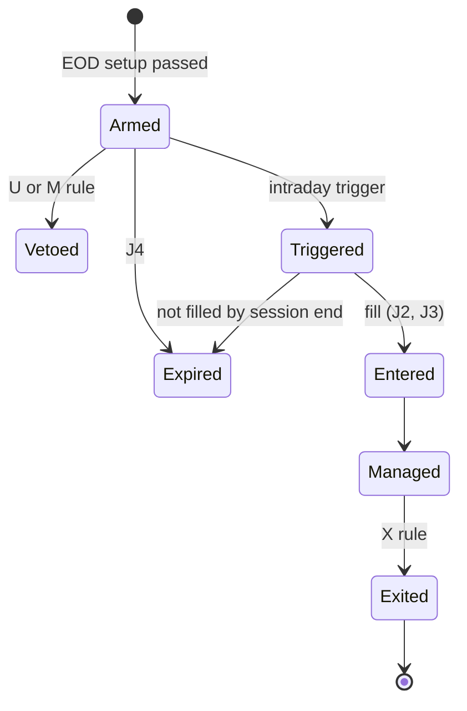

# مشخصات فنی موتور سیگنال رادار بازار

- نسخه: ۱٫۰ (پیش‌نویس برای پیاده‌سازی)
- تاریخ: ۵ مهر ۱۴۰۵
- وضعیت: در انتظار تأیید مالک محصول
- تصمیم معماری: `docs/adr/0006-signal-engine.md`
- پیکربندی پیش‌فرض: `configs/signal_engine.yaml`
- برنامه اجرا و دروازه‌ها: `docs/signal-engine-plan.md`

> این سند تعهد سودآوری نیست. همه آستانه‌ها مقادیر شروع برای کالیبراسیون‌اند و فقط پس از عبور از دروازه‌های بخش ۱۷ معتبر شمرده می‌شوند.

## ۰. هدف و دامنه

موتور سیگنال، نامزدهای معامله کوتاه‌مدت سهام را با قواعد **قطعی و قابل توضیح** شناسایی و مدیریت می‌کند. از نظر ADR-0005 جزء ردیف ۱ هوش مصنوعی است: بدون مدل آموزش‌دیده و با دلیل متنی برای هر خروجی. خروجی هر سیگنال شامل این موارد است:
- دلیل متنی
- محدوده ورود و حد ضرر
- اندازه پیشنهادی
- کارنامه زنده الگو

**در دامنه:** سهام بورس و فرابورس؛ دو راهبرد S1 (نوسان‌گیری، افق ۱۰ روز) و S2 (موج، افق ۴۰ روز)؛ بک‌تست؛ اجرای سایه؛ کارنامه زنده.

**خارج از دامنه:**
- ارسال خودکار سفارش
- صندوق‌ها به‌عنوان دارایی معامله (در این نسخه صندوق‌ها فقط ورودی رژیم بازارند)
- احتمال کالیبره با مدل آموزش‌دیده (AI-04). این نسخه فقط رابط آن را در بخش ۱۵ تعریف می‌کند.

## ۱. اصول طراحی

| کد | اصل |
| --- | --- |
| E-1 | **قاعده ۱ مخزن در همه سطوح.** ویژگی‌ای که داده لازمش ناقص است محاسبه نمی‌شود. خانواده‌ای که یکی از اعضای پیکربندی‌شده‌اش ناقص است امتیاز ندارد. الگویی که ورودی ناقص دارد «ارزیابی‌نشده» است، نه «رد» و نه «پذیرفته»، و دلیلش با کد ثبت می‌شود. هیچ صفرگذاری یا برآوردی مجاز نیست. |
| E-2 | **یک پیاده‌سازی برای هر فرمول.** همان کد Go ویژگی‌ها در تولید، بک‌تست و خروجی داده آموزشی ردیف ۲ به کار می‌رود. بازنویسی در Python ممنوع است تا ناهمخوانی آموزش و اجرا پیش نیاید. |
| E-3 | **نقطه‌ای در زمان.** هر مقدار ویژگی با `as_of` (آخرین زمان منبعِ داده مصرف‌شده) و `computed_at` ذخیره می‌شود. هیچ محاسبه‌ای داده‌ای با زمان منبع بعد از `as_of` نمی‌خواند. |
| E-4 | **هیچ آستانه‌ای در کد نیست.** همه آستانه‌ها در پیکربندی نسخه‌دار قرار دارند. `config_hash` روی هر ردیف ویژگی، سیگنال، نتیجه و گزارش آزمون ثبت می‌شود. |
| E-5 | **دلیل متنی.** هر سیگنال، وتو و خروج یک رشته `reason` فارسی دارد که از کد قواعد و مقادیر واقعی ساخته می‌شود (قاعده ۴ مخزن). |
| E-6 | **داده ساختگی ممنوع.** snapshot یا ردیفی که `IsSynthetic` است در هیچ مرحله‌ای از تولید و بک‌تست وارد نمی‌شود (قاعده ۵ مخزن). |
| E-7 | **رتبه، نه احتمال.** تا کالیبراسیون AI-04، رابط کاربری فقط رتبه نشان می‌دهد. |
| E-8 | **ردیابی الزام.** هر قاعده کد پایدار دارد (مانند U3 یا G1). این کد در توضیح کد، نام آزمون و متن دلیل می‌آید. |
| E-9 | **بدون نام یا فرمول اختصاصی رقبا** (قاعده ۶ مخزن). منشأ ایده‌ها در پیوست الف آمده و همه فرمول‌ها در همین سند منتشر شده‌اند. |

## ۲. اصطلاحات و نمادها

| نماد | تعریف |
| --- | --- |
| t | روز معاملاتی تصمیم، بر اساس تقویم تهران (`internal/tehran`) |
| τ | لحظه درون‌روزی |
| H | افق برچسب: `strategies.S1.horizon_days`، `strategies.S2.horizon_days` |
| R | فاصله قیمت ورود تا حد ضرر؛ بر حسب ریال و درصد |
| `last`، `final` | آخرین معامله (`price_last`) و قیمت پایانی (`price_close`) در قرارداد `model.Snapshot` |
| `adj_*` | قیمت تعدیل‌شده برای رویدادهای شرکتی (D4) |
| ارزش خرید حقیقی روز | `ind_buy_vol × value ÷ volume`، یعنی حجم ضرب در VWAP روز؛ همسو با ADR-0004 |
| ADV20 | میانه ارزش معاملات روزانه در ۲۰ روز معاملاتی **پیش از** t (خود روز t در آن نیست)؛ ریال |
| ATRn | میانگین دامنه واقعی n روزه با هموارسازی وایلدر روی قیمت‌های تعدیل‌شده |
| MAn | میانگین ساده n روزه `adj_final` |
| ROCn | `adj_final(t) ÷ adj_final(t−n) − 1` |
| صدک | رتبه درون‌مقطعی ۰ تا ۱۰۰ در همان روز (C1) |
| جهان نرمال‌سازی | نمادهای عبورکرده از U1، U2، U3 و U6 در روز t |
| قفل بالا / قفل پایین | همه معاملات روز یا بازه روی سقف / کف دامنه مجاز انجام شده |
| گروه محرک | گروه صنعت با محرک اقتصادی مشترک (D7)؛ ریزتر از گروه رسمی |

## ۳. معماری و خط لوله

موتور دو لایه دارد.

- **لایه پایان روز (EOD):** پس از تثبیت ارقام روز اجرا می‌شود. D-03 تأیید می‌کند جمع‌های روز پس از چه ساعتی ثابت می‌مانند. خروجی این لایه «فهرست مسلح» (armed) برای روز بعد است.
- **لایه درون‌روزی:** فقط روی نمادهای مسلح و موقعیت‌های باز کار می‌کند. ماشه‌های ورود و خروج‌های درون‌روزی را از snapshotهای `md.snap.*` ارزیابی می‌کند.

چرخه عمر هر سیگنال:

پیشنهاد جای کد (قطعی در SG-00):

| بسته | مسئولیت |
| --- | --- |
| `internal/signal/config` | بارگذاری و اعتبارسنجی پیکربندی، `config_hash` |
| `internal/signal/history` | خواندن تاریخچه روزانه نقطه‌ای در زمان |
| `internal/signal/ta` | ATR، MA، ROC و ابزارهای پایه |
| `internal/signal/features` | ویژگی‌های F، P، T، E و K |
| `internal/signal/xsec` | نرمال‌سازی صدکی و خانواده‌ها |
| `internal/signal/universe` | قواعد U |
| `internal/signal/regime` | قواعد R |
| `internal/signal/industry` | قواعد I |
| `internal/signal/patterns` | الگوهای G و قواعد M |
| `internal/signal/risk` | قواعد J، Z و X |
| `internal/signal/backtest` | قواعد L و B |
| `internal/signal/scoreboard` | قواعد S |
| `cmd/signal-eod`، `cmd/backtest` | فرمان‌های اجرایی |

## ۴. قرارداد داده

### ۴-۱. داده لازم و وضعیت فعلی

| داده | مصرف | منبع فعلی | وضعیت |
| --- | --- | --- | --- |
| snapshot درون‌روزی (قیمت، حجم، حقیقی/حقوقی) | P1 درون‌روزی، ماشه‌ها، J، X | collector فعلی روی `md.snap.*` | موجود؛ `ind_sell_count` در سورس‌آرنا تأییدنشده (D-03) |
| خروجی موتور جریان (`GameTotals`) | F4 | `internal/flow` | موجود؛ اعتبار مشروط به Q-02 |
| رخدادهای واگرایی AI-02 | M2 | `internal/anomaly` روی `ai.signal.*` | موجود |
| تاریخچه روزانه قیمت، حجم و آمار حقیقی/حقوقی، دست‌کم ۴۸۰ روز | همه ویژگی‌های EOD، بک‌تست | BrsApi یا SourceArena | نامعلوم (Q-SG1) |
| دامنه مجاز روزانه و حجم مبنا | U7، P3، J2، Z1، مدل پرشدن | نامعلوم | **حیاتی** (Q-SG2) |
| شناوری آزاد، گروه رسمی، وجود بازارگردان | U3، I، M1، M5 | نامعلوم | Q-SG3 |
| رویدادهای شرکتی و ضرایب تعدیل | D4، U4، U5، E2، X6 | نامعلوم | Q-SG4 |
| گزارش ماهانه کدال با زمان انتشار | E1، G5 | ندارد | G5 غیرفعال (Q-SG5) |
| عمق پنج‌سطحی دفتر سفارش | G4، X4 | ندارد (`book` در اندپوینت فعلی نیست) | G4 و X4 غیرفعال (Q-SG6) |
| معاملات بلوکی و توافقی | M4 | نامعلوم | M4 غیرفعال (Q-SG7) |
| صدور/ابطال و NAV صندوق‌ها | R4 | ماژول صندوق (اسپرینت ۴) | R4 غیرفعال تا آن زمان |
| نرخ ارز و بازده اوراق دولتی | R5 | ندارد | R5 غیرفعال |

### ۴-۲. جدول‌های ذخیره‌سازی (ClickHouse، `infra/clickhouse/002_signal.sql`)

همه ارقام پولی `Int64` ریال و همه زمان‌ها `DateTime64(3, 'UTC')` هستند، مطابق `001_schema.sql`.

| جدول | کلید مرتب‌سازی | ستون‌های اصلی |
| --- | --- | --- |
| `market.daily_bars` | (ins_code, day, source) | قیمت‌های باز، بیشینه، کمینه، آخرین، پایانی و دیروز؛ volume؛ value؛ trade_count؛ حجم و تعداد خرید و فروش حقیقی و حقوقی؛ `limit_up`؛ `limit_down`؛ `base_volume`؛ `ingest_time`؛ `missing` |
| `market.symbol_meta` | (ins_code, valid_from) | `industry_code`؛ `driver_group`؛ `free_float_pct`؛ `board`؛ `has_market_maker` |
| `market.corporate_events` | (ins_code, event_day, kind) | `kind` یکی از capital_increase، cash_dividend، agm، halt یا reopen؛ نسبت افزایش سرمایه یا سود نقدی هر سهم (ریال)؛ `announced_at` |
| `market.adjustments` | (ins_code, day) | `adj_factor`، `method` |
| `market.monthly_reports` | (ins_code, period, published_at) | `sales` (ریال) |
| `signal.features_daily` | (ins_code, day, feature, config_hash) | `value`، `pctile`، `as_of`، `computed_at`، `missing_reason` |
| `signal.regime_daily`، `signal.industry_daily` | (day, config_hash) | امتیاز ورودی‌ها، وضعیت رژیم، IGR گروه‌ها |
| `signal.signals` | (signal_id) | ساختار O1 |
| `signal.outcomes` | (signal_id) | روز و دلیل خروج، بازده ناخالص و خالص، مضرب R، MFE، MAE |
| `signal.trials` | (trial_id) | `config_hash`، شناسه داده، بازه، شاخص‌ها (B6) |

### ۴-۳. قواعد داده (D)

| کد | قاعده |
| --- | --- |
| D1 | **نقطه‌ای در زمان.** هر ردیف تاریخی با `ingest_time` ذخیره و فقط افزوده می‌شود؛ هیچ ردیفی بازنویسی نمی‌شود. برای داده‌ای که از گذشته پر می‌شود (backfill)، فرض می‌شود ارقام **نهایی روزانه** در پایان همان روز در دسترس بوده‌اند. این فرض برای رویدادها و گزارش‌هایی که زمان انتشار دارند مجاز نیست؛ آن‌ها فقط از `announced_at` یا `published_at` به بعد قابل مصرف‌اند. |
| D2 | **تطبیق دو منبع.** قیمت پایانی، حجم و آمار حقیقی/حقوقی روزانه بین دو منبع مقایسه می‌شود. اختلاف نسبی بیش از `data.reconcile_tolerance_pct` رخداد `SG_RECONCILE_MISMATCH` می‌سازد و آن نماد در آن روز در هیچ ویژگی‌ای مصرف نمی‌شود. تا فعال شدن `data.second_source_enabled` این قاعده «معلق» است و هر گزارش آزمون باید این را ذکر کند. |
| D3 | **بار دقیقه‌ای.** از snapshotهای معتبر (بدون رخداد کیفیت و دارای فیلدهای لازم) بارهای `data.bar_minutes` دقیقه‌ای ساخته می‌شود. دقیقه بدون snapshot معتبر «ناقص» است و در ویژگی‌های درون‌روزی شمرده نمی‌شود. |
| D4 | **تعدیل.** دو سری خام و تعدیل‌شده نگهداری می‌شود و روش تعدیل از `data.adjustment_method` می‌آید. ویژگی‌های قیمتی از سری تعدیل‌شده محاسبه می‌شوند؛ دامنه مجاز، حجم مبنا و قیمت سفارش از سری خام. |
| D5 | **دامنه مجاز و حجم مبنا.** این دو از منبع خوانده می‌شوند (`data.price_limit_source: feed`). اگر منبع تاریخی آن‌ها را ندهد، دامنه از جدول نسخه‌دار قواعد دامنه (نوع بازار × تاریخ اثر) محاسبه می‌شود (`rules_table`). روزهای استثنا، مانند بازگشایی پس از مجمع یا توقف، برای آن نماد کنار گذاشته می‌شوند. دامنه هرگز حدس زده نمی‌شود؛ نبود آن رخداد `SG_LIMIT_UNKNOWN` می‌سازد. |
| D6 | نمادهای حذف‌شده، ادغام‌شده و متوقف در تاریخچه می‌مانند (جلوگیری از سوگیری بازماندگی). |
| D7 | **صنعت دولایه.** یک لایه `industry_code` رسمی است و لایه دیگر `driver_group` از فایل نگاشت نسخه‌دار (در SG-06 ساخته می‌شود). نمونه: تفکیک اوره، متانول و پلیمر در گروه شیمیایی. عضویت با `valid_from` نقطه‌ای در زمان است. |
| D8 | بارگذار تاریخچه و بازپخش، ردیف `IsSynthetic` را رد می‌کند و رخداد `SG_SYNTHETIC_REJECTED` می‌سازد. |

**کدهای کیفیت جدید** (در همان تسک پیاده‌سازی به `docs/data-quality.md` افزوده می‌شوند):

| کد | معنا |
| --- | --- |
| `SG_RECONCILE_MISMATCH` | اختلاف دو منبع بیش از حد مجاز (D2) |
| `SG_LIMIT_UNKNOWN` | دامنه مجاز روز نامعلوم (D5) |
| `SG_HISTORY_SHORT` | تاریخچه کمتر از پنجره لازم یک ویژگی |
| `SG_THIN_CROSS_SECTION` | مقطع کمتر از حداقل؛ صدک محاسبه نمی‌شود (C1) |
| `SG_REGIME_UNKNOWN` | یکی از ورودی‌های فعال رژیم ناقص است (بخش ۶) |
| `SG_SYNTHETIC_REJECTED` | ردیف ساختگی رد شد (D8) |

## ۵. جهان معاملاتی (U)

هر قاعده حق وتو دارد. U1، U2، U3 و U6 «جهان نرمال‌سازی» را می‌سازند. U4 و U5 روی واجد شرایط بودن سیگنال اعمال می‌شوند و U7 در لحظه ماشه.

| کد | قاعده | کلید پیکربندی |
| --- | --- | --- |
| U1 | تعداد روزهای دارای معامله در `lookback_days` روز اخیر ≥ حداقل | `universe.min_trading_days` |
| U2 | صدک ADV20 در میان همه نمادهایی که در ۲۰ روز اخیر معامله داشته‌اند ≥ حداقل. آستانه صدکی است تا تورم آن را فرسوده نکند. | `universe.min_value_pctile` |
| U3 | شناوری آزاد ≥ حداقل | `universe.min_free_float_pct` |
| U4 | اگر نماد توقفی به طول دست‌کم `halt_min_days` روز داشته، دست‌کم `post_halt_cooldown_days` روز از بازگشایی گذشته باشد | `universe.halt_min_days`، `universe.post_halt_cooldown_days` |
| U5 | برای S1: هیچ مجمع، افزایش سرمایه یا توقف اعلام‌شده‌ای در این تعداد روز آینده نباشد | `universe.event_blackout_days_s1` |
| U6 | نماد در روز t رخداد کیفیت بازدارنده نداشته باشد (D2، `INCOMPLETE`، `SG_LIMIT_UNKNOWN`) | — |
| U7 | در لحظه τ: `last < limit_up` و نماد قفل بالا نیست. بدون `limit_up` این شرط «ارزیابی‌نشده» است و هیچ ورودی صادر نمی‌شود. | — |

## ۶. رژیم بازار (R)

به هر ورودی فعال یکی از سه امتیاز ‎+1، ۰ یا ‎−1 داده می‌شود. امتیاز رژیم برابر است با جمع امتیازها ÷ تعداد ورودی‌های فعال. نرمال‌سازی بر تعداد ورودی‌ها باعث می‌شود با فعال شدن R4 و R5 آستانه‌ها بازتعریف نشوند.

| کد | ورودی | تعریف دقیق | امتیاز |
| --- | --- | --- | --- |
| R1 | گستره | سهم نمادهای جهان نرمال‌سازی با `adj_final > MA50` | ≥ `up_pct`: ‎+1؛ ≤ `down_pct`: ‎−1 |
| R2 | جریان حقیقی کل بازار | برای n در {۵، ۲۰}: جمع ارزش خالص حقیقی همه نمادها در n روز ÷ جمع ADV20 همان نمادها | هر دو مثبت: ‎+1؛ هر دو منفی: ‎−1 |
| R3 | شاخص هم‌وزن | `I(t) = I(t−1) × (1 + میانگین بازده روزانه تعدیل‌شده جهان نرمال‌سازی)` | `I > MA50(I)` و شیب ۱۰ روزه MA50 مثبت: ‎+1؛ عکس هر دو: ‎−1 |
| R4 | جریان صندوق‌ها | (خالص صدور منهای ابطال واحدها × NAV، برای صندوق‌های سهامی و اهرمی) منهای همان مقدار برای صندوق‌های درآمد ثابت، در `window_days` روز ÷ دارایی صندوق‌های سهامی | بیش از `deadband_pct`: ‎+1؛ کمتر از منفی آن: ‎−1 |
| R5 | کلان | روند نرخ ارز و بازده اوراق در `window_days` روز | فقط پس از `direction_verified: true` فعال شود |

**وضعیت‌ها:**

| وضعیت | شرط | پیامد (از `regime.states`) |
| --- | --- | --- |
| مثبت (`risk_on`) | امتیاز ≥ `regime.risk_on_min_score` | حداکثر موقعیت، ریسک هر معامله و الگوهای مجاز طبق پیکربندی |
| خنثی (`neutral`) | بین دو آستانه | همان |
| منفی (`risk_off`) | امتیاز ≤ `regime.risk_off_max_score` | فقط الگوهای مجاز این وضعیت، و فقط وقتی امتیاز `requires_improving_days` روز پیاپی بهبود یافته باشد |
| نامعلوم | یکی از ورودی‌های فعال ناقص است | **بدون ورود تازه** و رخداد `SG_REGIME_UNKNOWN`. وضعیت منفی جعل نمی‌شود. |

**R6 (پسماند):** ارتقای وضعیت (منفی به خنثی، یا خنثی به مثبت) فقط پس از `regime.upgrade_confirm_days` روز پیاپی ثبت می‌شود. تنزل به منفی فوری است.

## ۷. صنعت (I)

| کد | قاعده |
| --- | --- |
| I1 | برای هر گروه محرک، سه جزء محاسبه می‌شود. **قدرت نسبی:** میانگین صدک بین‌گروهی ROC20 و ROC60 شاخص هم‌وزن گروه. **گستره:** سهم اعضای جهان نرمال‌سازی با `nrf_5d > 0` و `adj_final > MA20`. **جریان:** جمع ارزش خالص حقیقی اعضا در ۵ روز ÷ جمع ADV20 اعضا. IGR برابر میانگین صدک بین‌گروهی این سه جزء است. |
| I2 | گروه «مجاز» است اگر IGR ≥ `industry.allowed_min_igr` باشد، یا IGR در `rotation_window_days` روز دست‌کم `rotation_delta` واحد بالا رفته باشد (نشانه چرخش). |
| I3 | برای گروهی با کمتر از `industry.min_active_members` عضو در جهان نرمال‌سازی، IGR محاسبه نمی‌شود و اعضایش برای G2 و G3 واجد شرایط نیستند. این قاعده مانع می‌شود حرکت یک نماد به کل صنعت تعمیم داده شود. |
| I4 | **رهبران:** `leaders_per_group` عضو برتر از نظر ROC در `leader_rank_window_days` روز. **جامانده:** عضوی که صدک درون‌گروهی T1 آن زیر `patterns.G3.setup.laggard_max_rs_pctile_in_group` است و امتیاز خانواده جریانش رو به افزایش است. |
| I5 | شاخص گروه فقط از اعضایی ساخته می‌شود که در همان روز در جهان نرمال‌سازی هستند و عضویتشان طبق D7 نقطه‌ای در زمان معتبر است. |

## ۸. ویژگی‌ها

قواعد مشترک همه ویژگی‌ها:
- هر ویژگی فهرست «ورودی‌های لازم» دارد. نبود هر یک یعنی ویژگی ناقص است و `missing_reason` ثبت می‌شود.
- تقسیم بر صفر یا مخرج نامثبت یعنی ویژگی ناقص است، نه صفر.
- ستون «جهت» مشخص می‌کند مقدار بزرگ‌تر بهتر است یا کوچک‌تر. ویژگی‌های «کوچک‌تر بهتر» پیش از میانگین‌گیری خانواده به صورت `100 − صدک` وارونه می‌شوند.

### ۸-۱. جریان پول (F)

| کد | شناسه | تعریف | جهت | ورودی لازم |
| --- | --- | --- | --- | --- |
| F1 | `F1_nrf_5d` | ارزش خالص حقیقی روز = (`ind_buy_vol − ind_sell_vol`) × `value ÷ volume`. سپس `nrf_5d` = جمع این مقدار در روزهای معتبر پنجره `features.flow.window_days` ÷ ADV20(t). روز معتبر یعنی روزی که داده کامل دارد و با M4 حذف نشده. اگر تعداد روزهای معتبر کمتر از `features.flow.min_valid_days` باشد، ویژگی ناقص است. نسخه تک‌روزه `nrf_1d` هم با همین فرمول ساخته می‌شود و در F3 و X3 به کار می‌رود. | بزرگ‌تر | حجم خرید و فروش حقیقی، volume، value، ADV20 |
| F2 | `F2_buyer_power` | (ارزش خرید حقیقی ÷ `ind_buy_count`) ÷ (ارزش فروش حقیقی ÷ `ind_sell_count`) در روز t. برای خروجی مدل، لگاریتم آن ذخیره می‌شود. | بزرگ‌تر | همان به‌علاوه `ind_buy_count` و `ind_sell_count` بزرگ‌تر از صفر |
| F3 | `F3_flow_persistence` | تعداد روزهای معتبر پنجره که در آن‌ها `nrf_1d > 0` و `buyer_power > features.flow.persistence_buyer_power` بوده؛ عددی صحیح از ۰ تا ۵ | بزرگ‌تر | F1 و F2 روزانه |
| F4 | `F4_large_flow_rel` | جمع `NetHot + NetHotPlus` از `GameTotals` در پنجره ÷ ADV20(t). اگر `Partial` در هر روز پنجره true باشد، ناقص است. **تا `features.flow.f4_enabled: true` (پس از Q-02) عضو هیچ خانواده‌ای نیست.** | بزرگ‌تر | `GameTotals` کامل |
| F5 | `F5_ownership_shift` | خالص حجم حقیقی ÷ حجم روز. **فقط برای نمایش.** از نظر جبری هم‌ارز F1 است (خالص حقیقی = منفی خالص حقوقی)، پس در امتیاز نمی‌آید تا یک پدیده دو بار شمرده نشود. | — | همان F1 |

### ۸-۲. واکنش قیمت و حجم (P)

| کد | شناسه | تعریف | جهت | ورودی لازم |
| --- | --- | --- | --- | --- |
| P1 | `P1_rvol_day` و `rvol_slot` | **نسخه روزانه:** `volume(t)` ÷ میانه حجم ۲۰ روز پیش از t. **نسخه درون‌روزی:** حجم تجمعی تا τ ÷ میانه حجم تجمعی تا همان دقیقه در `rvol_baseline_days` روز قبل. در نسخه درون‌روزی، روزی که بار دقیقه τ آن ناقص است کنار می‌رود و اگر کمتر از `rvol_min_valid_days` روز معتبر بماند، ویژگی ناقص است. نسخه درون‌روزی نیمرخ زمانی را فراهم می‌کند که AI-01 فعلاً ندارد. | بزرگ‌تر | حجم روزانه و بارهای دقیقه‌ای |
| P2 | `P2_clv` | `((last − low) − (high − last)) ÷ (high − low)` با قیمت‌های خام همان روز. اگر `high = low` باشد، ناقص است و وضعیت قفل بالا، قفل پایین یا بی‌تحرک ثبت می‌شود. | بزرگ‌تر | last، high، low |
| P3 | `P3_last_vs_final` | `(last − final) ÷ final`. فقط وقتی `volume ≥ base_volume` است؛ در غیر این صورت ناقص است، چون قیمت پایانی زیر حجم مبنا کامل تعدیل نمی‌شود. | بزرگ‌تر | last، final، volume، `base_volume` |
| P4 | `P4_ad_rating` | جمع (`clv × volume`) ÷ جمع `volume` در `ad_window_days` روز، فقط روی روزهایی که `clv` تعریف شده. اگر روزهای تعریف‌شده کمتر از `ad_min_valid_days` باشد، ناقص است. | بزرگ‌تر | P2 روزانه، volume |
| P5 | `P5_er_5d` و `mic_class` | `er_5d = ROC5(نماد) − ROC5(شاخص هم‌وزن گروه محرک)`. طبقه ضریب اثر پول در جدول زیر آمده. **P5 عضو خانواده نیست**؛ فقط در M2، M5 و برچسب سیگنال به کار می‌رود. | — | ROC5، شاخص گروه، F1 |

| طبقه `mic_class` | شرط | کاربرد |
| --- | --- | --- |
| `absorption` (جذب) | صدک `F1_nrf_5d` ≥ ۷۰ و `er_5d ≤ 0` | وتو در M2 |
| `thin_supply` (عرضه رقیق) | صدک `F1_nrf_5d` بین ۴۰ و ۷۰ و صدک `er_5d` ≥ ۷۰ | برچسب مثبت در دلیل سیگنال |
| `no_real_flow` (حرکت بدون پول حقیقی) | صدک `er_5d` ≥ ۸۰ و `F1_nrf_5d ≤ 0` | برچسب «نیازمند بررسی»؛ در نماد دارای بازارگردان وتو (M5) |
| `neutral` | هیچ‌کدام از حالت‌های بالا | — |

### ۸-۳. روند و قدرت نسبی (T)

| کد | شناسه | تعریف | جهت | ورودی لازم |
| --- | --- | --- | --- | --- |
| T1 | `T1_rs_rating` | `Σ w_n × ROC_n` با وزن‌های `features.trend.rs_weights`، جداگانه برای S1 و S2. سپس به صدک تبدیل می‌شود. اگر تاریخچه کوتاه‌تر از بزرگ‌ترین n باشد، ناقص است و رخداد `SG_HISTORY_SHORT` ثبت می‌شود. | بزرگ‌تر | `adj_final` |
| T2 | `trend_gate` | **دروازه است، نه امتیاز.** شرط‌های S1 و S2 در زیر همین جدول آمده‌اند. | — | MAها و T1 |
| T3 | `T3_contraction` | دو جزء: `atr_ratio = ATR10 ÷ ATR50` و `vol_dryup` = میانگین حجم ۱۰ روز ÷ میانگین حجم ۵۰ روز. امتیاز T3 میانگین صدک وارونه این دو جزء است. | کوچک‌تر | ATR، حجم |
| T4 | `T4_dist_high` | برای n در `high_windows`: `adj_final ÷ max(adj_high در n روز) − 1`. امتیاز T4 میانگین صدک این دو است. | بزرگ‌تر (نزدیک‌تر به سقف) | `adj_final`، `adj_high` |

شرط‌های دروازه T2:
- **S1:** `adj_final > MA_fast > MA_slow`، و شیب MA_slow در `slope_days` روز ≥ ۰.
- **S2 (قالب روند بومی):** `adj_final` بالاتر از MA_mid و MA_long؛ ترتیب `MA_short > MA_mid > MA_long`؛ MA_long در `long_slope_days` روز صعودی؛ قیمت دست‌کم `min_above_low_pct` درصد بالاتر از کف `range_days` روزه؛ حداکثر `max_below_high_pct` درصد پایین‌تر از سقف همان بازه؛ صدک T1 ≥ `min_rs_pctile`.

### ۸-۴. رویداد (E) و ریسک (K)

| کد | شناسه | تعریف | ورودی لازم |
| --- | --- | --- | --- |
| E1 | `E1_sales_surprise` | دو جزء: `mom = sales_m ÷ میانگین(sales_{m−1..m−3}) − 1` و `yoy = sales_m ÷ sales_{m−12} − 1`. امتیاز، میانگین صدک این دو است. مقدار فقط از `published_at` به بعد و تا انتشار گزارش بعدی معتبر است. | گزارش‌های ماهانه با مخرج مثبت |
| E2 | `event_calendar` | روزهای معاملاتی مانده تا مجمع، افزایش سرمایه و توقف اعلام‌شده. فقط رویدادهایی به کار می‌روند که `announced_at` آن‌ها پیش از `as_of` است. | `corporate_events` |
| E3 | `pe_rel` | فقط برای S2: P/E نسبت به میانه سه‌ساله خود سهم و نسبت به بازده اوراق. تا تأمین منبع بنیادی، `features.event.e3_enabled: false`. | منبع بنیادی |
| K1 | `atr_pct` و `down_lock_days` | `ATR14 ÷ adj_final`؛ و تعداد روزهای قفل پایین در ۶۰ روز اخیر | ATR، `limit_down` |

## ۹. نرمال‌سازی و ترکیب (C)

| کد | قاعده |
| --- | --- |
| C1 | **صدک:** `pct = 100 × (rank − 1) ÷ (N − 1)`، با رتبه میانگین برای مقادیر برابر. فقط روی نمادهای جهان نرمال‌سازی که مقدار دارند محاسبه می‌شود. اگر N کمتر از `normalization.min_cross_section` باشد، آن روز صدکی محاسبه نمی‌شود و رخداد `SG_THIN_CROSS_SECTION` ثبت می‌شود. بریدن دنباله‌ها (`winsor_pct`) فقط روی جمع‌های خام (مانند جریان گروه) و خروجی مدل اعمال می‌شود؛ روی صدک اثری ندارد. |
| C2 | **خانواده:** امتیاز هر خانواده میانگین صدک اعضای فهرست‌شده در `combine.families` است. اگر هر عضوی ناقص باشد، خانواده ناقص است (E-1). اعضای خانواده با `config_hash` ثابت می‌مانند؛ افزودن F4 یعنی نسخه جدید پیکربندی. |
| C3 | **واجد شرایط بودن:** هر خانواده در `combine.required_families` باید ≥ `combine.family_min_pctile` باشد (شرط «و»، نه جمع)، دروازه T2 راهبرد برقرار باشد و شرایط آمادگی یک الگو برقرار باشد. |
| C4 | **رتبه‌بندی:** میانگین هندسی امتیاز خانواده‌های لازم، با کف ۱ برای هر امتیاز. میانگین هندسی خانواده ضعیف را جریمه می‌کند و اجازه جبران نمی‌دهد. |
| C5 | **قاعده امید ریاضی:** اگر `combine.ev_rule.enabled` باشد (فقط پس از AI-04)، امید خالص = `p·W − (1−p)·L − هزینه`، که W میانگین سود و L میانگین زیان است. سیگنال فقط وقتی مجاز است که امید خالص ≥ `min_net_pct` راهبرد باشد. |
| C6 | **سقف روزانه:** تعداد سیگنال‌های مسلح هر روز را `max_positions` وضعیت رژیم (منهای موقعیت‌های باز) محدود می‌کند. در تساوی رتبه، ADV20 بزرگ‌تر مقدم است. |
| C7 | حداکثر `combine.max_per_driver_group` سیگنال مسلح یا موقعیت باز در هر گروه محرک. |

## ۱۰. الگوها (G)

- شرایط آمادگی در پایان روز t ارزیابی می‌شوند و ماشه در جلسه t+1.
- سطح شکست L در سری تعدیل‌شده محاسبه، سپس به ریال خام روز t+1 تبدیل و به گام قیمت معتبر گرد می‌شود.
- هر الگو فقط وقتی اجرا می‌شود که `enabled` باشد، راهبردش فعال باشد و در فهرست الگوهای وضعیت رژیم باشد.

| کد | الگو | شرایط آمادگی (EOD روز t) | ماشه (درون‌روزی t+1) | پیش‌نیاز |
| --- | --- | --- | --- | --- |
| G1 | انباشت و شکست | T2 برقرار (S1)؛ صدک P4 ≥ `ad_min_pctile`؛ F3 ≥ `persistence_min`؛ `atr_ratio ≤ atr_ratio_max`؛ `vol_dryup ≤ vol_dryup_max`؛ ROC5 کمتر از `ret_5d_max_pct` درصد؛ C3 | L = بیشینه `adj_high` در `level_days` روز تا t. ماشه: `last > L`؛ `last > final` تا τ؛ `rvol_slot ≥ rvol_slot_min`؛ `mic_class(t) ≠ absorption`؛ U7 | — |
| G2 | شکست همراه صنعت | گروه مجاز (I2) با IGR ≥ `igr_min`؛ صدک T1 ≥ `rs_min_pctile`؛ T2؛ C3 | L = بیشینه ۶۰ روزه. ماشه: `last > L`؛ `rvol_slot ≥ rvol_slot_min`؛ CLV جلسه تا τ ≥ `clv_min`؛ قیمت ورود ≤ `L + max_entry_above_level_atr × ATR14`؛ U7 | I1 تا I3 |
| G3 | جامانده گروه پیشرو | IGR ≥ `igr_min`؛ میانگین ROC10 رهبران ≥ `leaders_ret_10d_min_pct`؛ برچسب جامانده (I4)؛ `adj_final > MA50`؛ خانواده جریان ≥ `flow_min_pctile` و `flow_rising_days` روز پیاپی رو به افزایش | `last > final` تا τ؛ `last` بالاتر از بیشینه روز t؛ U7 | D7، I4 |
| G4 | چرخش از صف فروش | دست‌کم `down_lock_days_min` روز قفل پایین در `down_lock_window_days` روز، **یا** ROC در `drawdown_days` روز ≤ منفی `drawdown_pct` درصد | حجم صف فروش در τ ≤ `queue_shrink_max_ratio` × حجم صف در همان دقیقه روز قبل، یا صف کاملاً جمع شده؛ قدرت خریدار تا τ ≥ `buyer_power_min`؛ `last > final`؛ CLV تا τ ≥ `clv_min`؛ U7 | دفتر سفارش (Q-SG6) |
| G5 | واکنش به رویداد | صدک E1 ≥ `surprise_min_pctile`؛ انتشار حداکثر `max_days_since_publish` روز پیش؛ صدک F1 ≥ `flow_nrf_min_pctile` | نخستین بار دقیقه‌ای پس از بازه J1 که در آن U7 برقرار است | کدال (Q-SG5)، S2 |

**رفتار الگو در بک‌تست حالت EOD (B1):** فقط شرط **قیمتی** ماشه اعمال می‌شود (عبور `high(t+1)` از L). شرط‌های RVOL درون‌روزی، «آخرین بالاتر از پایانی» و CLV جلسه فقط درون روز قابل دانستن‌اند. اعمال آن‌ها با ارقام پایان روز t+1 یعنی تصمیم در لحظه عبور از L با اطلاعاتی که هنوز وجود نداشته، که سوگیری نگاه به آینده است. اثر این شرط‌ها فقط در حالت بازپخش (B1) سنجیده می‌شود. استثنا: در G2، شرط «ورود ≤ L + ۱ ATR» در باز شدن بازار قابل دانستن است و اعمال می‌شود؛ اگر `open(t+1)` بالاتر از آن باشد، معامله‌ای انجام نمی‌شود.

## ۱۱. ضدفریب (M)

| کد | قاعده | اقدام |
| --- | --- | --- |
| M1 | شناوری کمتر از `free_float_max_pct`، و `P1_rvol_day ≥ rvol_day_min`، و بازده ۳ روزه ≥ `ret_3d_min_pct` درصد. آستانه شناوری بالاتر از U3 است، چون نمادهای زیر ۱۵٪ از قبل حذف شده‌اند. | وتو |
| M2 | `mic_class = absorption`، **یا** دست‌کم `ai02_absorption_min` رخداد AI-02 از نوع `absorption` در `ai02_window_days` روز اخیر | وتو |
| M3 | **توزیع پنهان:** `ind_sell_count(t) ≥ seller_count_growth_min` × میانگین `seller_baseline_days` روز قبل، و `buyer_power ≥ buyer_power_min`، و `last < final` در `weak_days` روز پیاپی تا t. یعنی تعداد فروشندگان خرد بالا می‌رود، خریداران درشت دیده می‌شوند و قیمت ضعیف است. | وتو |
| M4 | اگر سهم معاملات بلوکی یا توافقی از ارزش روز بیش از `block_share_max_pct` درصد باشد، آن روز از F1، F3 و F4 حذف می‌شود. تا تأمین داده (Q-SG7) معلق است. | حذف روز |
| M5 | در نماد دارای بازارگردان، `mic_class = no_real_flow` وتو است (نه فقط «بررسی»). | وتو |
| M6 | **ازدحام هشدارهای خود پلتفرم.** اگر پلتفرم در `alert_window_min` دقیقه اخیر هشداری عمومی برای نماد منتشر کرده (رخداد جریان، AI-01، AI-02 یا سیگنال SG) و قیمت از آن لحظه بیش از `max_move_atr × ATR14` حرکت کرده، ورود فقط در پولبک مجاز است: قیمت ≤ قیمت لحظه هشدار + `pullback_atr × ATR14`. خوراک هشدار منابع بیرونی استفاده نمی‌شود (قاعده ۶ مخزن). | ورود مشروط |

قاعده «سردشدن پس از بازگشایی» که در نسخه گفت‌وگو M7 بود، در U4 ادغام شد.

## ۱۲. اجرا (J) و اندازه موقعیت (Z)

| کد | قاعده |
| --- | --- |
| J1 | در `session.no_entry_first_min` دقیقه نخست و `session.no_entry_last_min` دقیقه پایانی جلسه ورود انجام نمی‌شود. |
| J2 | قیمت سفارش محدود = `min(L + execution.limit_ceiling_atr × ATR14, limit_up − یک گام قیمت)`. اگر `last ≥ limit_up` (صف خرید)، خریدی انجام نمی‌شود. بدون `limit_up`، ورود ارزیابی‌نشده است. |
| J3 | **ورود دومرحله‌ای** به نسبت `execution.tranche_split`. مرحله دوم در جلسه t+2 انجام می‌شود، فقط اگر `final(t+1) > L` بوده و در τ داشته باشیم `last > final(t+1)`. در غیر این صورت موقعیت با همان مرحله اول می‌ماند. |
| J4 | سیگنال مسلح در پایان روز `armed_expiry_days` منقضی می‌شود. سیگنال ماشه‌خورده‌ای که پر نشده، در پایان همان جلسه منقضی می‌شود. |

**Z1، اندازه موقعیت.** محاسبه میانی با float64 است و خروجی نهایی تعداد سهم int64:

| نماد | تعریف |
| --- | --- |
| C | سرمایه معاملاتی (ورودی کاربر در رابط؛ در بک‌تست از پیکربندی آزمون) |
| r | `risk_per_trade_pct` وضعیت رژیم |
| d | `(entry − stop) ÷ entry` |
| g | `sizing.gap_days` × درصد دامنه منفی مجاز نماد (از D5) |
| Q_risk | `r × C ÷ d` |
| Q_tail | `sizing.risk_tail_pct × C ÷ g` |
| Q_liq | `sizing.liquidity_cap_adv_pct × ADV20` |
| Q | `min(Q_risk, Q_tail, Q_liq) × size_mult(الگو) × size_mult(رژیم)` |

تعداد سهم = `floor(Q ÷ entry)`. قید تعیین‌کننده (`risk`، `tail` یا `liquidity`) در سیگنال ثبت می‌شود.

| کد | قاعده |
| --- | --- |
| Z2 | ریسک باز کل پورتفوی (جمع `d ×` ارزش موقعیت‌ها) ≤ `sizing.max_open_risk_pct` از C. سرمایه درگیر در هر گروه محرک ≤ `sizing.max_group_capital_pct`. |
| Z3 | اگر ارزش Q کمتر از `sizing.min_order_value_rial` باشد، سیگنالی صادر نمی‌شود و دلیل ثبت می‌شود (مقدار صفر یعنی غیرفعال). |

## ۱۳. خروج (X)

| کد | قاعده |
| --- | --- |
| X1 | **حد ضرر ساختاری.** stop = کمینه `adj_low` در `exits.stop_lookback_days` روز تا t، منهای یک گام قیمت، تبدیل‌شده به ریال خام. اگر `entry − stop > exits.max_stop_atr × ATR14`، معامله‌ای انجام نمی‌شود. اجرای حد ضرر درون‌روزی است؛ در قفل پایین، سفارش تا نخستین لحظه قابل اجرا می‌ماند (L4). |
| X2 | **حد زمانی.** اگر پس از `time_stop_days` روز، بیشترین سود شناور (MFE) کمتر از `time_stop_min_r` × R باشد، خروج در نخستین فرصت. |
| X3 | **برگشت جریان.** اگر در `flow_reversal.days` روز پیاپی `nrf_1d < 0` و `buyer_power < buyer_power_max` و `last < final` باشد، نیمی از موقعیت در جلسه بعد فروخته می‌شود؛ اگر روز بعد هم برقرار بود، بقیه. |
| X4 | **فروپاشی صف خرید.** نماد موقعیت قفل بالاست و حجم صف خرید در τ کمتر از `queue_collapse_ratio` × بیشینه صف همان جلسه شده: فروش در صف. به دفتر سفارش نیاز دارد و تا Q-SG6 غیرفعال است. |
| X5 | **سود پله‌ای.** در `partial_at_r` × R، سهم `partial_fraction` از موقعیت فروخته و حد ضرر به نقطه سربه‌سر منتقل می‌شود. باقی‌مانده وقتی بسته می‌شود که `final < MA(trail_ma)` یا `last` کمتر از بالاترین قیمت از زمان ورود منهای `trail_atr × ATR14` شود. |
| X6 | **رویداد.** در S1، خروج کامل در آخرین جلسه پیش از مجمع، توقف اعلام‌شده یا تاریخ ثبت افزایش سرمایه. |
| X7 | **رژیم.** با تنزل به منفی: موقعیت‌های با سود شناور کمتر از `regime_off_min_r` × R در جلسه بعد بسته می‌شوند و حد ضرر بقیه به `max(stop, سربه‌سر)` می‌رود. |
| X8 | **داده ناقص.** اگر نماد موقعیت باز رخداد کیفیت بگیرد، هیچ اقدام خودکاری انجام نمی‌شود. موقعیت برچسب `needs_review` و هشدار می‌گیرد، چون تصمیم روی داده خراب ممنوع است (E-1). |

**ترتیب اولویت** وقتی چند قاعده هم‌زمان فعال می‌شوند: X1، سپس X7، X6، X3، X4، X2 و در پایان X5.

## ۱۴. برچسب‌گذاری (L) و بک‌تست (B)

دو سنجه جدا گزارش می‌شوند:
- **برچسب سیگنال (L):** کیفیت خود سیگنال با روش سه‌مانعی. مبنای رتبه‌بندی و آموزش AI-04 است.
- **نتیجه راهبرد:** اجرای کامل قواعد J، Z و X.

| کد | قاعده |
| --- | --- |
| L1 | قیمت ورود از مدل پرشدن سفارش (B2) می‌آید، نه از قیمت پایانی روز سیگنال. |
| L2 | موانع: بالا `entry + labeling.target_r × R`، پایین `entry − labeling.stop_r × R`، زمان H روز. اگر در دوره نگهداری رویداد شرکتی رخ دهد، موانع با ضریب تعدیل جابه‌جا می‌شوند. |
| L3 | اگر هر دو مانع در یک روز لمس شوند، برخورد با مانع پایین فرض می‌شود (`both_hit_same_day: stop_first`). |
| L4 | در روزهای قفل پایین، خروج در نخستین قیمت قابل اجرا ثبت می‌شود. زیان واقعی ممکن است از ۱R بیشتر شود و همین عدد ثبت می‌شود. |
| L5 | بازده خالص = بازده ناخالص − `costs.buy_pct` − `costs.sell_pct` − لغزش در هر دو طرف. مضرب R هم خالص ثبت می‌شود. |
| L6 | برای هر سیگنال ثبت می‌شود: MFE، MAE، روزهای نگهداری، دلیل خروج (کد X یا مانع L). |

| کد | قاعده |
| --- | --- |
| B1 | **دو حالت آزمون.** **حالت EOD** روی تاریخچه روزانه اجرا می‌شود تا توان آماری داشته باشد؛ فقط ماشه قیمتی دارد (بخش ۱۰). **حالت بازپخش** روی ضبط‌های R-01 اجرا می‌شود و ماشه کامل درون‌روزی دارد. عبور از دروازه‌ها به هر دو نیاز دارد. حالت بازپخش همچنین نشان می‌دهد فرض پرشدن در حالت EOD خوش‌بینانه است یا نه. |
| B2 | **پرشدن خرید.** در حالت EOD: اگر `open(t+1) ≥ limit_up`، پر نمی‌شود. اگر `high(t+1) ≤ L`، ماشه نخورده. در غیر این صورت قیمت پرشدن = `max(open, L) × (1 + slippage)`. در حالت بازپخش: نخستین بار دقیقه‌ای که ماشه در آن برقرار است، با `last` آن بار ضرب در (۱ + لغزش)، به شرط U7. |
| B3 | **پرشدن فروش.** اگر قیمت با شکاف زیر حد ضرر باز شود، `min(open, stop)`. در قفل پایین پر نمی‌شود و به روز بعد منتقل می‌شود. |
| B4 | **آزمون پیش‌رونده:** `backtest.train_months` ماه آموزش (کالیبراسیون آستانه‌ها) و `backtest.test_months` ماه آزمون، به‌صورت غلتان. بین این دو، فاصله‌ای برابر H روز حذف می‌شود (embargo). |
| B5 | `backtest.holdout_months` ماه آخر داده تا زمان ارزیابی دروازه SG-G1 دست‌نخورده می‌ماند و فقط یک بار اجرا می‌شود. |
| B6 | **ثبت آزمون‌ها.** هر اجرا با `config_hash`، شناسه داده، بازه و شاخص‌ها در `signal.trials` ثبت می‌شود. گزارش باید تعداد کل پیکربندی‌های آزموده را نشان دهد تا اثر آزمون‌های متعدد قابل داوری باشد. |
| B7 | **خط پایه.** در هر دوره، N نماد برتر بر اساس میانگین صدک T1 و `P1_rvol_day` انتخاب و با همان قواعد J، Z و X معامله می‌شوند. هر الگو باید بیرون از نمونه از خط پایه بهتر باشد. |
| B8 | **آزمون حذف.** هر خانواده به نوبت از C3 حذف می‌شود. خانواده فقط وقتی می‌ماند که حذفش امید خالص بیرون از نمونه را کاهش دهد. |
| B9 | همه شاخص‌ها به تفکیک وضعیت رژیم (مثبت، خنثی، منفی) گزارش می‌شوند. |
| B10 | **شاخص‌ها.** سطح سیگنال: نرخ برخورد با مانع بالا، میانگین R خالص، امید خالص بر حسب R، درصد سیگنال‌های غیرقابل اجرا. سطح پورتفوی: بازده **مازاد بر بازده صندوق‌های درآمد ثابت** (`backtest.benchmark`)، بیشینه افت، گردش، درصد زمان در بازار. بازده اسمی به‌تنهایی در اقتصاد تورمی معیار پذیرش نیست. |
| B11 | بارگذار آزمون داده ساختگی را رد می‌کند (D8) و آزمون واحد این رفتار را پوشش می‌دهد. |

## ۱۵. کارنامه زنده (S) و رابط ردیف ۲

| کد | قاعده |
| --- | --- |
| S1 | برای هر ترکیب الگو و راهبرد، پنجره غلتان `scoreboard.window_signals` سیگنال بسته‌شده اخیر نگهداری می‌شود. |
| S2 | **وضعیت الگو.** «در حال ارزیابی» تا پر شدن پنجره؛ سپس «فعال» یا «معلق». |
| S3 | **تعلیق خودکار.** الگو معلق می‌شود اگر امید خالص پنجره کمتر از `suspend_expectancy_r_below` باشد، یا `z = (میانگین زنده − میانگین بک‌تست) ÷ (انحراف معیار بک‌تست ÷ √n)` کمتر از `suspend_z_below` شود. |
| S4 | **بازگشت.** الگوی معلق پس از `reactivate_paper_signals` سیگنال سایه با امید خالص مثبت دوباره فعال می‌شود. |
| S5 | الگوی معلق در حالت سایه اجرا می‌ماند: سیگنال‌ها ثبت می‌شوند ولی نمایش داده نمی‌شوند. |
| S6 | **رابط AI-04.** ردیف‌های `signal.features_daily` و برچسب‌های L برای Python صادر می‌شوند (قالب در SG-12). مدل برای هر سیگنال مسلح p و بازه عدم‌قطعیت برمی‌گرداند. C5 و نمایش احتمال (O2) فقط پس از دوره سایه ADR-0005 و آزمون کالیبراسیون (دروازه SG-G3) فعال می‌شوند. |

## ۱۶. خروجی (O)

**O1، ساختار سیگنال** (موضوع `sig.signal.<ins_code>`؛ ثبت در `contracts/subjects.md` در تسک SG-09):

| فیلد | نوع | توضیح |
| --- | --- | --- |
| `signal_id` | string | شناسه یکتا و پایدار |
| `ins_code`، `symbol` | string | |
| `strategy`، `pattern` | string | مثلاً S1 و G1 |
| `state` | string | یکی از armed، triggered، entered، managed، exited، expired، vetoed |
| `regime` | string | وضعیت رژیم و امتیاز آن در روز t |
| `driver_group`، `igr_pctile` | string، float | |
| `families` | object | صدک خانواده‌های flow، reaction، trend و event |
| `rank` | float | خروجی C4 |
| `mic_class` | string | |
| `level`، `limit_price`، `stop` | int64 | ریال |
| `targets_r` | array | برای نمونه [1, 2] |
| `size` | object | درصد ریسک، سقف نقدشوندگی (ریال)، قید تعیین‌کننده |
| `vetoes`، `flags` | array | کد قواعد |
| `pattern_stats` | object | n، نرخ برخورد، امید خالص R، وضعیت S2، زمان به‌روزرسانی |
| `reason` | string | متن فارسی (O3) |
| `as_of`، `created_at` | time | |
| `config_hash` | string | |

| کد | قاعده |
| --- | --- |
| O2 | تا `output.show_probability: true`، رابط فقط رتبه و کارنامه الگو نشان می‌دهد، نه «احتمال موفقیت». |
| O3 | **متن دلیل** از کد قواعد و مقادیر واقعی ساخته می‌شود. نمونه: «الگوی G1 (انباشت و شکست): جریان حقیقی ۵ روزه در صدک ۸۴، پایداری ۴ از ۵ روز، انقباض نوسان ۰٫۶۸؛ عبور از سقف ۲۰ روزه ۱۲٬۳۴۰ ریال با حجم نسبی ۲٫۱؛ رژیم بازار: مثبت. کارنامه الگو: ۴۲ سیگنال، امید خالص ۰٫۳۱R.» |
| O4 | **نزدیک‌به‌سیگنال:** نمادی که همه خانواده‌هایش ≥ `output.near_miss_min_family_pctile` است ولی با یک قاعده وتو شده، همراه با کد قاعده نمایش داده می‌شود. این شفافیت بخشی از ارزش محصول است. |
| O5 | تا `output.publish_to_users: true` همه خروجی‌ها فقط سایه‌اند. شرط فعال‌سازی: عبور از SG-G2، پاسخ استعلام حقوقی (O-4)، و تأیید مالک محصول. |

## ۱۷. دروازه‌های پذیرش

| دروازه | معیار عبور |
| --- | --- |
| SG-G0 (داده) | ماتریس دسترس‌پذیری داده (SG-01) تأیید شده باشد. دست‌کم `data.history_min_days` روز تاریخچه برای ۹۰٪ نمادهای جهان نرمال‌سازی موجود باشد. همه قواعد D با آزمون واحد پیاده شده و کدهای کیفیت SG در `docs/data-quality.md` ثبت شده باشند. |
| SG-G1 (بک‌تست) | **الف.** امید خالص بیرون از نمونه برای G1 و G2 در دست‌کم دو وضعیت از سه وضعیت رژیم مثبت باشد. **ب.** بازده مازاد دهک برتر رتبه C4 نسبت به کل جهان، در دست‌کم ۶۰٪ دوره‌های آزمون مثبت باشد. **پ.** برتری بر خط پایه B7. **ت.** هر خانواده از آزمون حذف B8 عبور کند. **ث.** نتیجه دوره نگهداشت B5 در محدوده دوره‌های آزمون باشد. **ج.** تأیید `quant-reviewer`. |
| SG-G2 (سایه به کاربر) | **الف.** دست‌کم ۴۰ روز معاملاتی اجرای سایه (بیش از حداقل ۲۰ روز ADR-0005). **ب.** میانه اختلاف قیمت پرشدن بازپخش و EOD ≤ ۰٫۵٪. **پ.** شاخص‌های S درون محدوده بک‌تست. **ت.** پاسخ حقوقی O-4 درباره انتشار سیگنال خرید برای مشترکان. **ث.** تأیید مالک محصول. |
| SG-G3 (نمایش احتمال) | AI-04 دوره سایه ADR-0005 را گذرانده و در آزمون کالیبراسیون، اختلاف احتمال پیش‌بینی‌شده و فراوانی واقعی در هر دهک حداکثر ۵ واحد درصد باشد. |

## ۱۸. مسائل باز

| کد | پرسش | اگر پاسخ منفی باشد |
| --- | --- | --- |
| Q-SG1 | آیا BrsApi یا SourceArena تاریخچه روزانه قیمت و آمار حقیقی/حقوقی دست‌کم دوساله می‌دهند؟ | بک‌تست EOD ممکن نیست؛ منبع تاریخی دیگر یا خرید داده لازم است. |
| Q-SG2 | آیا دامنه مجاز روزانه و حجم مبنا (فعلی و تاریخی) در دسترس است؟ | جدول نسخه‌دار قواعد دامنه (D5)؛ P3 بدون حجم مبنا ناقص می‌ماند و خانواده واکنش باید بازتعریف شود. |
| Q-SG3 | شناوری آزاد، گروه رسمی و فهرست بازارگردان‌ها با تاریخچه تغییرات؟ | U3، M1 و M5 تا تأمین منبع معلق می‌مانند. |
| Q-SG4 | رویدادهای شرکتی با زمان اعلام؟ | تعدیل از منبع قیمت تعدیل‌شده؛ U5 و X6 معلق. |
| Q-SG5 | گزارش‌های ماهانه کدال با زمان انتشار؟ | E1 و G5 غیرفعال می‌مانند. |
| Q-SG6 | منبع عمق دفتر سفارش؟ | G4 و X4 غیرفعال می‌مانند. |
| Q-SG7 | شناسایی معاملات بلوکی و توافقی؟ | M4 معلق. |
| Q-SG8 | نرخ کارمزد جاری و ساعت جلسه معاملاتی؟ | اعداد `costs` و `session` فرض‌اند و گزارش آزمون باید این را ذکر کند. |
| Q-SG9 | نگاشت به شناسه‌های PRD (برای نمونه H-04 تا H-09 «شکار سهام») و نام محصول (O-5)؟ | این سند با شناسه‌های SG پیش می‌رود. |
| Q-SG10 | آیا انتشار سیگنال خرید برای مشترکان به مجوز مشاوره سرمایه‌گذاری نیاز دارد؟ (بخشی از O-4) | `output.publish_to_users` خاموش می‌ماند. |

## پیوست الف: منشأ طراحی

| منبع الهام | منطق هسته | جای آن در این سند |
| --- | --- | --- |
| رتبه‌بندی قدرت نسبی و گروه صنعت (سبک CAN SLIM) | صدک بازده با وزن بیشتر برای افق نزدیک؛ رتبه گروه؛ رتبه انباشت/توزیع | T1، I1، P4 |
| قالب روند و انقباض نوسان (سبک مینروینی) | روند به‌عنوان شرط سخت؛ خشک‌شدن حجم پیش از شکست | T2، T3، G1 |
| رتبه فنی چندافقی (سبک SCTR) | ترکیب چند افق و رتبه‌بندی درون‌مقطعی | T1، C1 |
| رتبه بازنگری سود | غافلگیری و بازنگری سود | E1 (معادل بومی: گزارش ماهانه) |
| اسکنرهای درون‌روزی | حجم نسبی هم‌ساعت؛ آمار زنده هر راهبرد و خاموش‌سازی | P1، S |
| وایکاف و شاخص‌های قیمت-حجم | انباشت یعنی حجم همراه با بسته‌شدن در بالای دامنه | P2، P4 |
| تحلیل جریان سفارش | جذب: حجم بدون پیشرفت قیمت | P5، M2، AI-02 |
| محور رویدادی | کاتالیزور، جهش و حجم | G5 |
| فیلترهای رایج دیده‌بان | قدرت خریدار حقیقی، حجم غیرعادی، ورود پول حقیقی | F1 تا F3، با نرمال‌سازی و شرط پایداری |

آنچه عمداً کنار گذاشته شد: رأی‌شماری اندیکاتورها (یک پدیده را چند بار می‌شمارد)، آستانه‌های مطلق ریالی (در تورم فرسوده می‌شوند)، و سیگنال تک‌روزه بدون شرط پایداری.

## پیوست ب: اصلاحات نسبت به نسخه گفت‌وگو

1. F5 از امتیاز حذف شد، چون از نظر جبری هم‌ارز F1 است.
2. آستانه شناوری M1 به ۲۵٪ رسید، چون U3 نمادهای زیر ۱۵٪ را از قبل حذف می‌کند و آستانه قبلی عملاً هرگز فعال نمی‌شد.
3. M7 در U4 ادغام شد.
4. بریدن دنباله‌ها روی صدک اثری ندارد؛ فقط به جمع‌های خام و خروجی مدل محدود شد.
5. امتیاز رژیم بر تعداد ورودی‌های فعال نرمال شد، و وضعیت «نامعلوم» جای جعل وضعیت منفی را گرفت.
6. حالت EOD بک‌تست فقط ماشه قیمتی دارد تا سوگیری نگاه به آینده پیش نیاید.
7. G3 یک ماشه قیمتی صریح گرفت (عبور از بیشینه روز قبل).
8. معیار پذیرش به بازده مازاد بر صندوق‌های درآمد ثابت تغییر کرد.
9. M6 به هشدارهای خود پلتفرم محدود شد (قاعده ۶ مخزن).
10. قواعد وابسته به دفتر سفارش (G4 و X4) تا تأمین منبع غیرفعال شدند.
11. هرجا نسخه گفت‌وگو صفر یا مقدار پیش‌فرض می‌گذاشت (CLV در `high = low`، روزهای حذف‌شده M4)، اکنون مقدار «ناقص» است (قاعده ۱ مخزن).
