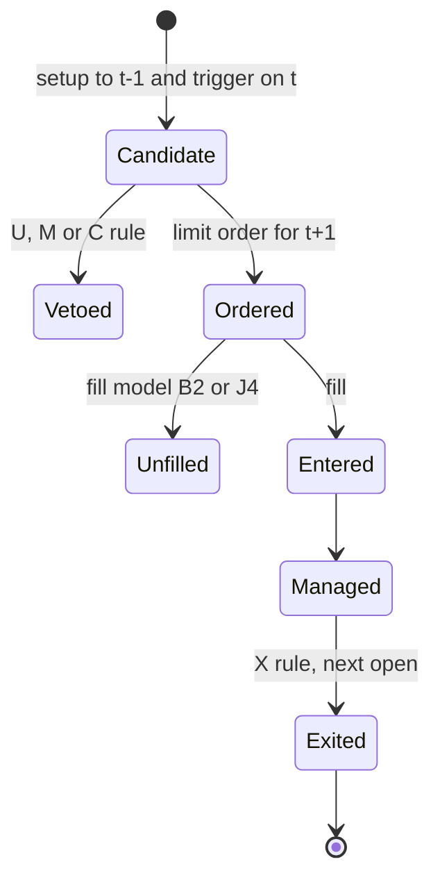

# مشخصات فنی «رادار جهش v1» (موتور سیگنال، وظیفه SM-02)

- نسخه: ۱٫۱ (پیش‌نویس برای پیاده‌سازی)
- تاریخ: ۶ مهر ۱۴۰۵ (نسخه ۱٫۰: ۵ مهر ۱۴۰۵)
- وضعیت: در انتظار تأیید مالک محصول
- تصمیم معماری: `docs/adr/0007-signal-engine.md`
- پیکربندی پیش‌فرض: `configs/signal_engine.yaml` (نسخه 1.1.0)
- وظایف، ترتیب و دروازه‌ها: `docs/sprint3-plan.md` (DL-03، TA-01، SM-01، SM-02، DL-02، UI-02، G-3)
- تغییرات نسبت به نسخه ۱٫۰: پیوست ب-۲

> این سند تعهد سودآوری نیست. همه آستانه‌ها مقادیر شروع برای کالیبراسیون‌اند و فقط پس از عبور از دروازه‌های بخش ۱۷ معتبر شمرده می‌شوند.

## ۰. هدف و دامنه

«رادار جهش v1» همان وظیفه SM-02 اسپرینت ۳ است (تصمیم مالک، ۶ مهر ۱۴۰۵). این موتور نامزدهای معامله کوتاه‌مدت سهام را با قواعد **قطعی و قابل توضیح** شناسایی و مدیریت می‌کند. از نظر ADR-0005 جزء ردیف ۱ هوش مصنوعی است: بدون مدل آموزش‌دیده و با دلیل متنی برای هر خروجی. خروجی هر سیگنال شامل این موارد است:
- دلیل متنی
- سقف قیمت سفارش و حد ضرر
- اندازه پیشنهادی
- کارنامه زنده الگو

**نسخه ۱ فقط پایان روز (EOD) است.** سیگنال پس از بسته شدن بازار در روز t ساخته می‌شود و سفارش محدود برای جلسه t+1 است. تولید و بک‌تست همان قواعد را روی همان داده روزانه اجرا می‌کنند (E-10).

**در دامنه:** سهام بورس و فرابورس؛ راهبرد S1 (نوسان‌گیری، افق ۱۰ روز، افق اصلی) و S2 (موج، افق ۴۰ روز، غیرفعال)؛ بک‌تست (DL-02)؛ اجرای کاغذی روی داده زنده پایان روز؛ کارنامه زنده.

**خارج از دامنه:**
- ارسال خودکار سفارش
- صندوق‌ها به‌عنوان دارایی معامله (در این نسخه صندوق‌ها فقط ورودی رژیم و معیار مقایسه‌اند)
- احتمال کالیبره با مدل آموزش‌دیده (AI-04). این نسخه فقط رابط آن را در بخش ۱۵ تعریف می‌کند.
- هر قاعده درون‌روزی. این قواعد به برنامه داده پربسامد منتقل شده‌اند (بخش ۱۹).

## ۱. اصول طراحی

| کد | اصل |
| --- | --- |
| E-1 | **قاعده ۱ مخزن در همه سطوح.** ویژگی‌ای که داده لازمش ناقص است محاسبه نمی‌شود. خانواده‌ای که یکی از اعضای پیکربندی‌شده‌اش ناقص است امتیاز ندارد. الگویی که ورودی ناقص دارد «ارزیابی‌نشده» است، نه «رد» و نه «پذیرفته»، و دلیلش با کد ثبت می‌شود. هیچ صفرگذاری یا برآوردی مجاز نیست. |
| E-2 | **یک پیاده‌سازی و یک تعریف برای هر سنجه.** همان کد Go در تولید، بک‌تست و خروجی داده آموزشی ردیف ۲ به کار می‌رود؛ بازنویسی در Python ممنوع است. در کل اسپرینت ۳ هر سنجه یک تعریف دارد: TA-01، SM-01 و SM-02 از یک پیاده‌سازی استفاده می‌کنند. گونه‌های دیگر یک تعریف، پارامتر DL-02 هستند، نه فرمول دوم. |
| E-3 | **نقطه‌ای در زمان.** هر مقدار ویژگی با `as_of` (آخرین زمان منبعِ داده مصرف‌شده) و `computed_at` ذخیره می‌شود. هیچ محاسبه‌ای داده‌ای با زمان منبع بعد از `as_of` نمی‌خواند. سطح‌های ریالی با لنگر تعدیل روز t ساخته می‌شوند، نه با سری تعدیل‌شده امروز (D4). |
| E-4 | **هیچ آستانه‌ای در کد نیست.** همه آستانه‌ها در پیکربندی نسخه‌دار قرار دارند. `config_hash` روی هر ردیف ویژگی، سیگنال، نتیجه و گزارش آزمون ثبت می‌شود. |
| E-5 | **دلیل متنی.** هر سیگنال، وتو و خروج یک رشته `reason` فارسی دارد که از کد قواعد و مقادیر واقعی ساخته می‌شود (قاعده ۴ مخزن). |
| E-6 | **داده ساختگی ممنوع.** snapshot یا ردیفی که `IsSynthetic` است در هیچ مرحله‌ای از تولید و بک‌تست وارد نمی‌شود (قاعده ۵ مخزن). |
| E-7 | **رتبه، نه احتمال.** تا کالیبراسیون AI-04، رابط کاربری فقط رتبه نشان می‌دهد. |
| E-8 | **ردیابی الزام.** هر قاعده کد پایدار دارد (مانند U3 یا G1). این کد در توضیح کد، نام آزمون و متن دلیل می‌آید. در Go، کد قاعده به‌صورت برچسب ساختار (`rule:"G1"`) روی فیلدهای پیکربندی می‌نشیند و آزمون، برچسب‌ها را با رجیستری قواعد مقایسه می‌کند. هیچ آزمونی توضیحات فایل پیکربندی را تجزیه نمی‌کند. |
| E-9 | **بدون نام یا فرمول اختصاصی رقبا** (قاعده ۶ مخزن). منشأ ایده‌ها در پیوست الف آمده و همه فرمول‌ها در همین سند منتشر شده‌اند. |
| E-10 | **تولید برابر بک‌تست.** هر قاعده فعال در تولید، ورودی‌هایش را در تاریخچه هم دارد. قاعده‌ای که ورودی‌اش تاریخچه ندارد یا در هر دو حالت خاموش است، یا با `in_backtest: false` فقط در تولید اجرا می‌شود؛ در حالت دوم، هر گزارش آزمون این را ذکر می‌کند و DL-02 یک اجرای حساسیت افشاشده با روشن بودن آن دارد. |

## ۲. اصطلاحات و نمادها

| نماد | تعریف |
| --- | --- |
| t | روز معاملاتی تصمیم، بر اساس تقویم `internal/calendar` (داده: `sessions.json`؛ همه منطق زمانی از آن می‌گذرد) |
| H | افق برچسب: `strategies.S1.horizon_days`، `strategies.S2.horizon_days` |
| R | فاصله قیمت ورود تا حد ضرر؛ بر حسب ریال و درصد |
| `last`، `final` | آخرین معامله و قیمت پایانی: در تاریخچه `pl` و `pc`؛ در snapshot زنده `price_last` و `price_close` |
| `open`، `high`، `low` | در تاریخچه `pf`، `pmax` و `pmin` |
| `adj_*` | قیمت تعدیل‌شده با لنگر روز t (D4) |
| مقیاس خام روز t | ریال خام روز t. هر سطح ریالی (L، cap، stop) در این مقیاس بیان می‌شود (D4). |
| ارزش خرید حقیقی روز | `Buy_I_Value` از History.php با `type=1`؛ در داده زنده، ارزش همان snapshot همان فروشنده (قاعده مالکیت فیلدها در ADR-0006). تقریب «حجم × VWAP» به کار نمی‌رود. |
| MDV20 | میانه ارزش معاملات روزانه (`tval`) در ۲۰ روز معاملاتی **پیش از** t (خود روز t در آن نیست)؛ ریال. پیش از نسخه ۱٫۱ ADV20 نام داشت. |
| ATRn | میانگین دامنه واقعی n روزه با هموارسازی وایلدر روی قیمت‌های تعدیل‌شده |
| MAn | میانگین ساده n روزه `adj_final` |
| ROCn | `adj_final(t) ÷ adj_final(t−n) − 1` |
| صدک | رتبه درون‌مقطعی ۰ تا ۱۰۰ در همان روز (C1) |
| جهان نرمال‌سازی | نمادهای عبورکرده از U1، U2، U3 و U6 در روز t |
| قفل بالا / قفل پایین | همه معاملات روز روی سقف / کف دامنه مجاز انجام شده. با جانشین D5، روزی که `pmin = pmax` است. |
| cap | سقف قیمت سفارش خرید محدود برای t+1 (بخش ۱۰-۲) |
| گروه محرک | گروه صنعت با محرک اقتصادی مشترک (D7)؛ ریزتر از گروه رسمی |

## ۳. معماری و خط لوله

موتور یک لایه پایان روز دارد. پس از بسته شدن بازار و تثبیت ارقام روز t (D-03 زمان تثبیت را تأیید کرده است؛ به‌روزرسانی روزانه یک پاسخ «همه نمادها» پس از بسته شدن است، طبق DL-03)، این مراحل اجرا می‌شوند:

```mermaid
flowchart LR
  subgraph EOD["EOD, after the close of day t"]
    H[Daily history D1-D9] --> FE[Features F P T E K]
    FE --> N[Normalize C1-C2]
    N --> U[Universe U]
    U --> RG[Regime R]
    RG --> IN[Industry I, when enabled]
    IN --> ST[Setup to t-1, trigger on t: G]
    ST --> AM[Anti-manipulation M]
    AM --> RK[Rank C3-C7]
    RK --> SZ[Sizing Z]
    SZ --> OR[(Limit orders for t+1)]
  end
  OR --> FM[Fill model on the t+1 daily bar: B2]
  FM --> PM[Position manager X, EOD]
  PM --> EX[(Exit orders for the next open: B3)]
  FM --> SB[Scoreboard S]
  EX --> SB
```

چرخه عمر هر سیگنال:

جای کد (قطعی در وظیفه‌های نام‌برده):

| بسته | مسئولیت | وظیفه |
| --- | --- | --- |
| `internal/signal/config` | بارگذاری و اعتبارسنجی پیکربندی، `config_hash`، رجیستری قواعد | DL-03 |
| `internal/history` | خواندن تاریخچه روزانه نقطه‌ای در زمان، تعدیل با لنگر (D4)، جدول دامنه (D5) | DL-03 |
| `internal/ta` | ATR، MA، ROC؛ P1، P2، P4، T1 تا T4، K1؛ شاخص‌های نمایشی TA-01 | TA-01 |
| `internal/smartmoney` | F1 تا F3، F5، P6 | SM-01 |
| `internal/signal/xsec` | نرمال‌سازی صدکی و خانواده‌ها (C1، C2) | SM-02 |
| `internal/signal/universe`، `regime`، `industry` | قواعد U، R و I | SM-02 |
| `internal/signal/patterns` | P5 و `mic_class`، الگوهای G، قواعد M | SM-02 |
| `internal/signal/risk` | سقف سفارش، مدل پرشدن (B2، B3)، قواعد J، Z و X | SM-02 |
| `internal/signal/scoreboard` | قواعد S | SM-02 |
| `internal/backtest` | قواعد L و B، ثبت آزمون‌ها، FDR | DL-02 |
| `cmd/signal-eod`، `cmd/backtest` | فرمان‌های اجرایی | SM-02، DL-02 |

## ۴. قرارداد داده

### ۴-۱. داده لازم و وضعیت فعلی

| داده | مصرف | منبع | وضعیت |
| --- | --- | --- | --- |
| تاریخچه روزانه قیمت، حجم و ارزش | همه ویژگی‌های EOD، بک‌تست | BrsApi `Tsetmc/History.php?type=0` | موجود (نمونه فولاد: ۴۶۴۴ روز). سهمیه بارگذاری کامل نامعلوم (Q-SG1) |
| تاریخچه روزانه حقیقی/حقوقی: تعداد، حجم و ارزش | F1 تا F3، F5، R2، M3 | BrsApi `History.php?type=1` | موجود (فولاد: ۳۸۴۷ روز) |
| به‌روزرسانی روزانه | تولید | یک پاسخ BrsApi `AllSymbols` پس از بسته شدن (DL-03) | قیمت‌ها، جمع روز، حجم و تعداد حقیقی/حقوقی، `tmin`/`tmax`: موجود. **ارزش حقیقی/حقوقی ندارد** (فقط History.php `type=1` و سورس‌آرنا دارند)؛ منبع روزانه ارزش‌ها در تولید باز است (Q-SG12) |
| دامنه مجاز و گام قیمت | مدل پرشدن، K1، Z1 | زنده: `tmin`/`tmax` در BrsApi؛ تاریخچه: ندارد | جدول نسخه‌دار قواعد دامنه در DL-03 (D5)؛ تا آن زمان جانشین |
| حجم مبنا | P3 (فقط نمایش) | زنده: احتمالاً `bvol` در BrsApi `AllSymbols` (نگاشت تأییدنشده)؛ تاریخچه: ندارد | P3 از خانواده‌ها بیرون رفت |
| شناوری آزاد | U3، M1 | سورس‌آرنا `free_float`، فقط مقدار جاری | فقط تولید (`in_backtest: false`) |
| کد صنعت رسمی | I (گروه‌بندی رسمی) | BrsApi `AllSymbols`، فقط مقدار جاری (`internal/classmap` آن را برای کلاس‌ها می‌خواند) | بدون تاریخچه؛ نگاشت گروه محرک وجود ندارد؛ `industry.enabled: false` |
| فهرست بازارگردان‌ها | M5 | ندارد | Q-SG3 |
| وضعیت توقف | U4 | تاریخچه: روزهای بدون ردیف در برابر تقویم؛ زنده: `state` در سورس‌آرنا | موجود |
| رویدادهای شرکتی با زمان اعلام | U5، X6، E2 | کدال (`Codal/Announcement.php` در BrsApi)، برای تاریخچه کاوش نشده | Q-SG4؛ U5 و X6 خاموش |
| گزارش ماهانه کدال با زمان انتشار | E1، G5 | کدال | G5 غیرفعال (Q-SG5) |
| دفتر سفارش پنج‌سطحی | G4، X4 | زنده: BrsApi (در `main`) و سورس‌آرنا (شاخه `queues-l1`)؛ تاریخچه: ندارد | به برنامه داده پربسامد منتقل شد (Q-SG6) |
| معاملات بلوکی و توافقی | M4 | نامعلوم | M4 غیرفعال (Q-SG7) |
| صدور/ابطال و NAV صندوق‌ها | R4 | ماژول صندوق (اسپرینت ۴)، سورس‌آرنا `nav=all` | R4 غیرفعال |
| نرخ ارز و بازده اوراق | R5 | ندارد | R5 غیرفعال |
| بازده صندوق‌های درآمد ثابت | معیار B10 | History.php برای نمادهای صندوق درآمد ثابت (کلاس `fixed_income`) | در DL-03 بررسی شود |
| خروجی موتور جریان (`GameTotals`) | F4 | `internal/flow`، درون‌روزی | F4 خاموش (Q-02) |
| رخدادهای AI-02 | بند دوم M2 | `internal/anomaly`، درون‌روزی | به برنامه داده پربسامد منتقل شد |

### ۴-۱-الف. ممیزی ورودی‌های لازم در برابر فیلدهای History.php

فیلدهای `type=0`: `date`، `time`، `pf`، `pl`، `pc`، `py`، `pmin`، `pmax`، `tno`، `tvol`، `tval` (و `plc`، `plp`، `pcc`، `pcp` که مشتق‌اند). فیلدهای `type=1`: `date`، `Buy_CountI`، `Buy_CountN`، `Sell_CountI`، `Sell_CountN`، `Buy_I_Volume`، `Buy_N_Volume`، `Sell_I_Volume`، `Sell_N_Volume`، `Buy_I_Value`، `Buy_N_Value`، `Sell_I_Value`، `Sell_N_Value`. مبنا: دو نمونه ذخیره‌شده فولاد در ۳ مهر ۱۴۰۵ (در `recordings/brsapi-probe`، بیرون از مخزن).

| قاعده یا ویژگی | ورودی لازم | فیلد History | وضعیت |
| --- | --- | --- | --- |
| D4 تعدیل | دیروز و پایانی | `py`، `pc` | ✓ |
| U1 | روزهای دارای معامله | ردیف با `tno > 0` | ✓ |
| U2، MDV20 | ارزش روز | `tval` | ✓ |
| U3، M1 | شناوری آزاد | — | ✗ فقط مقدار جاری: `in_backtest: false` |
| U4 | توقف | روزهای بی‌ردیف در برابر تقویم | ✓ (تقویم تأییدنشده است؛ D9) |
| U5، X6، E2 | رویداد اعلام‌شده | — | ✗ خاموش در نسخه ۱ |
| U6 | رخدادهای کیفیت | مشتق | ✓ |
| F1 | ارزش خرید و فروش حقیقی، MDV20 | `Buy_I_Value`، `Sell_I_Value`، `tval` | ✓ |
| F2 | ارزش و تعداد حقیقی | `Buy_I_Value`، `Sell_I_Value`، `Buy_CountI`، `Sell_CountI` | ✓ |
| F3 | F1 و F2 روزانه | — | ✓ |
| F4 | `GameTotals` | — | ✗ خاموش |
| F5 | خالص ارزش حقیقی، ارزش روز | `Buy_I_Value`، `Sell_I_Value`، `tval` | ✓ (نمایش) |
| P1 | حجم | `tvol` | ✓ |
| P2 | آخرین، بیشینه، کمینه | `pl`، `pmax`، `pmin` | ✓ |
| P3 | آخرین، پایانی، حجم، حجم مبنا | `pl`، `pc`، `tvol`، — | ✗ حجم مبنا ندارد: فقط پرچم نمایشی |
| P4 | P2، حجم | — | ✓ |
| P5 | ROC5، شاخص مرجع، F1 | `pc` همه نمادهای جهان | ✓ با `er_reference: market` |
| P6 | P1، بازده روز، قفل | `tvol`، `pc`، `pmin`، `pmax` | ✓ (قفل با جانشین D5) |
| T1 تا T4 | پایانی، بیشینه و کمینه تعدیل‌شده، حجم | `pc`، `pmax`، `pmin`، `tvol` و D4 | ✓ |
| K1 | ATR14، کف دامنه | `pmax`، `pmin`، `pc`؛ دامنه — | ATR ✓؛ `down_lock_days` با جانشین D5 |
| E1 | گزارش ماهانه | — | ✗ خاموش |
| R1، R3 | پایانی تعدیل‌شده جهان | `pc` | ✓ |
| R2 | خالص ارزش حقیقی، MDV20 | ارزش‌های `type=1`، `tval` | ✓ |
| I1 تا I5 | گروه‌ها | — | ✗ `industry.enabled: false` |
| M2 | `mic_class` | P5 | ✓ |
| M3 | تعداد فروشنده حقیقی، F2، آخرین و پایانی | `Sell_CountI`، `pl`، `pc` | ✓ |
| M4 | معاملات بلوکی | — | ✗ خاموش |
| M5 | بازارگردان | — | ✗ نمادهای `no_real_flow` «ارزیابی‌نشده» می‌مانند |
| سقف سفارش، B2، B3 | پایانی t، ATR14، باز/کمینه/بیشینه t+1، دامنه | `pc`، `pf`، `pmin`، `pmax`؛ دامنه — | ✓ با جانشین D5 |
| Z1 | درصد کف دامنه، MDV20 | — | ✗ تا جدول دامنه: شاخص‌های سطح پورتفوی منتظر می‌مانند |
| X1، X2، X3، X5، X7 | کمینه تعدیل‌شده، پایانی، MA، ATR، جریان | `pmin`، `pc`، `type=1` | ✓ |
| L، B | همان‌ها | | ✓ |
| B10 | بازده درآمد ثابت | `pc` نمادهای صندوق درآمد ثابت | ✓ (بررسی در DL-03) |

**نتیجه:** با History.php به‌تنهایی، G1 کامل ارزیابی‌پذیر است، به‌جز: U3 و M1 (فقط تولید)، U5 و X6 (خاموش)، M5 برای نمادهای `no_real_flow`، و Z1 تا رسیدن جدول دامنه.

### ۴-۲. جدول‌های ذخیره‌سازی (ClickHouse، فایل DDL در DL-03 با نخستین شماره آزاد `infra/clickhouse/`)

همه ارقام پولی `Int64` ریال و همه زمان‌ها `DateTime64(3, 'UTC')` هستند، مطابق `001_schema.sql`. جدول‌های بازار `ReplacingMergeTree` هستند و `ingest_time` در کلید مرتب‌سازی است: بارگذاری دوباره همان دسته تکرار نمی‌سازد و هیچ نسخه قبلی بازنویسی نمی‌شود (D1).

| جدول | کلید مرتب‌سازی | ستون‌های اصلی |
| --- | --- | --- |
| `market.daily_bars` | (ins_code, day, source, ingest_time) | `open` (`pf`)، `high` (`pmax`)، `low` (`pmin`)، `last` (`pl`)، `final` (`pc`)، `prev` (`py`)؛ `volume`؛ `value`؛ `trade_count`؛ `limit_up` و `limit_down` (nullable)؛ `base_volume` (nullable، فقط زنده)؛ `missing` |
| `market.daily_client` | (ins_code, day, source, ingest_time) | تعداد، حجم و ارزش خرید و فروش حقیقی و حقوقی (`type=1`) |
| `market.adjustments` | (ins_code, day) | `factor` (= `py(t) ÷ pc(t−1)`)، `status` (applied یا review)، `method` |
| `market.range_rules` | (board, effective_from) | درصد سقف و کف، جدول گام قیمت، منبع (اطلاعیه رسمی)، `verified` |
| `market.symbol_meta` | (ins_code, valid_from) | `industry_code`؛ `driver_group`؛ `free_float_pct`؛ `board`؛ `has_market_maker`. مقدار جاری با `valid_from` = روز دریافت؛ هرگز به گذشته نسبت داده نمی‌شود. |
| `market.corporate_events` | (ins_code, event_day, kind) | `kind` یکی از capital_increase، cash_dividend، agm، halt یا reopen؛ `announced_at` (برای U5 و X6، پس از Q-SG4) |
| `market.monthly_reports` | (ins_code, period, published_at) | `sales` (ریال) |
| `signal.features_daily` | (ins_code, day, feature, config_hash) | `value`، `pctile`، `as_of`، `computed_at`، `missing_reason` |
| `signal.regime_daily`، `signal.industry_daily` | (day, config_hash) | امتیاز ورودی‌ها، وضعیت رژیم، IGR گروه‌ها |
| `signal.signals` | (signal_id) | ساختار O1 |
| `signal.outcomes` | (signal_id, fill_variant) | روز و دلیل خروج، بازده ناخالص و خالص، مضرب R، MFE، MAE، `realized_loss_r` (B14) |
| `signal.trials` | (trial_id) | `config_hash`، `grid_hash`، `fill_variant`، `price_limit_source`، شناسه داده، بازه، شاخص‌ها (B6) |

### ۴-۳. قواعد داده (D)

| کد | قاعده |
| --- | --- |
| D1 | **نقطه‌ای در زمان.** هر ردیف تاریخی با `ingest_time` ذخیره و فقط افزوده می‌شود. منبع تاریخچه `data.history_source` است (BrsApi History.php، با قاعده مالکیت فیلدهای ADR-0006: همه ورودی‌های یک فرمول از ردیف‌های یک فروشنده). برای داده‌ای که از گذشته پر می‌شود، فرض می‌شود ارقام **نهایی روزانه** در پایان همان روز در دسترس بوده‌اند. این فرض برای رویدادها و گزارش‌هایی که زمان انتشار دارند مجاز نیست؛ آن‌ها فقط از `announced_at` یا `published_at` به بعد قابل مصرف‌اند. |
| D2 | **تطبیق دو منبع.** قیمت پایانی و حجم روزانه با منبع دوم (سورس‌آرنا) مقایسه می‌شود. آمار حقیقی/حقوقی روزانه منبع دوم تاریخی ندارد و تطبیق‌ناپذیر است؛ گزارش این را ذکر می‌کند. اختلاف نسبی بیش از `data.reconcile_tolerance_pct` رخداد `SG_RECONCILE_MISMATCH` می‌سازد و آن نماد در آن روز در هیچ ویژگی‌ای مصرف نمی‌شود. تا فعال شدن `data.second_source_enabled` این قاعده «معلق» است و هر گزارش آزمون باید این را ذکر کند. |
| D3 | بار دقیقه‌ای: به برنامه داده پربسامد منتقل شد (بخش ۱۹). |
| D4 | **تعدیل.** روش `data.adjustment_method: py_ratio`: هر روزی که `py(t) ≠ pc(t−1)` (t−1 آخرین روز معامله‌شده نماد) رویداد است و ضریب آن `f(t) = py(t) ÷ pc(t−1)`. روز بدون معامله رویداد نیست. ضریب بیرون از بازه [`adjustment_review_min_factor`، `adjustment_review_max_factor`] به صف بازبینی می‌رود و خودکار اعمال نمی‌شود؛ تا بازبینی، سری تعدیل‌شده در عرض آن تاریخ ناقص است. دو سری خام و تعدیل‌شده نگهداری می‌شود. ویژگی‌های قیمتی از سری تعدیل‌شده محاسبه می‌شوند؛ دامنه مجاز، حجم مبنا و قیمت سفارش از سری خام. **لنگر:** سری تعدیل‌شده‌ای که در روز t مصرف می‌شود، لنگر t دارد: `adj_p(s; t) = p(s) × Π f(e)` برای رویدادهای `s < e ≤ t`. نسبت‌ها (ROC، نسبت ATR، فاصله درصدی) به لنگر وابسته نیستند، ولی **هر سطح ریالی** (L، cap، stop، سطح‌های دنباله‌رو و قیمت ورود برای R) در مقیاس خام روز t بیان می‌شود و هرگز از سری کاملاً تعدیل‌شده امروز خوانده نمی‌شود، چون آن سری رویدادهای بعد از t را در خود دارد. **روز رویداد بعدی:** اگر `py(t+1) ≠ pc(t)`، cap و stop پیش از مدل پرشدن در `f(t+1)` ضرب می‌شوند. `py` پیش از گشایش منتشر می‌شود، پس نگاه به آینده نیست. همین قاعده برای موقعیت‌های باز در هر روز رویداد اجرا می‌شود: قیمت ورود، stop، L، مرجع دنباله‌رو و R در `f` ضرب می‌شوند. پس از هر ضرب، cap و stop به گام قیمت معتبر رو به پایین گرد می‌شوند. |
| D5 | **دامنه مجاز و گام قیمت.** منبع با `data.price_limit_source`: `feed` (زنده، `tmin`/`tmax`)، `rules_table` (جدول نسخه‌دار قواعد دامنه و گام قیمت: نوع بازار × تاریخ اثر، از اطلاعیه‌های رسمی، در DL-03) یا `proxy_pmin_eq_pmax` (تا ساخته شدن جدول). تولید و بک‌تستی که با هم مقایسه می‌شوند یک منبع دارند؛ `feed` فقط جدول را تطبیق می‌دهد و اختلاف، رخداد کیفیت است. **جانشین:** روزی که `pmin = pmax` است برای هر دو طرف «قفل» شمرده می‌شود (خرید پر نمی‌شود، فروش به روز بعد می‌رود) و هیچ قیمت دامنه‌ای ساخته نمی‌شود. زیر جانشین، `SG_LIMIT_UNKNOWN` ساخته نمی‌شود، چون روش اعلام‌شده است، ولی هر گزارش آزمون استفاده از جانشین را ذکر می‌کند. با `feed` یا `rules_table`، نبود دامنه رخداد `SG_LIMIT_UNKNOWN` می‌سازد. روزهای استثنا، مانند بازگشایی پس از مجمع یا توقف، با `rules_table` برای آن نماد کنار گذاشته می‌شوند؛ جانشین آن‌ها را تشخیص نمی‌دهد و گزارش این را ذکر می‌کند. دامنه هرگز حدس زده نمی‌شود. |
| D6 | نمادهای حذف‌شده، ادغام‌شده و متوقف در تاریخچه می‌مانند (جلوگیری از سوگیری بازماندگی). پاسخ «همه نمادها» نمادهای حذف‌شده را ندارد؛ فهرست آن‌ها از منبع جدا لازم است (Q-SG11). تا آن زمان هر گزارش و دروازه G-3a سوگیری بازماندگی را افشا می‌کند. |
| D7 | **صنعت دولایه.** یک لایه `industry_code` رسمی است و لایه دیگر `driver_group` از فایل نگاشت نسخه‌دار. نمونه: تفکیک اوره، متانول و پلیمر در گروه شیمیایی. عضویت با `valid_from` نقطه‌ای در زمان است. کد رسمی فقط مقدار جاری دارد و فایل نگاشت هنوز ساخته نشده؛ پس `industry.enabled: false` است. |
| D8 | بارگذار تاریخچه ردیف `IsSynthetic` را رد می‌کند و رخداد `SG_SYNTHETIC_REJECTED` می‌سازد. |
| D9 | **روز معاملاتی.** شمارش روزها از `internal/calendar` است. DL-03 روزهای معاملاتی تقویم را با روزهایی که ردیف در سطح بازار دارند تطبیق می‌دهد و هر اختلاف را گزارش می‌کند، چون قواعد تقویم تأییدنشده‌اند. |

**کدهای کیفیت جدید** (در همان وظیفه پیاده‌سازی به `docs/data-quality.md` افزوده می‌شوند):

| کد | معنا |
| --- | --- |
| `SG_RECONCILE_MISMATCH` | اختلاف دو منبع بیش از حد مجاز (D2) |
| `SG_LIMIT_UNKNOWN` | دامنه مجاز روز نامعلوم، با منبع `feed` یا `rules_table` (D5) |
| `SG_HISTORY_SHORT` | تاریخچه کمتر از پنجره لازم یک ویژگی |
| `SG_THIN_CROSS_SECTION` | مقطع کمتر از حداقل؛ صدک محاسبه نمی‌شود (C1) |
| `SG_REGIME_UNKNOWN` | یکی از ورودی‌های فعال رژیم ناقص است (بخش ۶) |
| `SG_SYNTHETIC_REJECTED` | ردیف ساختگی رد شد (D8) |
| `SG_ADJUSTMENT_REVIEW` | ضریب تعدیل بیرون از بازه بازبینی (D4) |

## ۵. جهان معاملاتی (U)

هر قاعده حق وتو دارد. U1، U2، U3 و U6 «جهان نرمال‌سازی» را می‌سازند. U4 و U5 روی واجد شرایط بودن سیگنال اعمال می‌شوند و U7 در مدل پرشدن.

| کد | قاعده | کلید پیکربندی |
| --- | --- | --- |
| U1 | تعداد روزهای دارای معامله در `lookback_days` روز اخیر ≥ حداقل | `universe.min_trading_days` |
| U2 | صدک MDV20 در میان همه نمادهایی که در ۲۰ روز اخیر معامله داشته‌اند ≥ حداقل. آستانه صدکی است تا تورم آن را فرسوده نکند. | `universe.min_value_pctile` |
| U3 | شناوری آزاد ≥ حداقل. فقط در تولید (`in_backtest: false`)، چون شناوری تاریخچه ندارد. | `universe.U3` |
| U4 | اگر نماد توقفی به طول دست‌کم `halt_min_days` روز داشته، دست‌کم `post_halt_cooldown_days` روز از بازگشایی گذشته باشد | `universe.halt_min_days`، `universe.post_halt_cooldown_days` |
| U5 | برای S1: هیچ مجمع، افزایش سرمایه یا توقف اعلام‌شده‌ای در این تعداد روز آینده نباشد. **در نسخه ۱ خاموش** (منبع رویداد با زمان اعلام نیست، Q-SG4). | `universe.U5` |
| U6 | نماد در روز t رخداد کیفیت بازدارنده نداشته باشد (D2، `INCOMPLETE`، `SG_LIMIT_UNKNOWN`، `SG_ADJUSTMENT_REVIEW`) | — |
| U7 | در مدل پرشدن (B2): روز سفارش اگر قفل بالا باشد، خرید پر نمی‌شود؛ وقتی سقف دامنه معلوم است، `cap ≤ limit_up − یک گام قیمت`. | — |

## ۶. رژیم بازار (R)

به هر ورودی فعال یکی از سه امتیاز ‎+1، ۰ یا ‎−1 داده می‌شود. امتیاز رژیم برابر است با جمع امتیازها ÷ تعداد ورودی‌های فعال. نرمال‌سازی بر تعداد ورودی‌ها باعث می‌شود با فعال شدن R4 و R5 آستانه‌ها بازتعریف نشوند.

| کد | ورودی | تعریف دقیق | امتیاز |
| --- | --- | --- | --- |
| R1 | گستره | سهم نمادهای جهان نرمال‌سازی با `adj_final > MA50` | ≥ `up_pct`: ‎+1؛ ≤ `down_pct`: ‎−1 |
| R2 | جریان حقیقی کل بازار | برای n در {۵، ۲۰}: جمع خالص ارزش حقیقی (`Buy_I_Value − Sell_I_Value`) همه نمادها در n روز ÷ جمع MDV20 همان نمادها | هر دو مثبت: ‎+1؛ هر دو منفی: ‎−1 |
| R3 | شاخص هم‌وزن | `I(t) = I(t−1) × (1 + میانگین بازده روزانه تعدیل‌شده جهان نرمال‌سازی)` | `I > MA50(I)` و شیب ۱۰ روزه MA50 مثبت: ‎+1؛ عکس هر دو: ‎−1 |
| R4 | جریان صندوق‌ها | (خالص صدور منهای ابطال واحدها × NAV، برای صندوق‌های سهامی و اهرمی) منهای همان مقدار برای صندوق‌های درآمد ثابت، در `window_days` روز ÷ دارایی صندوق‌های سهامی | بیش از `deadband_pct`: ‎+1؛ کمتر از منفی آن: ‎−1 |
| R5 | کلان | روند نرخ ارز و بازده اوراق در `window_days` روز | فقط پس از `direction_verified: true` فعال شود |

**وضعیت‌ها:**

| وضعیت | شرط | پیامد (از `regime.states`) |
| --- | --- | --- |
| مثبت (`risk_on`) | امتیاز ≥ `regime.risk_on_min_score` | حداکثر موقعیت، ریسک هر معامله و الگوهای مجاز طبق پیکربندی |
| خنثی (`neutral`) | بین دو آستانه | همان |
| منفی (`risk_off`) | امتیاز ≤ `regime.risk_off_max_score` | فقط الگوهای مجاز این وضعیت، و فقط وقتی امتیاز `requires_improving_days` روز پیاپی بهبود یافته باشد. **در نسخه ۱ فهرست خالی است** (تنها الگوی آن، G4، منتقل شده). DL-02 نتیجه فرضی الگوها در این وضعیت را جدا گزارش می‌کند (B9). |
| نامعلوم | یکی از ورودی‌های فعال ناقص است | **بدون ورود تازه** و رخداد `SG_REGIME_UNKNOWN`. وضعیت منفی جعل نمی‌شود. |

**R6 (پسماند):** ارتقای وضعیت (منفی به خنثی، یا خنثی به مثبت) فقط پس از `regime.upgrade_confirm_days` روز پیاپی ثبت می‌شود. تنزل به منفی فوری است.

## ۷. صنعت (I)

**در نسخه ۱ غیرفعال** (`industry.enabled: false`): کد رسمی فقط مقدار جاری دارد و نگاشت گروه محرک (D7) هنوز نیست. قواعد زیر فقط G2 و G3 را تغذیه می‌کنند و با فعال شدن آن‌ها اجرا می‌شوند.

| کد | قاعده |
| --- | --- |
| I1 | برای هر گروه محرک، سه جزء محاسبه می‌شود. **قدرت نسبی:** میانگین صدک بین‌گروهی ROC20 و ROC60 شاخص هم‌وزن گروه. **گستره:** سهم اعضای جهان نرمال‌سازی با `nrf_5d > 0` و `adj_final > MA20`. **جریان:** جمع خالص ارزش حقیقی اعضا در ۵ روز ÷ جمع MDV20 اعضا. IGR برابر میانگین صدک بین‌گروهی این سه جزء است. |
| I2 | گروه «مجاز» است اگر IGR ≥ `industry.allowed_min_igr` باشد، یا IGR در `rotation_window_days` روز دست‌کم `rotation_delta` واحد بالا رفته باشد (نشانه چرخش). |
| I3 | برای گروهی با کمتر از `industry.min_active_members` عضو در جهان نرمال‌سازی، IGR محاسبه نمی‌شود و اعضایش برای G2 و G3 واجد شرایط نیستند. این قاعده مانع می‌شود حرکت یک نماد به کل صنعت تعمیم داده شود. |
| I4 | **رهبران:** `leaders_per_group` عضو برتر از نظر ROC در `leader_rank_window_days` روز. **جامانده:** عضوی که صدک درون‌گروهی T1 آن زیر `patterns.G3.setup.laggard_max_rs_pctile_in_group` است و امتیاز خانواده جریانش رو به افزایش است. |
| I5 | شاخص گروه فقط از اعضایی ساخته می‌شود که در همان روز در جهان نرمال‌سازی هستند و عضویتشان طبق D7 نقطه‌ای در زمان معتبر است. |

## ۸. ویژگی‌ها

قواعد مشترک همه ویژگی‌ها:
- هر ویژگی فهرست «ورودی‌های لازم» دارد. نبود هر یک یعنی ویژگی ناقص است و `missing_reason` ثبت می‌شود.
- تقسیم بر صفر یا مخرج نامثبت یعنی ویژگی ناقص است، نه صفر.
- ستون «جهت» مشخص می‌کند مقدار بزرگ‌تر بهتر است یا کوچک‌تر. ویژگی «کوچک‌تر بهتر» پیش از میانگین‌گیری خانواده **یک بار** به صورت `100 − صدک` وارونه می‌شود. ویژگی ترکیبی که مؤلفه‌هایش را خودش وارونه می‌کند (T3)، «بزرگ‌تر بهتر» است و دوباره وارونه نمی‌شود.
- هر ویژگی یک تعریف دارد و در یک بسته پیاده می‌شود (E-2). ستون «وظیفه» آن بسته را نام می‌برد.

### ۸-۱. جریان پول (F)

| کد | شناسه | تعریف | جهت | ورودی لازم | وظیفه |
| --- | --- | --- | --- | --- | --- |
| F1 | `F1_nrf_5d` | خالص ارزش حقیقی روز = `Buy_I_Value − Sell_I_Value`. سپس `nrf` = جمع این مقدار در روزهای معتبر پنجره `features.flow.window_days` ÷ MDV20(t). روز معتبر یعنی روزی که داده کامل دارد و با M4 حذف نشده. اگر تعداد روزهای معتبر کمتر از `features.flow.min_valid_days` باشد، ویژگی ناقص است. نسخه تک‌روزه `nrf_1d` هم با همین فرمول ساخته می‌شود و در F3 و X3 به کار می‌رود. شناسه برای پایداری «5d» را نگه می‌دارد؛ طول پنجره از پیکربندی است. | بزرگ‌تر | ارزش خرید و فروش حقیقی، MDV20 | SM-01 |
| F2 | `F2_buyer_power` | (`Buy_I_Value ÷ Buy_CountI`) ÷ (`Sell_I_Value ÷ Sell_CountI`) در روز t. همان «قدرت خریدار» SM-01. برای خروجی مدل، لگاریتم آن ذخیره می‌شود. | بزرگ‌تر | ارزش‌ها، و `Buy_CountI` و `Sell_CountI` بزرگ‌تر از صفر | SM-01 |
| F3 | `F3_flow_persistence` | روز «قوی» روزی است که `nrf_1d > 0` و `buyer_power > features.flow.persistence_buyer_power`. با `persistence_mode: count`: تعداد روزهای قوی در روزهای معتبر پنجره؛ عدد صحیح از ۰ تا `window_days`. با `run`: تعداد روزهای قوی پیاپی که به t ختم می‌شوند، با سقف `window_days` (گونه SM-01). حالت و آستانه پارامترهای DL-02 هستند. | بزرگ‌تر | F1 و F2 روزانه | SM-01 |
| F4 | `F4_large_flow_rel` | جمع `NetHot + NetHotPlus` از `GameTotals` در پنجره ÷ MDV20(t). اگر `Partial` در هر روز پنجره true باشد، ناقص است. **تا `features.flow.f4_enabled: true` (پس از Q-02) عضو هیچ خانواده‌ای نیست.** | بزرگ‌تر | `GameTotals` کامل | SM-01 |
| F5 | `F5_ownership_shift` | خالص ارزش حقیقی روز ÷ ارزش روز (`tval`). همان «ورود نسبی پول حقیقی» SM-01. **فقط برای نمایش.** با F1 فقط در مخرج فرق دارد، پس در امتیاز نمی‌آید تا یک پدیده دو بار شمرده نشود. | — | همان F1، `tval` | SM-01 |

### ۸-۲. واکنش قیمت و حجم (P)

| کد | شناسه | تعریف | جهت | ورودی لازم | وظیفه |
| --- | --- | --- | --- | --- | --- |
| P1 | `P1_rvol_day` | `volume(t)` ÷ آماره حجم `rvol_baseline_days` روز معاملاتی پیش از t. آماره با `rvol_stat` تعیین می‌شود: `median` (پیش‌فرض) یا `mean` (همان «حجم نسبی» TA-01؛ گونه DL-02). اگر روزهای دارای معامله پایه کمتر از `rvol_min_valid_days` باشد، ناقص است. نسخه درون‌روزی (`rvol_slot`) به بخش ۱۹ منتقل شد. | بزرگ‌تر | حجم روزانه | TA-01 |
| P2 | `P2_clv` | `((last − low) − (high − last)) ÷ (high − low)` با قیمت‌های خام همان روز. اگر `high = low` باشد، ناقص است و وضعیت قفل بالا، قفل پایین یا بی‌تحرک ثبت می‌شود. | بزرگ‌تر | last، high، low | TA-01 |
| P3 | `P3_last_vs_final` | `(last − final) ÷ final`. فقط وقتی حجم مبنا معلوم و `volume ≥ base_volume` است. **پرچم نمایشی است و عضو هیچ خانواده‌ای نیست**، چون تاریخچه حجم مبنا ندارد. | — | last، final، volume، `base_volume` | TA-01 |
| P4 | `P4_ad_rating` | جمع (`clv × volume`) ÷ جمع `volume` در `ad_window_days` روز، فقط روی روزهایی که `clv` تعریف شده. اگر روزهای تعریف‌شده کمتر از `ad_min_valid_days` باشد، ناقص است. | بزرگ‌تر | P2 روزانه، volume | TA-01 |
| P5 | `P5_er_5d` و `mic_class` | `er_5d = ROC5(نماد) − ROC5(شاخص مرجع)`. شاخص مرجع با `er_reference`: `market` یعنی شاخص هم‌وزن جهان نرمال‌سازی (همان I در R3)؛ `group` یعنی شاخص گروه محرک، فقط پس از فعال شدن صنعت. طبقه در جدول زیر آمده است. **P5 عضو خانواده نیست**؛ فقط در M2، M5 و برچسب سیگنال به کار می‌رود. | — | ROC5، شاخص مرجع، F1 | SM-02 |
| P6 | `P6_quiet_volume` | پرچم «حجم مشکوک» SM-01: `P1_rvol_day ≥ quiet_volume.rvol_min` و قدر مطلق بازده روز (ROC1) ≤ `quiet_volume.abs_ret_max_pct` درصد (انباشت بی‌صدا)؛ یا `P1_rvol_day ≥ rvol_min` در روز قفل. **پرچم نمایشی** و سیگنال مستقل در DL-02؛ عضو خانواده نیست. | — | P1، `adj_final`، قفل (D5) | SM-01 |

| طبقه `mic_class` | شرط (کلیدها در `features.reaction.mic_class`) | کاربرد |
| --- | --- | --- |
| `absorption` (جذب) | صدک `F1_nrf_5d` ≥ `absorption_nrf_min_pctile` و `er_5d` ≤ `absorption_er_max_pct` | وتو در M2 |
| `thin_supply` (عرضه رقیق) | صدک `F1_nrf_5d` در بازه `thin_supply_nrf_pctile` و صدک `er_5d` ≥ `thin_supply_er_min_pctile` | برچسب مثبت در دلیل سیگنال |
| `no_real_flow` (حرکت بدون پول حقیقی) | صدک `er_5d` ≥ `no_real_flow_er_min_pctile` و `F1_nrf_5d ≤ 0` | برچسب «نیازمند بررسی»؛ در نماد دارای بازارگردان وتو (M5) |
| `neutral` | هیچ‌کدام از حالت‌های بالا | — |

### ۸-۳. روند و قدرت نسبی (T)

| کد | شناسه | تعریف | جهت | ورودی لازم | وظیفه |
| --- | --- | --- | --- | --- | --- |
| T1 | `T1_rs_rating` | `Σ w_n × ROC_n` با وزن‌های `features.trend.rs_weights`، جداگانه برای S1 و S2. سپس به صدک تبدیل می‌شود. اگر تاریخچه کوتاه‌تر از بزرگ‌ترین n باشد، ناقص است و رخداد `SG_HISTORY_SHORT` ثبت می‌شود. | بزرگ‌تر | `adj_final` | TA-01 |
| T2 | `trend_gate` | **دروازه است، نه امتیاز.** شرط‌های S1 و S2 در زیر همین جدول آمده‌اند. | — | MAها و T1 | TA-01 |
| T3 | `T3_contraction` | دو جزء: `atr_ratio = ATR10 ÷ ATR50` و `vol_dryup` = میانگین حجم ۱۰ روز ÷ میانگین حجم ۵۰ روز. امتیاز T3 میانگین `100 − صدک` این دو جزء است. | بزرگ‌تر (مؤلفه‌ها درون T3 یک بار وارونه شده‌اند) | ATR، حجم | TA-01 |
| T4 | `T4_dist_high` | برای n در `high_windows`: `adj_final ÷ max(adj_high در n روز) − 1`. امتیاز T4 میانگین صدک این دو است. | بزرگ‌تر (نزدیک‌تر به سقف) | `adj_final`، `adj_high` | TA-01 |

شرط‌های دروازه T2:
- **S1:** `adj_final > MA_fast > MA_slow`، و شیب MA_slow در `slope_days` روز ≥ ۰.
- **S2 (قالب روند بومی):** `adj_final` بالاتر از MA_mid و MA_long؛ ترتیب `MA_short > MA_mid > MA_long`؛ MA_long در `long_slope_days` روز صعودی؛ قیمت دست‌کم `min_above_low_pct` درصد بالاتر از کف `range_days` روزه؛ حداکثر `max_below_high_pct` درصد پایین‌تر از سقف همان بازه؛ صدک T1 ≥ `min_rs_pctile`.

### ۸-۴. رویداد (E) و ریسک (K)

| کد | شناسه | تعریف | ورودی لازم | وظیفه |
| --- | --- | --- | --- | --- |
| E1 | `E1_sales_surprise` | دو جزء: `mom = sales_m ÷ میانگین(sales_{m−1..m−3}) − 1` و `yoy = sales_m ÷ sales_{m−12} − 1`. امتیاز، میانگین صدک این دو است. مقدار فقط از `published_at` به بعد و تا انتشار گزارش بعدی معتبر است. خاموش تا Q-SG5. | گزارش‌های ماهانه با مخرج مثبت | SM-02 |
| E2 | `event_calendar` | روزهای معاملاتی مانده تا مجمع، افزایش سرمایه و توقف اعلام‌شده. فقط رویدادهایی به کار می‌روند که `announced_at` آن‌ها پیش از `as_of` است. خاموش تا Q-SG4. | `corporate_events` | SM-02 |
| E3 | `pe_rel` | فقط برای S2: P/E نسبت به میانه سه‌ساله خود سهم و نسبت به بازده اوراق. تا تأمین منبع بنیادی، `features.event.e3_enabled: false`. | منبع بنیادی | SM-02 |
| K1 | `atr_pct` و `down_lock_days` | `ATR14 ÷ adj_final`؛ و تعداد روزهای قفل پایین در `features.risk.lock_window_days` روز اخیر. زیر جانشین D5، روز قفل پایین روزی است با `pmin = pmax` و `pc < py`، با برچسب جانشین. | ATR، قفل پایین (D5) | TA-01 |

## ۹. نرمال‌سازی و ترکیب (C)

| کد | قاعده |
| --- | --- |
| C1 | **صدک:** `pct = 100 × (rank − 1) ÷ (N − 1)`، با رتبه میانگین برای مقادیر برابر. فقط روی نمادهای جهان نرمال‌سازی که مقدار دارند محاسبه می‌شود. اگر N کمتر از `normalization.min_cross_section` باشد، آن روز صدکی محاسبه نمی‌شود و رخداد `SG_THIN_CROSS_SECTION` ثبت می‌شود. بریدن دنباله‌ها (`winsor_pct`) فقط روی جمع‌های خام (مانند جریان گروه) و خروجی مدل اعمال می‌شود؛ روی صدک اثری ندارد. |
| C2 | **خانواده:** امتیاز هر خانواده میانگین صدک اعضای فهرست‌شده در `combine.families` است. اگر هر عضوی ناقص باشد، خانواده ناقص است (E-1). خانواده واکنش در نسخه ۱٫۱: P1، P2 و P4. اعضای خانواده با `config_hash` ثابت می‌مانند؛ افزودن F4 یعنی نسخه جدید پیکربندی. |
| C3 | **واجد شرایط بودن (روز t):** هر خانواده در `combine.required_families` باید ≥ `combine.family_min_pctile` باشد (شرط «و»، نه جمع)، و شرایط آمادگی (تا t−1) و ماشه (روز t) یک الگو برقرار باشد (بخش ۱۰). |
| C4 | **رتبه‌بندی:** میانگین هندسی امتیاز خانواده‌های لازم، با کف ۱ برای هر امتیاز. میانگین هندسی خانواده ضعیف را جریمه می‌کند و اجازه جبران نمی‌دهد. خروجی در بازه ۰ تا ۱۰۰ است و همان «امتیاز فرصت» UI-02 است. |
| C5 | **قاعده امید ریاضی:** اگر `combine.ev_rule.enabled` باشد (فقط پس از AI-04)، امید خالص = `p·W − (1−p)·L − هزینه`، که W میانگین سود و L میانگین زیان است. سیگنال فقط وقتی مجاز است که امید خالص ≥ `min_net_pct` راهبرد باشد. |
| C6 | **سقف روزانه:** تعداد سیگنال‌های هر روز را `max_positions` وضعیت رژیم (منهای موقعیت‌های باز) محدود می‌کند. در تساوی رتبه، MDV20 بزرگ‌تر مقدم است. |
| C7 | حداکثر `combine.max_per_driver_group` سیگنال یا موقعیت باز در هر گروه محرک. تا `industry.enabled: false` غیرفعال است. |

## ۱۰. الگوها (G) و سفارش

### ۱۰-۱. زمان‌بندی

- **آمادگی** روی داده تا **t−1** ارزیابی می‌شود: پایه پیش از روز شکست. داده روز شکست در شرایط انقباض و خشک‌شدن حجم نمی‌آید.
- **سطح شکست L** بیشینه `adj_high` در `level_days` روزی است که به **t−1** ختم می‌شود.
- **ماشه** روی ارقام پایانی روز t ارزیابی می‌شود: `adj_final(t) > L` و شرط‌های ویژه الگو (`rvol_day`، CLV، `last > final`). همه این‌ها هنگام تصمیم معلوم‌اند و نگاه به آینده نیست.
- C3، و قواعد U و M، روی روز t اجرا می‌شوند.
- **سفارش** یک خرید محدود برای جلسه t+1 است (۱۰-۲).
- هر الگو فقط وقتی اجرا می‌شود که `enabled` باشد، راهبردش فعال باشد و در فهرست الگوهای وضعیت رژیم باشد.

شرط‌های درون‌روزی نسخه ۱٫۰ (`rvol_slot`، CLV جلسه تا τ، ماشه در لحظه عبور از L) در نسخه ۱ با معادل روز t جایگزین شده‌اند. چون تولید و بک‌تست یک قاعده را اجرا می‌کنند، حالت دوگانه «ماشه قیمتی در بک‌تست، ماشه کامل در تولید» دیگر وجود ندارد.

### ۱۰-۲. قیمت سفارش

- `cap = final(t) + cap_atr × ATR14(t)`، با `cap_atr` از `patterns.<G>.order`. cap در مقیاس خام روز t است (D4) و به گام قیمت معتبر رو به پایین گرد می‌شود. این قاعده جای J2 نسخه ۱٫۰ را گرفت.
- اگر سقف دامنه روز سفارش معلوم باشد: `cap = min(cap, limit_up − یک گام قیمت)`.
- اگر روز سفارش روز رویداد باشد (`py(t+1) ≠ pc(t)`)، cap و stop در `f(t+1)` ضرب می‌شوند (D4).
- **پارامتر `skip_if_open_below_level`:** اگر true باشد و `open(t+1) < L` (در مقیاس همان روز)، ورودی انجام نمی‌شود؛ شکست یک‌شبه شکست خورده است. در تولید، این گونه یعنی سفارش پس از انتشار قیمت گشایش فرستاده می‌شود. مقدار پیش‌فرض false است و true در شبکه پیش‌ثبت‌شده آزموده می‌شود (B15).
- مدل پرشدن در B2 آمده است.

### ۱۰-۳. الگوها

| کد | الگو | آمادگی (داده تا t−1) | ماشه (پایانی روز t) | سفارش t+1 | پیش‌نیاز |
| --- | --- | --- | --- | --- | --- |
| G1 | انباشت و شکست با تأیید پایانی | T2 برقرار (S1)؛ صدک P4 ≥ `ad_min_pctile`؛ F3 ≥ `persistence_min`؛ `atr_ratio ≤ atr_ratio_max`؛ `vol_dryup ≤ vol_dryup_max`؛ ROC5 کمتر از `ret_5d_max_pct` درصد | L = بیشینه `adj_high` در `level_days` روز تا t−1. `adj_final(t) > L`؛ `last(t) > final(t)`؛ `P1_rvol_day(t) ≥ rvol_day_min`؛ C3 | `cap_atr` = ۰٫۵ | — |
| G2 | شکست همراه صنعت با تأیید پایانی | گروه مجاز (I2) با IGR ≥ `igr_min`؛ صدک T1 ≥ `rs_min_pctile`؛ T2 | L = بیشینه ۶۰ روزه تا t−1. `adj_final(t) > L`؛ `P1_rvol_day(t) ≥ rvol_day_min`؛ CLV روز t ≥ `clv_min`؛ C3 | `cap_atr` = ۱٫۰ | I1 تا I3 (`industry.enabled`)؛ در نسخه ۱ غیرفعال |
| G3 | جامانده گروه پیشرو | IGR ≥ `igr_min`؛ میانگین ROC10 رهبران ≥ `leaders_ret_10d_min_pct`؛ برچسب جامانده (I4)؛ `adj_final > MA50`؛ خانواده جریان ≥ `flow_min_pctile` و `flow_rising_days` روز پیاپی رو به افزایش | `last(t) > final(t)`؛ `adj_final(t) > adj_high(t−1)` | `cap_atr` = ۰٫۵ | D7، I4؛ غیرفعال |
| G4 | چرخش از صف فروش | — | — | — | ماشه به صف درون‌روزی نیاز دارد: منتقل به بخش ۱۹ |
| G5 | واکنش به رویداد | صدک E1 ≥ `surprise_min_pctile`؛ انتشار حداکثر `max_days_since_publish` روز پیش؛ صدک F1 ≥ `flow_nrf_min_pctile` | ماشه جدا ندارد: نخستین پایانی پس از انتشار، روز t است | `cap_atr` = ۱٫۰ | کدال (Q-SG5)، S2؛ غیرفعال |

شرط «`mic_class ≠ absorption`» از ماشه G1 حذف شد، چون M2 همان را برای همه الگوها وتو می‌کند.

## ۱۱. ضدفریب (M)

| کد | قاعده | اقدام |
| --- | --- | --- |
| M1 | شناوری کمتر از `free_float_max_pct`، و `P1_rvol_day ≥ rvol_day_min`، و بازده ۳ روزه ≥ `ret_3d_min_pct` درصد. آستانه شناوری بالاتر از U3 است، چون نمادهای زیر ۱۵٪ از قبل حذف شده‌اند. فقط در تولید (`in_backtest: false`). | وتو |
| M2 | `mic_class = absorption`. بند دوم نسخه ۱٫۰ (رخدادهای AI-02) درون‌روزی است و به بخش ۱۹ منتقل شد. | وتو |
| M3 | **توزیع پنهان:** `Sell_CountI(t) ≥ seller_count_growth_min` × میانگین `seller_baseline_days` روز قبل، و `buyer_power ≥ buyer_power_min`، و `last < final` در `weak_days` روز پیاپی تا t. یعنی تعداد فروشندگان خرد بالا می‌رود، خریداران درشت دیده می‌شوند و قیمت ضعیف است. | وتو |
| M4 | اگر سهم معاملات بلوکی یا توافقی از ارزش روز بیش از `block_share_max_pct` درصد باشد، آن روز از F1، F3 و F4 حذف می‌شود. تا تأمین داده (Q-SG7) معلق است. | حذف روز |
| M5 | در نماد دارای بازارگردان، `mic_class = no_real_flow` وتو است (نه فقط «بررسی»). تا فهرست بازارگردان‌ها نیست (Q-SG3)، نمادی با `no_real_flow` «ارزیابی‌نشده» است و شمارش آن گزارش می‌شود. | وتو |
| M6 | ازدحام هشدارهای خود پلتفرم: درون‌روزی است و به بخش ۱۹ منتقل شد. | — |

قاعده «سردشدن پس از بازگشایی» که در نسخه گفت‌وگو M7 بود، در U4 ادغام شد.

## ۱۲. اجرا (J) و اندازه موقعیت (Z)

| کد | قاعده |
| --- | --- |
| J1 | ممنوعیت ورود در دقیقه‌های آغاز و پایان جلسه: درون‌روزی است و به بخش ۱۹ منتقل شد. |
| J2 | با سقف سفارش هر الگو (۱۰-۲) جایگزین شد. |
| J3 | **ورود دومرحله‌ای** به نسبت `execution.tranche_split`. مرحله اول سفارش t+1 است. مرحله دوم سفارشی برای t+2 است، فقط اگر `final(t+1) > L`، با `cap2 = final(t+1) + cap_atr × ATR14(t+1)`. در غیر این صورت موقعیت با همان مرحله اول می‌ماند. |
| J4 | سفارش پرنشده پس از `execution.order_valid_days` جلسه منقضی می‌شود. |

**Z1، اندازه موقعیت.** محاسبه میانی با float64 است و خروجی نهایی تعداد سهم int64:

| نماد | تعریف |
| --- | --- |
| C | سرمایه معاملاتی (ورودی کاربر در رابط؛ در بک‌تست از پیکربندی آزمون) |
| r | `risk_per_trade_pct` وضعیت رژیم |
| entry | cap (بدترین قیمت ورود) |
| d | `(entry − stop) ÷ entry × sizing.stop_overshoot_mult`. ضریب، زیان واقعی حد ضرر پایانی را در نظر می‌گیرد و از B14 کالیبره می‌شود. |
| g | `sizing.gap_days` × درصد کف دامنه مجاز نماد (از D5) |
| Q_risk | `r × C ÷ d` |
| Q_tail | `sizing.risk_tail_pct × C ÷ g` |
| Q_liq | `sizing.liquidity_cap_mdv_pct × MDV20` |
| Q | `min(Q_risk, Q_tail, Q_liq) × size_mult(الگو) × size_mult(رژیم)` |

تعداد سهم = `floor(Q ÷ entry)`. قید تعیین‌کننده (`risk`، `tail` یا `liquidity`) در سیگنال ثبت می‌شود. g به درصد دامنه نیاز دارد؛ زیر جانشین D5، Z1 «ارزیابی‌نشده» است و شاخص‌های سطح پورتفوی (B10) تا ساخته شدن جدول دامنه منتظر می‌مانند. شاخص‌های سطح سیگنال به Z1 وابسته نیستند.

| کد | قاعده |
| --- | --- |
| Z2 | ریسک باز کل پورتفوی (جمع `d ×` ارزش موقعیت‌ها) ≤ `sizing.max_open_risk_pct` از C. سرمایه درگیر در هر گروه محرک ≤ `sizing.max_group_capital_pct`. |
| Z3 | اگر ارزش Q کمتر از `sizing.min_order_value_rial` باشد، سیگنالی صادر نمی‌شود و دلیل ثبت می‌شود (مقدار صفر یعنی غیرفعال). |

## ۱۳. خروج (X)

همه قواعد X روی ارقام پایانی روز t ارزیابی می‌شوند و خروج در **گشایش جلسه بعد** اجرا می‌شود (مدل پرشدن فروش: B3). نسخه ۱ حد ضرر درون‌روزی ندارد.

| کد | قاعده |
| --- | --- |
| X1 | **حد ضرر ساختاری با تأیید پایانی.** stop = کمینه `adj_low` در `exits.stop_lookback_days` روز تا t، منهای یک گام قیمت، در مقیاس خام روز t (D4). اگر `cap − stop > exits.max_stop_atr × ATR14`، معامله‌ای انجام نمی‌شود. اگر در روزی پس از ورود `final ≤ stop` شود، فروش در گشایش روز بعد است. شکاف قیمتی می‌تواند زیان را از ۱R بیشتر کند؛ B14 آن را می‌سنجد. |
| X2 | **حد زمانی.** اگر پس از `time_stop_days` روز، بیشترین سود شناور (MFE بر پایه بیشینه روزانه) کمتر از `time_stop_min_r` × R باشد، خروج در گشایش بعدی. |
| X3 | **برگشت جریان.** اگر در `flow_reversal.days` روز پیاپی `nrf_1d < 0` و `buyer_power < buyer_power_max` و `last < final` باشد، نیمی از موقعیت در گشایش بعدی فروخته می‌شود؛ اگر روز بعد هم برقرار بود، بقیه. |
| X4 | فروپاشی صف خرید: به دفتر سفارش درون‌روزی نیاز دارد و به بخش ۱۹ منتقل شد. |
| X5 | **سود پله‌ای.** اگر `final ≥ entry + partial_at_r × R` شود، سهم `partial_fraction` از موقعیت در گشایش بعدی فروخته و حد ضرر به نقطه سربه‌سر منتقل می‌شود. باقی‌مانده وقتی بسته می‌شود که `final < MA(trail_ma)` یا `final` کمتر از بیشینه `adj_high` از زمان ورود منهای `trail_atr × ATR14` شود. |
| X6 | **رویداد.** در S1، خروج کامل در آخرین جلسه پیش از مجمع، توقف اعلام‌شده یا تاریخ ثبت افزایش سرمایه. در نسخه ۱ خاموش (Q-SG4). |
| X7 | **رژیم.** با تنزل به منفی: موقعیت‌های با سود شناور کمتر از `regime_off_min_r` × R در گشایش بعدی بسته می‌شوند و حد ضرر بقیه به `max(stop, سربه‌سر)` می‌رود. |
| X8 | **داده ناقص.** اگر نماد موقعیت باز رخداد کیفیت بگیرد، هیچ اقدام خودکاری انجام نمی‌شود. موقعیت برچسب `needs_review` و هشدار می‌گیرد، چون تصمیم روی داده خراب ممنوع است (E-1). |

**ترتیب اولویت** وقتی چند قاعده هم‌زمان فعال می‌شوند: X1، سپس X7، X6، X3، X2 و در پایان X5.

**دو سنجه عمداً متفاوت.** برچسب سه‌مانعی L با برخورد بیشینه و کمینه روزانه کار می‌کند (لمس درون‌روزی)، ولی راهبرد با حد ضرر پایانی و خروج در گشایش بعد. برچسب کیفیت خود سیگنال را برای رتبه‌بندی و AI-04 می‌سنجد؛ راهبرد آنچه معامله‌گر پایان روز واقعاً به دست می‌آورد. این دو نباید یکی شوند و هر گزارش هر دو را جدا نشان می‌دهد.

## ۱۴. برچسب‌گذاری (L) و بک‌تست (B)

سه سنجه جدا گزارش می‌شوند و هر کدام کاربرد مشخصی دارد:

| سنجه | تعریف | کاربرد |
| --- | --- | --- |
| بازده آتی خالص | B12، برای افق‌های ۳، ۵ و ۱۰ روز | آزمون FDR (B13) و کارنامه هر سیگنال در DL-02 |
| برچسب سه‌مانعی | L1 تا L6، با H = ۱۰ | رتبه‌بندی و برچسب آموزشی AI-04 |
| نتیجه راهبرد | اجرای کامل مدل پرشدن و قواعد J، Z و X پایان روز | امید خالص دروازه G-3a |

| کد | قاعده |
| --- | --- |
| L1 | قیمت ورود از مدل پرشدن سفارش (B2) می‌آید، نه از قیمت پایانی روز سیگنال. |
| L2 | موانع: بالا `entry + labeling.target_r × R`، پایین `entry − labeling.stop_r × R`، زمان H روز. در روز رویداد، موانع در `f` ضرب می‌شوند (D4). |
| L3 | اگر هر دو مانع در یک روز لمس شوند، برخورد با مانع پایین فرض می‌شود (`both_hit_same_day: stop_first`). |
| L4 | در روزهای قفل پایین (با جانشین D5: `pmin = pmax`)، خروج در نخستین قیمت قابل اجرا ثبت می‌شود. زیان واقعی ممکن است از ۱R بیشتر شود و همین عدد ثبت می‌شود. |
| L5 | بازده خالص = بازده ناخالص − `costs.buy_pct` − `costs.sell_pct` − ۲ × `costs.slippage_pct`. لغزش فقط همین‌جا کسر می‌شود و در قیمت پرشدن نمی‌آید. مضرب R هم خالص ثبت می‌شود. |
| L6 | برای هر سیگنال ثبت می‌شود: MFE، MAE، روزهای نگهداری، دلیل خروج (کد X یا مانع L). |

| کد | قاعده |
| --- | --- |
| B1 | **یک حالت آزمون: پایان روز** (`backtest.mode: eod`). تولید و بک‌تست یک قاعده را روی یک داده اجرا می‌کنند. حالت بازپخش ضبط‌های R-01 به بخش ۱۹ منتقل شد. |
| B2 | **پرشدن خرید** در روز سفارش s. (۱) اگر s قفل بالا باشد (با جدول: `pmin = pmax = limit_up`؛ با جانشین: `pmin = pmax`)، پر نمی‌شود. (۲) اگر `skip_if_open_below_level` true و `open(s) < L` باشد، سفارشی نیست. (۳) **گونه پایه:** `open ≤ cap`: پرشدن با `open`؛ `open > cap`: پرشدن با cap اگر `low(s) ≤ cap`، وگرنه پرنشده. (۴) **گونه محافظه‌کار:** مانند پایه، جز این‌که اگر `open = pmax` باشد، پرشدن در گشایش مجاز نیست و پرشدن فقط با cap است، اگر `low(s) ≤ cap`. دلیل: روزی که روی بیشینه‌اش باز شده ممکن است با صف خرید باز شده باشد و پرشدن در گشایش قطعی نیست. قیمت cap عمداً بدبینانه است. هر دو گونه گزارش می‌شوند (`backtest.fill_variants`) و G-3a روی گونه محافظه‌کار داوری می‌شود (`backtest.gate_fill_variant`). لغزش در قیمت نمی‌آید (L5). |
| B3 | **پرشدن فروش.** سفارش فروش در گشایش روز s: اگر s قفل پایین باشد (با جانشین: `pmin = pmax`)، به روز بعد منتقل می‌شود؛ وگرنه پرشدن با `open(s)`، حتی اگر زیر stop باشد. |
| B4 | **آزمون پیش‌رونده:** `backtest.train_months` ماه (۲۴) آموزش و `backtest.test_months` ماه (۳) آزمون، به‌صورت غلتان. بین این دو، فاصله‌ای برابر H روز حذف می‌شود (embargo). |
| B5 | `backtest.holdout_months` ماه آخر داده تا زمان ارزیابی دروازه G-3a دست‌نخورده می‌ماند و فقط یک بار اجرا می‌شود. |
| B6 | **ثبت آزمون‌ها.** هر اجرا با `config_hash`، `grid_hash`، گونه پرشدن، `price_limit_source`، شناسه داده، بازه و شاخص‌ها در `signal.trials` ثبت می‌شود. گزارش باید تعداد کل پیکربندی‌های آزموده را نشان دهد. |
| B7 | **خط پایه.** در هر دوره، N نماد برتر بر اساس میانگین صدک T1 و `P1_rvol_day` انتخاب و با همان مدل پرشدن و قواعد X معامله می‌شوند. هر الگو باید بیرون از نمونه از خط پایه بهتر باشد. تا ساخته شدن جدول دامنه، مقایسه بر حسب R با ریسک برابر برای هر معامله است، نه با Z1. |
| B8 | **آزمون حذف.** هر خانواده به نوبت از C3 حذف می‌شود. خانواده فقط وقتی می‌ماند که حذفش امید خالص بیرون از نمونه را کاهش دهد. |
| B9 | همه شاخص‌ها به تفکیک وضعیت رژیم (مثبت، خنثی، منفی) گزارش می‌شوند. برای وضعیتی که الگو در آن معامله نمی‌کند (در نسخه ۱، منفی)، نتیجه فرضی بدون فیلتر رژیم هم گزارش می‌شود (`report_hypothetical_risk_off`) تا ارزش افزوده فیلتر رژیم سنجیده شود. |
| B10 | **شاخص‌ها.** سطح سیگنال: نرخ برخورد با مانع بالا، میانگین R خالص، امید خالص بر حسب R، درصد سیگنال‌های پرنشده. سطح پورتفوی (پس از جدول دامنه): بازده **مازاد بر بازده صندوق‌های درآمد ثابت** (`backtest.benchmark`)، بیشینه افت، گردش، درصد زمان در بازار. بازده اسمی به‌تنهایی در اقتصاد تورمی معیار پذیرش نیست. |
| B11 | بارگذار آزمون داده ساختگی را رد می‌کند (D8) و آزمون واحد این رفتار را پوشش می‌دهد. |
| B12 | **بازده آتی خالص.** برای هر سیگنال (TA-01، SM-01 و SM-02) و هر h در `backtest.horizons_days`: `adj_final(روز ورود + h) ÷ قیمت پرشدن − 1`، خالص طبق L5. ورود با مدل پرشدن B2؛ سیگنالی که سقف سفارش ندارد، در گشایش روز بعد وارد می‌شود (cap بی‌نهایت)، به شرط قفل نبودن. سیگنال‌های پرنشده کنار می‌روند و نرخشان گزارش می‌شود. مبنای مقایسه: شاخص هم‌وزن جهان (R3)، و میانگین هم‌گروه وقتی صنعت فعال است. |
| B13 | **کنترل آزمون چندگانه.** برای هر ترکیب سیگنال × افق × پارامتر، p-value آزمون یک‌طرفه «میانگین بازده آتی خالص (B12) > ۰» محاسبه می‌شود، با خطای معیار خوشه‌ای بر حسب روز سیگنال (سیگنال‌های هم‌روز مستقل نیستند). روش Benjamini–Hochberg با `backtest.fdr_q` روی **همه** ترکیب‌ها و همه آزمون‌های ثبت‌شده در `signal.trials` اجرا می‌شود. ترکیبی با کمتر از `min_events_per_test` رویداد «نمونه ناکافی» است و همچنان در شمار آزمون‌ها می‌آید. سیگنالی که از FDR نگذرد، برچسب «بدون سابقه معنادار» می‌گیرد. |
| B14 | **زیان واقعی حد ضرر.** برای معامله‌هایی که با X1 بسته شده‌اند، توزیع «زیان واقعی ÷ R برنامه‌ریزی‌شده» (میانه، صدک ۷۵، بیشینه) گزارش می‌شود. `sizing.stop_overshoot_mult` در نسخه بعدی پیکربندی برابر صدک ۷۵ آن قرار می‌گیرد. |
| B15 | **شبکه پیش‌ثبت‌شده.** همه پارامترهای آزموده در `backtest.grid` ثبت می‌شوند: برای هر الگو حداکثر حدود ۲۴ ترکیب (حاصل‌ضرب محورها؛ محوری که مقدارهایش نگاشت‌اند، چند کلید را با هم تنظیم می‌کند). شبکه پیش از نخستین اجرا روی داده واقعی در یک commit بازبینی‌شده قفل می‌شود (`grid.frozen: true`). اجرای داده واقعی با شبکه قفل‌نشده رد می‌شود. `grid_hash` روی هر آزمون ثبت می‌شود؛ تغییر شبکه یعنی پیش‌ثبت تازه، و همه آزمون‌های آن در خانواده B13 شمرده می‌شوند. |

## ۱۵. کارنامه زنده (S) و رابط ردیف ۲

| کد | قاعده |
| --- | --- |
| S1 | برای هر ترکیب الگو و راهبرد، پنجره غلتان `scoreboard.window_signals` سیگنال بسته‌شده اخیر نگهداری می‌شود. |
| S2 | **وضعیت الگو.** «در حال ارزیابی» تا پر شدن پنجره؛ سپس «فعال» یا «معلق». |
| S3 | **تعلیق خودکار.** الگو معلق می‌شود اگر امید خالص پنجره کمتر از `suspend_expectancy_r_below` باشد، یا `z = (میانگین زنده − میانگین بک‌تست) ÷ (انحراف معیار بک‌تست ÷ √n)` کمتر از `suspend_z_below` شود. |
| S4 | **بازگشت.** الگوی معلق پس از `reactivate_paper_signals` سیگنال کاغذی با امید خالص مثبت دوباره فعال می‌شود. |
| S5 | الگوی معلق در حالت کاغذی اجرا می‌ماند: سیگنال‌ها ثبت می‌شوند ولی نمایش داده نمی‌شوند. |
| S6 | **رابط AI-04.** ردیف‌های `signal.features_daily` و برچسب‌های L برای Python صادر می‌شوند (کار آماده‌سازی فاز ۲، بیرون از اسپرینت ۳). مدل برای هر سیگنال p و بازه عدم‌قطعیت برمی‌گرداند. C5 و نمایش احتمال (O2) فقط پس از دوره سایه ADR-0005 و دروازه کالیبراسیون AI-04 فعال می‌شوند. |

## ۱۶. خروجی (O)

**O1، ساختار سیگنال** (موضوع `sig.signal.<ins_code>`؛ ثبت در `contracts/subjects.md` در وظیفه SM-02):

| فیلد | نوع | توضیح |
| --- | --- | --- |
| `signal_id` | string | شناسه یکتا و پایدار |
| `ins_code`، `symbol` | string | |
| `strategy`، `pattern` | string | مثلاً S1 و G1 |
| `state` | string | یکی از ordered، unfilled، entered، managed، exited، vetoed |
| `signal_day`، `order_day` | date | t و t+1 |
| `regime` | string | وضعیت رژیم و امتیاز آن در روز t |
| `driver_group`، `igr_pctile` | string، float | تا فعال شدن صنعت خالی |
| `families` | object | صدک خانواده‌های flow، reaction، trend و event |
| `rank` | float | خروجی C4 («امتیاز فرصت») |
| `mic_class` | string | |
| `level`، `cap`، `stop` | int64 | ریال، در مقیاس خام روز t (D4) |
| `targets_r` | array | برای نمونه [1, 2] |
| `size` | object | درصد ریسک، سقف نقدشوندگی (ریال)، قید تعیین‌کننده |
| `vetoes`، `flags` | array | کد قواعد؛ پرچم‌های نمایشی P3 و P6 |
| `pattern_stats` | object | n، نرخ برخورد، امید خالص R، عبور از FDR، وضعیت S2، زمان به‌روزرسانی |
| `reason` | string | متن فارسی (O3) |
| `as_of`، `created_at` | time | |
| `config_hash` | string | |

| کد | قاعده |
| --- | --- |
| O2 | تا `output.show_probability: true`، رابط فقط رتبه و کارنامه الگو نشان می‌دهد، نه «احتمال موفقیت». «امتیاز اطمینان» UI-02 فرمول ترکیبی تازه نیست: همان کارنامه الگو (n، عبور از FDR، نرخ برخورد، امید خالص) به‌علاوه پرچم‌های داده (جانشین دامنه، قواعد فقط‌تولید) است. |
| O3 | **متن دلیل** از کد قواعد و مقادیر واقعی ساخته می‌شود. نمونه: «الگوی G1 (انباشت و شکست): جریان حقیقی ۵ روزه در صدک ۸۴، پایداری ۴ از ۵ روز، انقباض نوسان ۰٫۶۸؛ پایانی بالای سقف ۲۰ روزه ۱۲٬۳۴۰ ریال با حجم نسبی ۲٫۱؛ سفارش محدود فردا تا ۱۲٬۵۱۰ ریال؛ رژیم بازار: مثبت. کارنامه الگو: ۴۲ سیگنال، امید خالص ۰٫۳۱R.» |
| O4 | **نزدیک‌به‌سیگنال:** نمادی که همه خانواده‌هایش ≥ `output.near_miss_min_family_pctile` است ولی با یک قاعده وتو شده، همراه با کد قاعده نمایش داده می‌شود. این شفافیت بخشی از ارزش محصول است. |
| O5 | تا `output.publish_to_users: true` همه خروجی‌ها کاغذی‌اند. شرط فعال‌سازی: عبور از G-3b، پاسخ استعلام حقوقی (O-4)، و تأیید مالک محصول. |

## ۱۷. دروازه‌های پذیرش

| دروازه | معیار عبور |
| --- | --- |
| پذیرش داده (DL-03) | ممیزی ۴-۱-الف تأیید شده باشد. دست‌کم `data.history_min_days` روز تاریخچه برای ۹۰٪ نمادهای جهان نرمال‌سازی موجود باشد. همه قواعد D با آزمون واحد پیاده شده و کدهای کیفیت SG در `docs/data-quality.md` ثبت شده باشند. تعدیل با قیمت تعدیل‌شده رسمی برای ۱۰ رویداد تطبیق داده شده باشد. تطبیق تقویم (D9) گزارش شده باشد. |
| G-3a (بک‌تست، برای هر الگو جدا) | **الف.** در هر وضعیت رژیمی که الگو در آن معامله می‌کند (فهرست `regime.states`؛ برای G1: مثبت و خنثی)، امید خالص بیرون از نمونه **نتیجه راهبرد** (با خروج‌های پایان روز و گونه پرشدن محافظه‌کار) مثبت باشد، با دست‌کم `gates.G3a.min_events_per_regime` رویداد. نتیجه فرضی وضعیت منفی هم گزارش شود (B9). **ب.** بازده مازاد دهک برتر رتبه C4 نسبت به کل جهان، در دست‌کم `top_decile_min_fold_share_pct` درصد دوره‌های آزمون مثبت باشد. **پ.** برتری بر خط پایه B7. **ت.** هر خانواده از آزمون حذف B8 عبور کند. **ث.** نتیجه دوره نگهداشت B5 در محدوده دوره‌های آزمون باشد. **ج.** بازده آتی خالص الگو در افق اصلی (۱۰ روز) از FDR بگذرد (B13). **چ.** گزارش این موارد را افشا کند: سوگیری بازماندگی تا دریافت فهرست نمادهای حذف‌شده (D6)؛ جانشین دامنه (D5)؛ قواعد فقط‌تولید (U3، M1) و اجرای حساسیت آن‌ها؛ خاموش بودن U5 و X6؛ معلق بودن D2؛ تأییدنشده بودن تقویم و نرخ کارمزد. **ح.** تأیید `quant-reviewer`. G1 می‌تواند به‌تنهایی عبور کند. G2 وقتی داده صنعت برسد (`industry.enabled`) جداگانه ارزیابی می‌شود. |
| G-3b (نمایش به کاربر) | **الف.** دست‌کم `gates.G3b.paper_min_trading_days` روز معاملاتی اجرای کاغذی روی داده زنده پایان روز، با همان `config_hash` و همان مدل پرشدن روی بار واقعی t+1. **ب.** شاخص‌های S درون محدوده بک‌تست. **پ.** پاسخ حقوقی O-4 درباره انتشار سیگنال خرید برای مشترکان. **ت.** تأیید مالک محصول. فقط الگوهایی که از G-3a گذشته‌اند. |
| کالیبراسیون AI-04 (فاز ۲) | AI-04 دوره سایه ADR-0005 را گذرانده و در آزمون کالیبراسیون، اختلاف احتمال پیش‌بینی‌شده و فراوانی واقعی در هر دهک حداکثر ۵ واحد درصد باشد. |

## ۱۸. مسائل باز

| کد | پرسش | وضعیت و پیامد |
| --- | --- | --- |
| Q-SG1 | تاریخچه روزانه قیمت و حقیقی/حقوقی؟ | **پاسخ داده شد:** BrsApi History.php (`type=0` و `type=1`). باز: سهمیه History برای بارگذاری کامل (حدود ۱۱۰۰ نماد × ۲ درخواست؛ هر درخواست کل تاریخچه را می‌دهد). |
| Q-SG2 | دامنه مجاز و حجم مبنا، فعلی و تاریخی؟ | زنده: `tmin`/`tmax`. تاریخچه: ندارد. منبع جدول قواعد دامنه و گام قیمت (اطلاعیه‌های رسمی) باز است؛ تا آن زمان جانشین D5. حجم مبنا: P3 فقط نمایشی. |
| Q-SG3 | شناوری آزاد، گروه رسمی و فهرست بازارگردان‌ها با تاریخچه تغییرات؟ | مقدار جاری شناوری (سورس‌آرنا) و کد صنعت (BrsApi) موجود است؛ تاریخچه و فهرست بازارگردان نه. U3 و M1 فقط تولید؛ M5 برای `no_real_flow` ارزیابی‌نشده. |
| Q-SG4 | رویدادهای شرکتی با زمان اعلام؟ | کدال BrsApi برای تاریخچه کاوش نشده. U5، X6 و E2 خاموش. |
| Q-SG5 | گزارش‌های ماهانه کدال با زمان انتشار؟ | E1 و G5 غیرفعال می‌مانند. |
| Q-SG6 | منبع عمق دفتر سفارش؟ | زنده موجود، تاریخچه ندارد. G4 و X4 در برنامه داده پربسامد. |
| Q-SG7 | شناسایی معاملات بلوکی و توافقی؟ | M4 معلق. |
| Q-SG8 | نرخ کارمزد جاری و ساعت جلسه معاملاتی؟ | اعداد `costs` فرض‌اند؛ ساعت‌ها در `internal/calendar` تأییدنشده‌اند. گزارش آزمون هر دو را ذکر می‌کند. |
| Q-SG9 | نگاشت به شناسه‌های برنامه و نام محصول؟ | **پاسخ داده شد:** این سند SM-02 «رادار جهش v1» است؛ شناسه‌های SG بازنشسته شدند. نام تجاری همچنان O-5. |
| Q-SG10 | آیا انتشار سیگنال خرید برای مشترکان به مجوز مشاوره سرمایه‌گذاری نیاز دارد؟ (بخشی از O-4) | `output.publish_to_users` خاموش می‌ماند. |
| Q-SG11 | فهرست نمادهای حذف‌شده و ادغام‌شده، همراه کد صنعت و تاریخچه، از کجا؟ | تا پاسخ، سوگیری بازماندگی در هر گزارش و در G-3a افشا می‌شود (D6). |
| Q-SG12 | منبع روزانه ارزش خرید و فروش حقیقی/حقوقی در تولید؟ BrsApi `AllSymbols` فقط حجم و تعداد دارد. گزینه‌ها: (الف) History.php `type=1` برای همه نمادها پس از بسته شدن (حدود ۱۱۰۰ درخواست در روز؛ همان منبع بک‌تست)؛ (ب) یک پاسخ `all` سورس‌آرنا (ارزش، حجم و تعداد همان ردیف، طبق ADR-0006) و تطبیق D2 با بارگذاری بعدی History. | تا تصمیم، F1، F2، F3، R2 و M3 در تولید «ارزیابی‌نشده» می‌مانند و اجرای کاغذی G-3b شروع نمی‌شود. تقریب «حجم × VWAP» مجاز نیست. |

## ۱۹. منتقل‌شده به برنامه داده پربسامد

این قواعد به snapshot درون‌روزی با بسامد بالا یا ضبط‌های R-01 نیاز دارند و با سهمیه فعلی (سورس‌آرنا حدود ۴۵ درخواست در روز؛ BrsApi رایگان ۱۰۰) ممکن نیستند. هر کدام وقتی پلن داده پربسامد (ADR-0006) تأمین شد، با `config_hash` تازه، بک‌تست دوباره و آزمون حذف فعال می‌شود.

| کد | موضوع |
| --- | --- |
| P1 درون‌روزی (`rvol_slot`) | حجم نسبی هم‌ساعت |
| D3 | بار دقیقه‌ای |
| J1 | ممنوعیت ورود در دقیقه‌های آغاز و پایان جلسه |
| M2 (بند AI-02) | رخدادهای جذب AI-02 |
| M6 | ازدحام هشدارهای خود پلتفرم |
| G4، X4 | صف فروش و صف خرید از دفتر سفارش |
| B1 (بازپخش) | بک‌تست روی ضبط‌های R-01 و مقایسه پرشدن بازپخش با پایان روز |
| X1 درون‌روزی | حد ضرر در لحظه |

## پیوست الف: منشأ طراحی

| منبع الهام | منطق هسته | جای آن در این سند |
| --- | --- | --- |
| رتبه‌بندی قدرت نسبی و گروه صنعت (سبک CAN SLIM) | صدک بازده با وزن بیشتر برای افق نزدیک؛ رتبه گروه؛ رتبه انباشت/توزیع | T1، I1، P4 |
| قالب روند و انقباض نوسان (سبک مینروینی) | روند به‌عنوان شرط سخت؛ خشک‌شدن حجم پیش از شکست | T2، T3، G1 |
| رتبه فنی چندافقی (سبک SCTR) | ترکیب چند افق و رتبه‌بندی درون‌مقطعی | T1، C1 |
| رتبه بازنگری سود | غافلگیری و بازنگری سود | E1 (معادل بومی: گزارش ماهانه) |
| اسکنرهای حجم | حجم نسبی؛ آمار زنده هر راهبرد و خاموش‌سازی | P1، P6، S |
| وایکاف و شاخص‌های قیمت-حجم | انباشت یعنی حجم همراه با بسته‌شدن در بالای دامنه | P2، P4 |
| تحلیل جریان سفارش | جذب: حجم بدون پیشرفت قیمت | P5، M2 |
| محور رویدادی | کاتالیزور، جهش و حجم | G5 |
| فیلترهای رایج دیده‌بان | قدرت خریدار حقیقی، حجم غیرعادی، ورود پول حقیقی | F1 تا F3، P6، با نرمال‌سازی و شرط پایداری |

آنچه عمداً کنار گذاشته شد: رأی‌شماری اندیکاتورها (یک پدیده را چند بار می‌شمارد)، آستانه‌های مطلق ریالی (در تورم فرسوده می‌شوند)، و سیگنال تک‌روزه بدون شرط پایداری.

## پیوست ب: تغییرات

### ب-۱. اصلاحات نسخه ۱٫۰ نسبت به نسخه گفت‌وگو

1. F5 از امتیاز حذف شد، چون از نظر جبری هم‌ارز F1 است.
2. آستانه شناوری M1 به ۲۵٪ رسید، چون U3 نمادهای زیر ۱۵٪ را از قبل حذف می‌کند و آستانه قبلی عملاً هرگز فعال نمی‌شد.
3. M7 در U4 ادغام شد.
4. بریدن دنباله‌ها روی صدک اثری ندارد؛ فقط به جمع‌های خام و خروجی مدل محدود شد.
5. امتیاز رژیم بر تعداد ورودی‌های فعال نرمال شد، و وضعیت «نامعلوم» جای جعل وضعیت منفی را گرفت.
6. حالت EOD بک‌تست فقط ماشه قیمتی دارد تا سوگیری نگاه به آینده پیش نیاید.
7. G3 یک ماشه قیمتی صریح گرفت (عبور از بیشینه روز قبل).
8. معیار پذیرش به بازده مازاد بر صندوق‌های درآمد ثابت تغییر کرد.
9. M6 به هشدارهای خود پلتفرم محدود شد (قاعده ۶ مخزن).
10. قواعد وابسته به دفتر سفارش (G4 و X4) تا تأمین منبع غیرفعال شدند.
11. هرجا نسخه گفت‌وگو صفر یا مقدار پیش‌فرض می‌گذاشت (CLV در `high = low`، روزهای حذف‌شده M4)، اکنون مقدار «ناقص» است (قاعده ۱ مخزن).

### ب-۲. تغییرات نسخه ۱٫۱ نسبت به نسخه ۱٫۰ (۶ مهر ۱۴۰۵)

منبع هر تغییر در کروشه آمده است: **[مالک n]** تصمیم‌های مالک در بازبینی ۶ مهر؛ **[اصلاحیه n]** اصلاحیه‌های مالک پس از تأیید برنامه؛ **[بازبینی]** یافته‌های بازبینی مخزن؛ **[پیاده‌سازی]** تصمیم‌هایی که برای یکپارچگی لازم بود و **منتظر تأیید مالک** است.

**دامنه و ساختار**
1. این سند تعریف SM-02 «رادار جهش v1» شد؛ یک مسیر با شناسه‌های اسپرینت ۳. شناسه‌های وظیفه SG-00 تا SG-12، SG-G0 تا SG-G3 و SG-C1 تا SG-C6 بازنشسته شدند و `docs/signal-engine-plan.md` به مخزن افزوده نشد؛ محتوایش در `docs/sprint3-plan.md` است. پیشوند SG فقط در کد پرسش‌ها (Q-SG) و کدهای کیفیت (`SG_*`) می‌ماند. [مالک ۱]
2. ADR موتور سیگنال از ۰۰۰۶ به ۰۰۰۷ تغییر شماره داد، چون ADR-0006 نقش فروشندگان داده است. [بازبینی]
3. اصل E-2 به «یک تعریف برای هر سنجه در کل اسپرینت ۳» گسترش یافت؛ گونه‌ها پارامتر DL-02 هستند. [مالک ۱]
4. اصل E-10 (تولید برابر بک‌تست) و مفهوم `in_backtest: false` افزوده شد. [مالک ۲، ۳]
5. جدول بسته‌ها بر پایه وظایف اسپرینت ۳ بازنویسی شد: `internal/ta` (TA-01)، `internal/smartmoney` (SM-01)، `internal/history` و `internal/signal/config` (DL-03)، `internal/backtest` (DL-02). [مالک ۱]
6. نمودارهای خط لوله و چرخه عمر برای نسخه فقط پایان روز بازنویسی شدند؛ وضعیت‌های O1 به ordered، unfilled، entered، managed، exited و vetoed تغییر کرد و `signal_day`، `order_day` و `cap` (به‌جای `limit_price`) افزوده شد. [مالک ۲]
7. بخش ۱۹ (منتقل‌شده به برنامه داده پربسامد) افزوده شد: `rvol_slot`، D3، J1، M2 بند AI-02، M6، G4، X4، حالت بازپخش، حد ضرر درون‌روزی. [مالک ۲؛ M2 بند AI-02 و G4: پیاده‌سازی]

**داده**
8. منبع تاریخچه BrsApi History.php شد (Q-SG1 پاسخ گرفت)؛ F1، F2، F5 و R2 مستقیم از `Buy_I_Value`، `Sell_I_Value` و تعدادها ساخته می‌شوند و تقریب «حجم × VWAP» حذف شد. [بازبینی ۴]
9. جدول ۴-۱ به‌روز شد: دفتر سفارش زنده، `free_float` و `state` سورس‌آرنا، کد صنعت و کدال BrsApi، و `bvol` (احتمالاً حجم مبنا) در `AllSymbols`. [بازبینی ۵] همچنین: `AllSymbols` ارزش حقیقی/حقوقی ندارد، پس به‌روزرسانی روزانه تولید با یک پاسخ آن، F1 و F2 را با تعریف بک‌تست نمی‌سازد؛ پرسش Q-SG12 افزوده شد و تا پاسخ، اجرای کاغذی شروع نمی‌شود. [پیاده‌سازی]
10. ممیزی ۴-۱-الف (همه ورودی‌های لازم در برابر فیلدهای History.php) افزوده شد. [مالک ۳]
11. جدول‌های ذخیره‌سازی: `market.daily_client`، `market.range_rules` و ستون‌های `status` تعدیل، `grid_hash`، `fill_variant`، `price_limit_source` و `realized_loss_r` افزوده شد؛ جدول‌های بازار `ReplacingMergeTree` با `ingest_time` در کلید، تا با D1 (فقط افزودن) و DL-03 (تکرارپذیری) هر دو سازگار باشند؛ شماره فایل DDL به DL-03 سپرده شد. [پیاده‌سازی]
12. D4: روش تعدیل `py_ratio` از برنامه اسپرینت ۳ (ضریب `py(t) ÷ pc(t−1)`، صف بازبینی) جای گزینه‌های capital_only و capital_and_dividend را گرفت، چون تفکیک نوع رویداد بدون منبع رویداد ممکن نیست. [مالک ۱، پیاده‌سازی]
13. D4: لنگر تعدیل روز t؛ همه سطح‌های ریالی (L، cap، stop، سطح دنباله‌رو، ورود) در مقیاس خام روز t؛ ضرب در `f(t+1)` در روز رویداد بعدی و برای موقعیت‌های باز در هر روز رویداد. [اصلاحیه ۱]
14. D5: گزینه `proxy_pmin_eq_pmax` و جدول نسخه‌دار دامنه و گام قیمت در DL-03 افزوده شد؛ زیر جانشین `SG_LIMIT_UNKNOWN` ساخته نمی‌شود ولی هر گزارش آن را ذکر می‌کند. [مالک ۳]
15. D2: تطبیق منبع دوم به قیمت و حجم محدود شد، چون سورس‌آرنا تاریخچه حقیقی/حقوقی ندارد. [بازبینی]
16. D3 منتقل شد (بخش ۱۹). D9 (تطبیق تقویم با تاریخچه) افزوده شد و همه ارجاع‌های تقویم از `internal/tehran` به `internal/calendar` رفت. [مالک ۲؛ بازبینی ۳]
17. D6: سوگیری بازماندگی تا دریافت فهرست نمادهای حذف‌شده افشا می‌شود؛ پرسش Q-SG11 افزوده شد. [اصلاحیه، بند پایانی]
18. D7: `industry.enabled: false`؛ `internal/classmap` کلاس تابلو و صندوق را نگاشت می‌کند، نه صنعت، و کد صنعت رسمی فقط مقدار جاری دارد. [مالک ۴]
19. کد کیفیت `SG_ADJUSTMENT_REVIEW` افزوده شد. [پیاده‌سازی]

**ویژگی‌ها و ترکیب**
20. ADV20 به MDV20 تغییر نام داد و میانه ماند؛ `sizing.liquidity_cap_adv_pct` به `liquidity_cap_mdv_pct` و `features.adv_window_days` به `mdv_window_days` تغییر کرد. [مالک ۵]
21. F3: بازه ۰ تا `window_days`؛ پارامتر `persistence_mode: count|run` (گونه «روزهای پیاپی» SM-01). [مالک ۵، مالک ۱]
22. P1: پارامتر `rvol_stat: median|mean` (گونه «حجم نسبی» TA-01)؛ `rvol_min_valid_days` به نسخه روزانه اعمال شد. [مالک ۱، پیاده‌سازی]
23. P3 از خانواده واکنش بیرون رفت و پرچم نمایشی شد؛ خانواده واکنش = P1، P2، P4. [مالک ۳]
24. P5: پارامتر `er_reference: market|group`؛ پیش‌فرض شاخص هم‌وزن بازار، تا G1 به داده صنعت وابسته نشود. [پیاده‌سازی]
25. آستانه‌های `mic_class` که در متن بودند (۷۰، ۴۰ تا ۷۰، ۸۰، صفر) به `features.reaction.mic_class` رفتند (E-4)؛ کلیدهای M2 حذف شدند. [پیاده‌سازی]
26. P6 (حجم مشکوک SM-01) با کد جدید، به‌عنوان پرچم نمایشی و سیگنال مستقل DL-02 افزوده شد. [مالک ۱]
27. T3: وارونه‌سازی دوباره رفع شد؛ مؤلفه‌ها یک بار درون T3 وارونه می‌شوند و T3 «بزرگ‌تر بهتر» است. [بازبینی ۱۱]
28. K1: پنجره قفل پایین به `features.risk.lock_window_days` رفت (E-4) و زیر جانشین با `pmin = pmax` و `pc < py` شمرده می‌شود. [پیاده‌سازی]
29. هر ویژگی ستون «وظیفه» گرفت (TA-01، SM-01 یا SM-02). [مالک ۱]
30. C4 همان «امتیاز فرصت» UI-02 شد؛ «امتیاز اطمینان» فرمول تازه ندارد و کارنامه الگو است. [پیاده‌سازی]
31. C7 تا فعال شدن صنعت غیرفعال است. [مالک ۴]

**الگوها، اجرا و خروج**
32. G1 و G2 شکست با تأیید پایانی شدند: L از پنجره منتهی به t−1، ماشه روی ارقام پایانی t (`adj_final > L`، `rvol_day`، CLV، `last > final`)، سفارش محدود t+1. `rvol_slot_min` به `rvol_day_min` تغییر کرد. [مالک ۲]
33. آمادگی الگو روی داده تا t−1 و ماشه و C3 و قواعد U و M روی t. [پیاده‌سازی]
34. سقف سفارش هر الگو `cap = final(t) + cap_atr × ATR14` (G1: ۰٫۵، G2: ۱٫۰) جای J2 را گرفت؛ `execution.limit_ceiling_atr` و `max_entry_above_level_atr` حذف شدند. سقف ۱ ATR G2 زیر سقف ۰٫۵ ATR J2 عملاً بی‌اثر بود. [مالک ۲، مالک ۵]
35. پارامتر `skip_if_open_below_level` (پیش‌فرض false) افزوده شد. [اصلاحیه ۵]
36. شرط `mic_class ≠ absorption` از ماشه G1 حذف شد، چون M2 همان را وتو می‌کند. [پیاده‌سازی]
37. G2 تا داده صنعت غیرفعال شد. G3 و G5 به شکل پایان روز بازنویسی شدند. G4 منتقل شد و از `regime.states` حذف شد؛ فهرست الگوهای `risk_off` در نسخه ۱ خالی است. [مالک ۴؛ پیاده‌سازی]
38. M1 و U3 فقط تولید (`in_backtest: false`) با یک اجرای حساسیت افشاشده. [مالک ۳]
39. U5، X6 و E2 در نسخه ۱ خاموش شدند (منبع رویداد با زمان اعلام نیست). [پیاده‌سازی]
40. M2 فقط `mic_class = absorption`. M5 بدون فهرست بازارگردان «ارزیابی‌نشده». [پیاده‌سازی]
41. J1 و M6 و X4 منتقل شدند؛ بلوک `session` پیکربندی و `data.bar_minutes` و `exits.queue_collapse_ratio` حذف شد (ساعت‌ها از `internal/calendar`). [مالک ۲؛ بازبینی ۳]
42. J3 به سفارش پایان روز برای t+2 تبدیل شد؛ J4 به `order_valid_days`. [پیاده‌سازی]
43. همه قواعد X روی پایانی روز t ارزیابی و در گشایش بعد اجرا می‌شوند؛ حد ضرر X1 پایانی است و B3 پرشدن در گشایش است. [پیاده‌سازی]
44. تفاوت عمدی برچسب سه‌مانعی (لمس بیشینه/کمینه روزانه) و راهبرد (حد ضرر پایانی) مستند شد. [اصلاحیه ۴]
45. Z1: ورود = cap؛ ضریب `sizing.stop_overshoot_mult` از B14؛ Z1 تا جدول دامنه ارزیابی‌نشده و شاخص‌های پورتفوی منتظر. [اصلاحیه ۴؛ پیاده‌سازی]

**برچسب، بک‌تست و دروازه**
46. لغزش دو بار کسر می‌شد (در قیمت B2 و در L5)؛ اکنون فقط در L5. [پیاده‌سازی]
47. مدل پرشدن B2: قفل بالا → پرنشده؛ `open ≤ cap` → `open`؛ `open > cap` → cap اگر `low ≤ cap`. [مالک ۲]
48. گونه پرشدن محافظه‌کار (`open = pmax` → پرشدن در گشایش ممنوع، فقط cap اگر `low ≤ cap`)؛ هر دو گزارش می‌شوند و G-3a روی محافظه‌کار داوری می‌شود. [اصلاحیه ۲]
49. B1 یک حالت (پایان روز) شد؛ حالت بازپخش منتقل شد. [مالک ۲]
50. B4 آزمون پیش‌رونده ۲۴/۳ ماه (برنامه اسپرینت ۳ ۱۸ ماه گفته بود). [مالک ۱]
51. B12 (بازده آتی خالص ۳، ۵ و ۱۰ روز برای همه سیگنال‌ها)، B13 (FDR بنیامینی–هوخبرگ با q = ۰٫۱۰ روی همه ترکیب‌ها و آزمون‌های ثبت‌شده، با حداقل ۳۰ رویداد) افزوده شد. [مالک ۱]
52. جدول «سه سنجه و کاربرد هر کدام»: FDR روی بازده آتی خالص؛ رتبه‌بندی و برچسب AI-04 با سه‌مانعی؛ امید G-3a از شبیه‌سازی راهبرد با خروج‌های پایان روز. [اصلاحیه ۳]
53. B14 (زیان واقعی حد ضرر ÷ R برنامه‌ریزی‌شده) افزوده شد. [اصلاحیه ۴]
54. B15 (شبکه پارامتر پیش‌ثبت‌شده، حداکثر حدود ۲۴ ترکیب برای هر الگو، قفل پیش از نخستین اجرای داده واقعی) افزوده شد؛ شبکه G1 و G2 در پیکربندی ثبت شد. [اصلاحیه ۵]
55. B7 تا جدول دامنه بر حسب R با ریسک برابر؛ B9 نتیجه فرضی `risk_off`. [مالک ۴؛ پیاده‌سازی]
56. `data.history_min_days` از ۴۸۰ به ۱۱۰۰ (۲۴۰ گرم‌شدن + ۴۸۰ آموزش + دست‌کم ۴ دوره آزمون + ۱۲۰ نگهداشت)؛ بارگذاری DL-03 برای ۵ تا ۶ سال. [مالک ۵]
57. دروازه‌ها: SG-G0 به پذیرش داده DL-03، SG-G1 به G-3a (برای هر الگو جدا؛ امید مثبت با دست‌کم ۳۰ رویداد در هر وضعیتی که الگو معامله می‌کند؛ بند FDR؛ بند افشا شامل سوگیری بازماندگی)، SG-G2 به G-3b (اجرای کاغذی دست‌کم ۴۰ روز روی داده زنده پایان روز، به‌جای معیار بازپخش)، SG-G3 به دروازه کالیبراسیون AI-04. [مالک ۲، ۴؛ اصلاحیه، بند پایانی]
58. «سایه» در خروجی و کارنامه به «کاغذی» تغییر کرد (S4، S5، O5). [مالک ۲]

**پیکربندی و بارگذار**
59. کتابخانه YAML: `go.yaml.in/yaml/v3` نسخه v3.0.5 (در ۶ مهر ۱۴۰۵، v4 فقط نسخه‌های rc.1 تا rc.6 دارد). بارگذار علاوه بر `KnownFields(true)`، کلید غایب را صریح بررسی می‌کند. کد قاعده برچسب ساختار است و هیچ آزمونی توضیحات را تجزیه نمی‌کند. [مالک ۶]
60. پیکربندی به نسخه 1.1.0 رسید؛ همه کلیدهای بالا در `configs/signal_engine.yaml` اعمال شد و بلوک‌های `gates` و `backtest.grid` افزوده شد. [همه موارد بالا]
