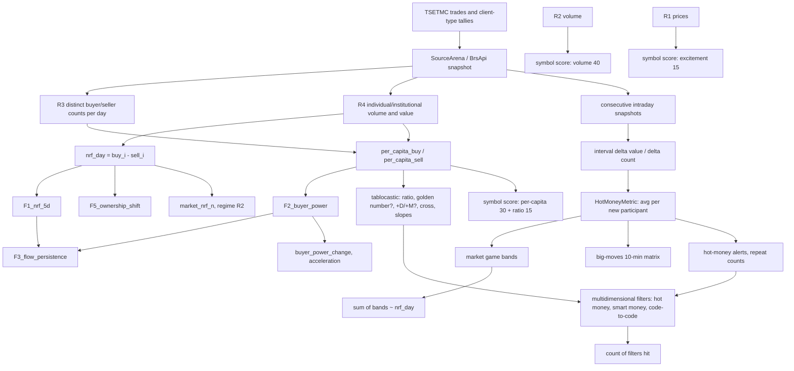
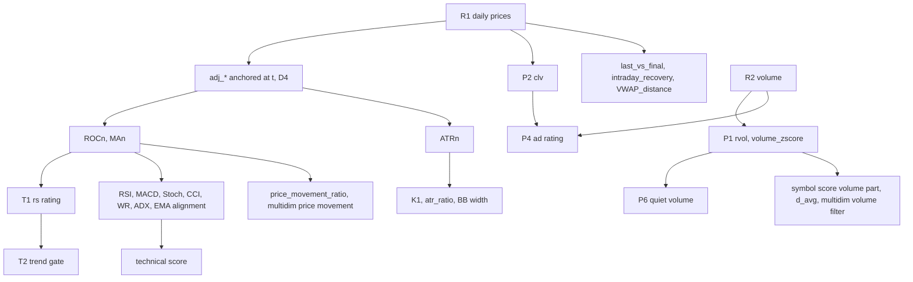

# ماتریس استقلال منبع و تبار ویژگی‌ها

- وضعیت: نسخه ۱، ۱۳ مهر ۱۴۰۵. ستون «اطلاعات مستقل» از روی **فرمول و منبع** تعیین شده است (ساختاری). سنجش تجربی هم‌بستگی (`data_dictionary` بخش ۴-ب) پس از ساخت مجموعه داده جای آن را می‌گیرد.
- هدف: هیچ دو ویژگی‌ای که از یک والد ساخته شده‌اند دو تأیید مستقل شمرده نشوند. نمونه: ۶ فیلتر مشابه ≠ ۶ تأیید.
- مرتبط: `docs/data_dictionary.md` (تعریف‌ها و خوشه‌ها)، `docs/tablokhani_inventory.md` (ابزارها)، `docs/archive_feasibility.md` (در دسترس بودن تاریخچه).

## ۱. دو نوع استقلال

دو پرسش جدا هستند و نباید با هم قاطی شوند:

| نوع | پرسش | نمونه |
| --- | --- | --- |
| **استقلال اطلاعاتی** | آیا این ویژگی چیزی می‌گوید که از متغیرهای پایه‌ای که ما از پیش داریم به دست نمی‌آید؟ | قدرت خریدار تابلوخوانی: **نه**؛ همان چهار فیلد حقیقی سورس‌آرنا |
| **ارزش در دسترس بودن** | آیا این منبع تاریخچه‌ای دارد که ما نداریم، حتی اگر از همان داده خام ساخته شده باشد؟ | بایگانی پول داغ تابلوخوانی: اطلاعات مستقلی ندارد، ولی **تاریخچه درون‌روزی** است که ما ضبط نکرده‌ایم |

قاعده شمارش تأیید فقط به استقلال اطلاعاتی نگاه می‌کند. ارزش در دسترس بودن در `archive_feasibility` بررسی می‌شود.

## ۲. والدهای پایه (ریشه‌ها)

همه ویژگی‌ها به این ریشه‌ها برمی‌گردند. ریشه‌های R1 تا R6 یک خوراک دارند (عکس لحظه‌ای TSETMC از راه سورس‌آرنا یا BrsApi). ریشه‌های R7 تا R10 خوراک جدا دارند.

| کد | ریشه | فیلدهای خام | منبع خام |
| --- | --- | --- | --- |
| R1 | قیمت روز | `pf`، `pl`، `pc`، `py`، `pmin`، `pmax` | TSETMC ← SA / BA |
| R2 | فعالیت | `tvol`، `tval`، `tno` | همان |
| R3 | تعداد حقیقی/حقوقی | `Buy_CountI/N`، `Sell_CountI/N` (افراد متمایز روز) | همان |
| R4 | حجم و ارزش حقیقی/حقوقی | `Buy/Sell_I/N_Volume`، `…_Value` | همان |
| R5 | دفتر سفارش | ۵ سطح قیمت، حجم و تعداد | همان (فقط زنده) |
| R6 | مرجع | دامنه، حجم مبنا، تعداد سهام، شناوری، صنعت | همان (فقط جاری) |
| R7 | سهامداران عمده | تغییر مالکیت دارندگان ≥ ۱٪ | TSETMC / تابلوخوانی `shareholders` |
| R8 | اطلاعیه‌ها | کدال، گزارش ماهانه، مجمع | کدال |
| R9 | قضاوت انسانی | سیگنال‌های تالار | تحلیلگران تابلوخوانی |
| R10 | کلان و صندوق | NAV، صدور/ابطال، ارز، اوراق | SA `nav`، منبع ندارد |

**نتیجه کلیدی:** هر ویژگی محاسبه‌شده تابلوخوانی از R1 تا R6 ساخته می‌شود، چون داده خامش کش سورس‌آرناست. پس در برابر ویژگی‌هایی که ما از همان داده می‌سازیم، **هیچ‌کدام اطلاعات مستقل اضافه نمی‌کند.** تنها استثناها R7، R8 و R9 هستند.

## ۳. ماتریس

ستون‌ها: **Raw Source** (ریشه)، **Derived By** (چه کسی محاسبه می‌کند)، **Formula Known?**، **Independent Information?** (نسبت به همه ویژگی‌های دیگر این جدول)، **Correlated Feature Family** (خوشه `data_dictionary`)، **Duplication Risk** (بالا یعنی با ویژگی دیگری که در همان امتیاز یا شمارش هست تکرار می‌شود)، **Research Value**.

### ۳-الف. ویژگی‌های خودمان

| Feature | Raw Source | Derived By | Formula Known? | Independent Information? | Correlated Feature Family | Duplication Risk | Research Value |
| --- | --- | --- | --- | --- | --- | --- | --- |
| `nrf_day`، `F1_nrf_5d` | R4 (+R2) | ما (SM-01) | بله | **بله، نماینده K-FLOW** | K-FLOW | با F5، `market_nrf`، پول داغ | بالا |
| `F5_ownership_shift` | R4، R2 | ما | بله | نه (F1 با مخرج دیگر) | K-FLOW | **بالا** | فقط نمایش |
| `F2_buyer_power` | R3، R4 | ما (SM-01) | بله | **بله، نماینده K-SIZE** | K-SIZE | با سرانه‌ها و همه نسبت‌های خرید به فروش | بالا |
| `per_capita_buy/sell_i` | R3، R4 | ما | بله | نه (اجزای F2) | K-SIZE | **بالا** | نمایش؛ نسبت به میانه خود نماد |
| `buyer_power_change`، `…_acceleration` | R3، R4 | ما (پیشنهاد) | بله | جزئی (مشتق زمانی F2؛ اطلاعات «تغییر» دارد) | K-SIZE | متوسط | بالا (H-A2) |
| `F3_flow_persistence` | R3، R4 | ما | بله | نه (ترکیب F1 و F2 در زمان) | K-FLOW + K-SIZE | **بالا** با F1 و F2 | متوسط |
| `inst_net_share` | R4 | ما | بله | جزئی (طرف حقوقی؛ قرینه K-FLOW در جمع) | K-FLOW | متوسط | متوسط |
| `sell_count_growth_i` | R3 | ما (M3) | بله | جزئی | K-SIZE | متوسط | متوسط |
| `P1_rvol_day`، `volume_zscore` | R2 | ما | بله | **بله، نماینده K-VOL** (دو شکل یک ویژگی) | K-VOL | **بالا** میان خودشان | بالا |
| `P6_quiet_volume` | R2، R1 | ما | بله | نه (P1 + بازده) | K-VOL | بالا | متوسط |
| `P2_clv`، `P4_ad_rating` | R1، R2 | ما | بله | **بله، نماینده K-LOC** | K-LOC | با `last_vs_final`، `intraday_recovery` | بالا |
| `last_vs_final` | R1 | ما | بله | جزئی (اطلاعات قاعده حجم مبنا را هم دارد) | K-LOC | متوسط | متوسط |
| `intraday_recovery` | R1 | ما | بله | جزئی | K-LOC | متوسط | بالا (H-B1، H-C1) |
| `ROCn`، `T1`، `T4`، `MAn`، `T2` | R1 | ما | بله | **بله، نماینده K-TREND** (یکی) | K-TREND | **بالا** میان خودشان | بالا |
| `rsi14`، `macd`، `stoch`، `cci14`، `williams_r14`، `adx14`، `ema_alignment` | R1 (+R2 برای MFI) | ما | بله | نه (بازبیان روند و تکانه) | K-TREND | **بسیار بالا** | فقط تأیید؛ حداکثر یک عضو در هر مدل |
| `ATRn`، `K1`، `T3_atr_ratio`، `bb_width`، `realized_vol` | R1 | ما | بله | **بله، نماینده K-VOLA** (یکی) | K-VOLA | بالا میان خودشان | بالا برای اندازه موقعیت |
| `T3_vol_dryup` | R2 | ما | بله | جزئی | K-VOL | متوسط | متوسط |
| `price_response_to_money_flow` | R1، R4 | ما | بله | **بله، به‌عنوان تعامل** (واکنش قیمت مشروط به جریان؛ نه جمع دو خوشه) | K-FLOW × K-TREND | پایین | **بالا** (H-G1، H-J1) |
| `sr_levels`، `distance_*` | R1 | ما | بله | جزئی (ساختار قیمت) | K-TREND | متوسط | متوسط |
| `queue_*` | R5 | ما | بله | **بله، نماینده K-BOOK** | K-BOOK | — | بالا؛ فقط رو به جلو |
| `regime_*`، `breadth_*`، `market_nrf_n` | R1، R4 همه نمادها | ما | بله | **بله در سطح بازار** (متغیر مقطعی نیست) | K-MKT | میان خودشان بالا | بالا |
| `IGR`، `industry_relative_strength` | R1، R4، R6 | ما | بله | **بله در سطح صنعت** (به‌شرط عضویت نقطه‌ای) | K-IND | متوسط | بالا؛ مسدود (D7) |

### ۳-ب. ویژگی‌های تابلوخوانی

| Feature | Raw Source | Derived By | Formula Known? | Independent Information? | Correlated Feature Family | Duplication Risk | Research Value |
| --- | --- | --- | --- | --- | --- | --- | --- |
| پول داغ و پلاس (`alert_per_capita`، `delta_count`) | R3، R4 در عکس‌های پیاپی | تابلوخوانی (سرور) | تقریباً (میانگین بازه ÷ افزایش تعداد؛ آستانه ۲۰۰ و ۱۰۰ میلیون تومان) | نه؛ نسخه درون‌روزی K-SIZE و K-FLOW | K-SIZE + K-FLOW | **بالا** با F1، F2 و بازی بازار | متوسط: بایگانی رویداد (در دسترس بودن) |
| تکرار هشدار، میانگین خریدهای داغ، `proceeds` | همان | تابلوخوانی | بله (شمارش و میانگین) | نه | K-SIZE + K-FLOW | بالا | پایین |
| بازی بازار (سه باند) | همان | تابلوخوانی | جزئی | نه؛ جمع باندها ≈ `nrf_day` | K-FLOW | **بالا** | پایین |
| ماتریس تحرکات بزرگان | همان + R1 | تابلوخوانی | جزئی | نه؛ ولی جفت جریان و قیمت = همان تعامل `price_response` درون‌روزی | K-FLOW × K-TREND | متوسط | متوسط |
| تابلوکستیک: نسبت خرید به فروش، عدد طلایی، +D، +M، M/D، کراس، شیب‌ها، نسبت به میانگین | R3، R4 درون‌روزی | تابلوخوانی (سرور) | **نه** (جز نسبت خرید به فروش) | نه؛ همه مشتق سرانه درون‌روزی | K-SIZE | **بسیار بالا** میان ستون‌ها | متوسط (H-C1 درون‌روزی) |
| تحلیل چندبعدی: فیلترهای پول داغ، پول هوشمند، کد به کد | R3، R4 | تابلوخوانی | نه | نه | K-SIZE + K-FLOW | **بسیار بالا**: سه فیلتر ≈ یک شاهد | — |
| تحلیل چندبعدی: فیلتر حجم | R2 | تابلوخوانی | نه | نه | K-VOL | بالا با P1 | — |
| تحلیل چندبعدی: تحرک قیمت، حرکت امروز، ساعت | R1 (+زمان) | تابلوخوانی | نه | نه | K-TREND + K-LOC | بالا | — |
| تحلیل چندبعدی: رانتی | R1، R2، R6؟ | تابلوخوانی | نه | **نامعلوم** (تعریف دیده نشد) | نامعلوم | نامعلوم | نامعلوم تا MI-01 |
| شمار حضور در ۸ فیلتر | همه بالا | تابلوخوانی | بله (شمارش) | نه؛ حداکثر ۴ خوشه زیر آن | — | **ذاتاً تکراری** | آزمون H-X1 |
| امتیاز نماد (۴ جزء) | R1، R2، R3، R4 + تاریخچه ۱۰ روزه | مرورگر کاربر | **بله** (inventory C-01) | نه؛ جمع وزنی K-VOL (۴۰)، K-SIZE (۳۰ + ۱۵) و K-LOC (۱۵) | K-SIZE غالب (۴۵ از ۱۰۰) | بالا با همه | بالا: آزمون ادعا (H-T09) |
| امتیاز تکنیکالی | R1 | مرورگر کاربر | بله | نه | K-TREND | بسیار بالا | پایین |
| امتیاز پول هوشمند صفحه اصلی | R2، R3، R4 | تابلوخوانی | جزئی (متن، با ناسازگاری C-04) | نه | K-VOL + K-SIZE | بالا | پایین |
| `price_movement_ratio` | R1 | تابلوخوانی | بله | نه (≈ ROC کوتاه) | K-TREND | بالا | پایین |
| ۲۱ هشدار ویژه | R1 تا R5 | تابلوخوانی (سرور) | نه | نه برای ۲۰ مورد؛ «کد به کد» و «رفتار حقوقی در صف» از R3، R4، R5 | هر هشدار یک خوشه | متوسط | **بالا**: بایگانی رویداد + آزمون برچسب جهت (H-T08) |
| روند صف بازار | R5 همه نمادها | تابلوخوانی | جزئی | بله در سطح بازار تا وقتی خودمان ضبط نکنیم؛ پس از آن نه | K-BOOK / K-MKT | پایین | بالا (رژیم) |
| سهامداران عمده | **R7** | TSETMC | — | **بله** | K-HOLDER | پایین | متوسط: تنها شاهد واقعی خریدار بزرگ (بخش ۵) |
| کدال | **R8** | کدال | — | **بله** | K-EVENT | پایین | متوسط (وتوی رویداد) |
| سیگنال‌های تالار | **R9** | انسان | نه | **بله** (قضاوت؛ ولی از همان تابلو) | K-HUMAN | پایین | بالا: معیار مقایسه (H-T17) |

## ۴. تبار ویژگی‌ها

### ۴-الف. شاخه اندازه خریدار (K-SIZE) و جریان (K-FLOW)



**وابستگی‌های صریح (یک والد، چند فرزند):**
- `per_capita_*` والد مشترک F2، `buyer_power_change`، همه ستون‌های تابلوکستیک، دو جزء امتیاز نماد (۴۵ امتیاز از ۱۰۰)، `tk_ratio_to_avg` و فیلتر «پول هوشمند» است.
- `nrf_day` والد مشترک F1، F3، F5، بازی بازار (جمع باندها)، «ورود/خروج پول» و R2 رژیم است.
- تفاضل عکس‌های پیاپی (`delta value`، `delta count`) والد مشترک پول داغ، بازی بازار، ماتریس ۱۰ دقیقه‌ای، هشدارهای «خرید/فروش سنگین» و فیلترهای «پول داغ» و «کد به کد» است.

### ۴-ب. شاخه قیمت، حجم و روند



### ۴-پ. نمونه زنجیره‌ای که مأموریت خواسته (اصلاح‌شده)

```text
TSETMC trades and client-type tallies (via SourceArena)
        ↓
cumulative daily buyer/seller COUNTS (distinct people per day) + volumes
        ↓
interval deltas between snapshots (Δvalue, Δcount)
        ↓
per-capita = Δvalue ÷ Δcount  (an AVERAGE, not one person)
        ↓
HotMoneyMetric (≥ 200M toman average)
        ↓
multidimensional filters "hot money", "smart money", "code-to-code" (3 filters, ~1 evidence)
        ↓
count of filters hit (double counting)

parallel branch from the SAME daily counts/volumes:
per-capita (daily) → buyer power → symbol score (45 of 100 points)
```

**اصلاح نسبت به نمونه مأموریت:** امتیاز نماد از فیلترهای چندبعدی ساخته نمی‌شود؛ مستقیم از همان سرانه روزانه و حجم ساخته می‌شود (کد سمت کاربر). پس امتیاز نماد و فیلترهای چندبعدی **خواهرند، نه مادر و فرزند**، و هر دو از R3 و R4 تغذیه می‌شوند.

## ۵. اعتبارسنجی پول داغ: HotMoneyMetric در برابر TrueLargeBuyerEvidence

**تصمیم:** این دو مفهوم جدا تعریف و نگهداری می‌شوند. پول داغ تا اطلاع بعدی «پول هوشمند» شمرده نمی‌شود.

| مفهوم | تعریف | چه چیزی را **نمی‌تواند** بگوید |
| --- | --- | --- |
| **HotMoneyMetric** | در بازه میان دو عکس: `Δvalue_side ÷ Δcount_side` حقیقی، وقتی `Δcount > 0`؛ بازه‌ای با `Δcount = 0` و `Δvalue > 0` «غیرقابل انتساب» (ADR-0004) | اینکه **یک** نفر خریده؛ سهم معامله‌گران تکراری که دوباره شمرده نمی‌شوند؛ ترتیب معاملات درون بازه |
| **TrueLargeBuyerEvidence** | شاهدی که به یک شخص یا یک سفارش واحد اشاره کند | — |

**آیا داده‌ای برای شناسایی واقعی خرید بزرگ فردی هست؟**

| منبع | چه می‌گوید | محدودیت | وضعیت دسترسی |
| --- | --- | --- | --- |
| خوراک تجمعی حقیقی/حقوقی (SA، BA) | فقط جمع و تعداد افراد متمایز روز | هویت ندارد؛ پس از نخستین معامله هر شخص، معاملات بعدی او تعداد را بالا نمی‌برد | در دسترس |
| بازه با `Δcount = 1` در نمونه‌برداری خیلی ریز (≤ ۵ ثانیه) | کران بالای خرید یک نفر تازه‌وارد | معاملات تکراری دیگران در همان بازه هم در Δvalue هست؛ پس فقط **کران**، نه مقدار | نیازمند خوراک ریز (در دسترس نیست) |
| فهرست معاملات روز (ریز معاملات TSETMC) | اندازه هر معامله | طرفین و نوع حقیقی/حقوقی هر معامله را ندارد؛ یک سفارش بزرگ با چند طرف مقابل به چند معامله شکسته می‌شود | **فرضیه:** در TSETMC هست؛ از این رایانه در دسترس نیست |
| دفتر سفارش با تعداد ۱ و حجم بزرگ | یک سفارش **ثبت‌شده** بزرگ از یک کد | نیت است، نه اجرا؛ قابل لغو | فقط زنده و ضبط‌شده |
| تغییر سهامداران عمده (≥ ۱٪) | **هویت واقعی** خریدار یا فروشنده بزرگ | فقط بالای ۱٪؛ روزانه و با تأخیر؛ نهادها بیشتر از اشخاص | تابلوخوانی `shareholders`؛ تاریخچه نامعلوم |
| معاملات بلوکی و توافقی | معامله بزرگ واقعی | از جریان عادی جداست (M4) | منبع ندارد (Q-SG7) |

**نتیجه:** از داده‌های در دسترس، **هیچ شاهد مستقیمی از خرید بزرگ یک شخص حقیقی در جریان عادی وجود ندارد.** آنچه هست میانگین سرانه است. پس:
1. در فرهنگ داده، `hot_*` و `tk_hot_alert` با نام **HotMoneyMetric** و توضیح «میانگین بازه» تعریف می‌شوند (نه «پول هوشمند» و نه «خریدار بزرگ»).
2. ویژگی جدای `large_holder_change` (از R7، تغییر سهامداران ≥ ۱٪) تنها عضو خانواده TrueLargeBuyerEvidence است. اگر تاریخچه‌اش در دسترس نباشد، این خانواده خالی است و این در هر گزارش ذکر می‌شود.
3. در پژوهش الگو، فرضیه‌های خانواده A و J فقط از «جریان حقیقی و سرانه» حرف می‌زنند، نه از «پول هوشمند». ادعای «ورود پول هوشمند» فقط وقتی به کار می‌رود که TrueLargeBuyerEvidence هم برقرار باشد.
4. حساسیت HotMoneyMetric به فاصله نمونه‌برداری خودش یک آزمون است: همان روز با فاصله‌های ۵ ثانیه، ۱ دقیقه و ۱۴ دقیقه (با زیرنمونه‌گیری ضبط ریز، وقتی داریم) چند هشدار مشترک دارد؟ تا این آزمون، هشدار پول داغ با فاصله بیش از ۱ دقیقه **LOW CONFIDENCE** است.

## ۶. قاعده شمارش تأیید (برای الگوها و رتبه‌بندی)

1. هر الگو حداکثر **یک** ویژگی از هر خوشه را در شرط «و» دارد. ویژگی دوم همان خوشه فقط با اجرای حذف (B8) که ارزش افزوده‌اش را نشان دهد پذیرفته می‌شود.
2. `signal_confluence` شمار **خوشه‌ها** است: K-FLOW، K-SIZE، K-VOL، K-LOC، K-TREND، K-VOLA، K-BOOK (+ K-HOLDER و K-EVENT اگر داده دارند). K-FLOW و K-SIZE تا سنجش تجربی با هم **حداکثر ۱٫۵ تأیید** شمرده می‌شوند، چون از یک ریشه (R3، R4) می‌آیند.
3. شمارش فیلترهای تابلوخوانی (تحلیل چندبعدی) هرگز مستقیم در امتیاز ما نمی‌آید؛ فقط در آزمون H-X1 در برابر شمارش خوشه‌ای مقایسه می‌شود.
4. هر ویژگی تابلوخوانی که از R1 تا R6 ساخته شده، **تأیید اضافه** بر ویژگی خودمان از همان خوشه نیست.
